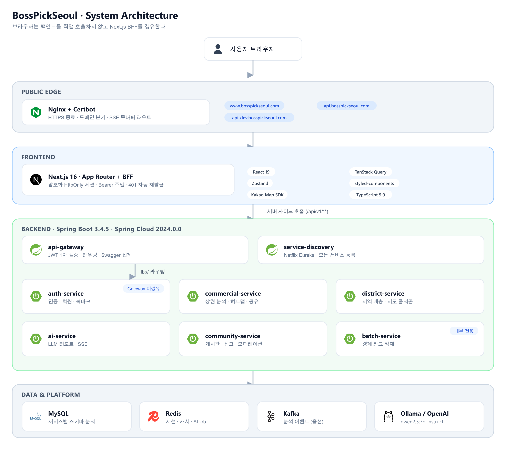
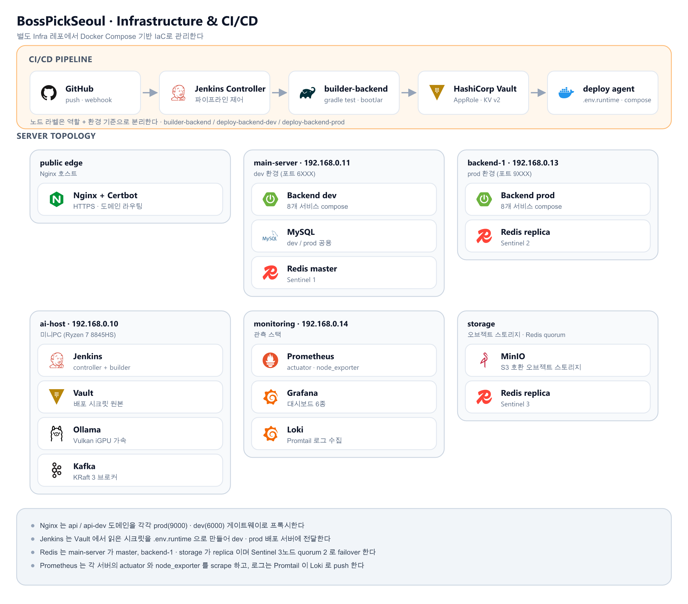

# BossPickSeoul (보스픽서울)

> 서울시 상권 분석 서비스 프로젝트
>
> 서울시 상권 공공데이터를 분석해 **"어디서, 무슨 업종으로 창업할지"** 를 판단하도록 돕습니다.

| 항목 | 내용 |
| --- | --- |
| 프로젝트명 | BossPickSeoul (보스픽서울) |
| 한 줄 소개 | 서울시 상권 분석 서비스 프로젝트 |
| 개발 기간 | 2025.12 ~ 진행 중 |
| 주제 | 창업을 위한 상권 분석 서비스 플랫폼 |
| 타겟 | 자기 지역 상권을 분석하려는 예비 창업자, 동업종·주변 상권을 확인하려는 기존 창업자 |
| 도메인 | `www.bosspickseoul.com` (웹) · `api.bosspickseoul.com` (운영 API) · `api-dev.bosspickseoul.com` (개발 API) |

## 설계 포인트

- **MSA**: Eureka + Spring Cloud Gateway 기반으로 인증 / 상권 / 지역 / 커뮤니티 / AI / 배치 서비스 분리
- **Hexagonal Architecture**: `Controller → WebUseCase → WebFacade → Processor → Port/Adapter` 계층 규약을 전 서비스에 통일
- **Next.js App Router + BFF**: 브라우저가 토큰을 들고 있지 않도록 암호화 HttpOnly 세션 + 서버 프록시 구조로 구성
- **LLM AI 리포트**: 자체 호스팅 Ollama 기반 분석 리포트, 비동기 job + SSE 스트리밍
- **IaC 기반 운영**: Jenkins · Vault · Nginx · Redis Sentinel · Kafka · Prometheus/Grafana/Loki를 [별도 Infra 레포](#인프라-구성)에서 코드로 관리

## 주요 기능

| 영역 | 기능 |
| --- | --- |
| 회원 | 이메일 인증 회원가입 · 로그인, 카카오/네이버 소셜 로그인, 프로필·비밀번호·탈퇴, 관심 상권 북마크 |
| 상권 분석 | 자치구 → 행정동 → 상권 → 업종 4단계 탐색, 매출·유동인구·점포·거주인구·소득·집객시설 분석, 분기별 트렌드, 벤치마크 |
| 비교 · 추천 | 상권 A vs B 비교, 복합 지표 히트맵(프리셋 6종 + 지표별 breakdown), 조건별 후보 상권 Top N, 업종 기반 자동 추천 |
| AI 리포트 | 상권 / 상권 비교 / 자치구 / 행정동 4종 LLM 리포트, 비동기 작업 + SSE 실시간 진행 상황, Redis 캐시·멱등성·토큰 사용량 집계 |
| 커뮤니티 | 지역 기반 게시판, 댓글·대댓글(depth 1), 좋아요, 키워드 검색, 신고 및 매니저 모더레이션 |
| 공유 | 분석 화면 상태를 단축 코드로 공유 (base62 8자, TTL 90일) |
| 인기 순위 | Kafka 분석 이벤트 + Redis ZSET 기반 실시간 인기 상권 랭킹 (옵션 기능) |

> 창업 시뮬레이션과 실시간 채팅은 백엔드 구현 전까지 화면에서 안내 상태로 유지됩니다.

## 시스템 아키텍처

### 전체 구성



**핵심 흐름**

- 브라우저는 백엔드를 직접 호출하지 않습니다. 모든 요청은 Next.js BFF(`/api/bff`)를 거치고, 토큰은 서버 측 암호화 HttpOnly 세션에만 존재합니다. 401이면 BFF가 재발급 후 1회 재시도합니다.
- `auth-service`는 게이트웨이를 거치지 않고 단독 호출하며, 나머지 서비스는 게이트웨이가 JWT 1차 검증 후 Eureka `lb://`로 라우팅합니다. Swagger는 게이트웨이가 5개 서비스 문서를 집계합니다.
- AI 리포트는 캐시 hit면 즉시 200, miss면 202 + `jobId`를 내려주고 워커가 백그라운드에서 처리합니다. 진행 상황은 SSE로 push하고 실패 시 폴링으로 폴백합니다.

### 백엔드 모듈

| 구분 | 모듈 | 책임 | 내부 포트 |
| --- | --- | --- | --- |
| cloud | `service-discovery` | Eureka 서비스 레지스트리 | 8761 |
| cloud | `api-gateway` | 라우팅, JWT 1차 검증, CORS, Swagger 집계 | 8000 |
| service | `auth-service` | 인증, 회원, 소셜 로그인, 북마크 | 8081 |
| service | `district-service` | 지역 계층, 지도 폴리곤·오버레이 오케스트레이션 | 8082 |
| service | `commercial-service` | 상권·행정동·자치구 분석, 히트맵, 추천, 공유 링크, 랭킹 | 8083 |
| service | `ai-service` | LLM AI 리포트 (비동기 job + SSE) | 8085 |
| service | `community-service` | 커뮤니티, 신고, 모더레이션 | 8086 |
| service | `batch-service` | 영역 경계 좌표 대량 적재 (Spring Batch) | 8080 |
| core | `common-core` / `persistence-core` / `redis-core` / `security-core` / `shared-commercial` | 공통 응답·Swagger, JPA·QueryDSL·Snowflake, Redis 설정, JWT 보안, 공유 도메인 타입 | — |

계층 규약은 서비스 전반에 동일하게 적용됩니다.

```
Controller → WebUseCase → WebFacade → Processor → Port → Adapter
                              ↘ Presenter (Info → Response 변환 전담)
```

### 인프라 구성

인프라는 별도 IaC 레포(`Infra`)에서 Docker Compose + 셸 스크립트로 관리합니다.



| 영역 | 구성 |
| --- | --- |
| 리버스 프록시 | Nginx + Certbot(Let's Encrypt), HTTP→HTTPS 강제, SSE 전용 버퍼링 해제 라우트 |
| 시크릿 | HashiCorp Vault KV v2 + AppRole, `kv/bosspickseoul/backend/{env}/env` |
| 캐시/세션 | Redis master 1 + replica 2 + Sentinel 3 (quorum 2) |
| 메시징 | Kafka KRaft 3 브로커 (replication 3 / min ISR 2) + Kafka UI |
| 오브젝트 스토리지 | MinIO (S3 호환) |
| LLM | Ollama (Radeon 780M · Vulkan 백엔드), `qwen2.5:7b-instruct` |
| 관측 | Prometheus + Grafana(대시보드 6종 프로비저닝) + Loki/Promtail + node_exporter |

> 백엔드는 dev(`6XXX`) / prod(`9XXX`) 두 환경이 운영 중이며, 프론트엔드 운영 배포는 준비 중입니다.

### CI/CD

- 파이프라인 흐름은 위 인프라 구성도 상단 밴드에 함께 정리되어 있습니다.
- Jenkins 노드는 **역할 + 환경** 기준으로 라벨을 분리합니다 (`builder-backend`, `deploy-backend-dev`, `deploy-backend-prod` 등).
- 서비스별 `Jenkinsfile-{service}`가 공통 파이프라인 `Jenkinsfile.backend-common.groovy`를 재사용합니다.
- 시크릿은 Vault가 원본이고, 배포 서버에는 `.env.runtime`으로만 최소 기간 존재합니다.

## 기술 스택

| 영역 | 스택 |
| --- | --- |
| Frontend | Next.js 16 (App Router), React 19, TypeScript 5.9, TanStack Query, Zustand, styled-components, Kakao Map SDK, Vitest |
| Backend | Java 21, Spring Boot 3.4.5, Spring Cloud 2024.0.0 (Gateway · Eureka · OpenFeign), Spring Security / OAuth2 Resource Server, Spring Data JPA, QueryDSL, MapStruct, Spring Batch, Spring AI |
| Data | MySQL, Redis (Sentinel), Kafka (KRaft) |
| AI | Ollama (`qwen2.5:7b-instruct`) / OpenAI 호환 API, SSE 스트리밍 |
| Infra | Docker Compose, Nginx, Certbot, HashiCorp Vault, Jenkins, Prometheus, Grafana, Loki, Promtail |
| 기타 | Resilience4j, Jasypt, Snowflake ID, SpringDoc OpenAPI, GeoTools |

## 저장소 구조

```
bosspickseoul/
├── backend/                  # Spring Boot 멀티모듈 (core / cloud / service)
│   ├── core/                 # common · persistence · redis · security · shared-commercial
│   ├── cloud/                # api-gateway · service-discovery
│   ├── service/              # auth · commercial · district · community · ai · batch
│   └── docs/                 # 아키텍처 · API · 배포 · 관측 가이드
├── frontend/                 # Next.js App Router + BFF
│   ├── app/                  # 라우트 (auth) / (shell)
│   ├── src/                  # components · lib · hooks · stores
│   └── docs/                 # 기능 명세 · 엔지니어링 규약 · 런북
├── Jenkinsfile-*             # 서비스별 파이프라인 + 공통 groovy
└── docs/                     # CI/CD 문서 · 아키텍처 다이어그램(images) 및 생성기(diagrams)
```

아키텍처 다이어그램은 손으로 그린 이미지가 아니라 `docs/diagrams/generate-diagrams.mjs`가 생성합니다. 구성이 바뀌면 스크립트를 수정한 뒤 다시 실행해 `docs/images/*.png`를 갱신합니다.

## 문서

- [CI/CD Architecture Roadmap](docs/cicd-architecture-roadmap.md) · [Jenkins Node Label and Job Design](docs/jenkins-node-label-job-design.md)
- 백엔드: [아키텍처 가이드](backend/docs/architecture-guide.md) · [API 설계 가이드](backend/docs/api-design-guide.md) · [서비스 인벤토리](backend/docs/service-inventory.md) · [배포 가이드](backend/docs/deploy-guide.md) · [관측 가이드](backend/docs/observability-guide.md)
- 프론트엔드: [문서 인덱스](frontend/docs/README.md) · [기능 명세](frontend/docs/features/_index.md) · [엔지니어링 규약](frontend/docs/engineering/data-fetching-rules.md)
