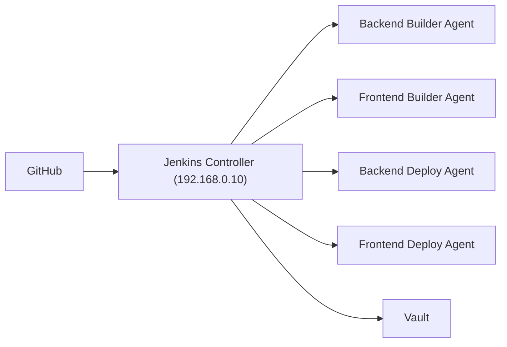

# BossPickSeoul CI/CD Architecture Roadmap

Related docs:

- [Jenkins Node Label and Job Design](jenkins-node-label-job-design.md)

이 문서는 BossPickSeoul의 CI/CD 구조를 현재 VM/호스트 기반 운영부터 추후 Kubernetes 전환까지 이어서 설계할 때의 추천 기준을 정리한 문서입니다.

핵심 원칙은 하나입니다.

> 빌드는 중앙화하고, 배포는 배포 책임 경계별로 분리한다.

여기서 "배포 책임 경계"는 서버, 환경, 클러스터, 권한 범위를 뜻합니다.

## 한 줄 결론

- 지금은 `backend deploy agent`, `frontend deploy agent`를 분리하는 것이 가장 좋습니다.
- 서버가 더 늘어나면 `서버별`보다 `역할별` 또는 `환경별` 분리가 더 중요해집니다.
- Kubernetes로 넘어가면 `노드별 agent`가 아니라 `클러스터별/환경별 deploy agent`로 전환하는 것이 가장 자연스럽습니다.

## 추천 아키텍처 표

| 단계 | 추천 deploy agent 단위 | builder 구성 | 배포 대상 | 추천 이유 |
| --- | --- | --- | --- | --- |
| 현재: VM/호스트 2~4대 | 역할별 분리 | 중앙 builder 1개 이상 | backend 서버, frontend 서버 | 가장 단순하고 장애 원인 분리가 쉽습니다. |
| 성장기: 서비스/서버 증가 | 환경별 + 역할별 분리 | backend builder, frontend builder 분리 | backend-dev, backend-prod, frontend-dev, frontend-prod | 권한 분리와 배포 파이프라인 독립성이 좋아집니다. |
| 전환기: 일부 Kubernetes 도입 | 환경별/플랫폼별 분리 | container/image builder 중심 | VM 배포 대상 + dev cluster + prod cluster | VM과 K8s를 동시에 운영할 때 경계가 명확해집니다. |
| 정착기: Kubernetes 중심 | 클러스터별 + 환경별 분리 | image builder + chart/manifest 검증 builder | dev cluster, prod cluster | 쿠버네티스에서는 서버별보다 클러스터별 agent가 더 적합합니다. |

## 현재 시점 추천 구조

현재 가정:

- Jenkins controller: `192.168.0.10`
- Vault: `192.168.0.10`
- backend 배포 대상 서버: 별도
- frontend 배포 대상 서버: 별도

추천 구조:

| 구성요소 | 권장 위치 | 역할 |
| --- | --- | --- |
| Jenkins controller | `192.168.0.10` | GitHub webhook 수신, 파이프라인 실행 제어, Credential/Vault 연동 |
| backend builder agent | build 전용 노드 | Gradle test/build, Docker image build |
| frontend builder agent | build 전용 노드 | Node.js/pnpm install, Next.js build |
| backend deploy agent | backend 실제 배포 서버 | `.env.runtime` 주입, `docker compose up`, 헬스 체크 |
| frontend deploy agent | frontend 실제 배포 서버 | Next.js 앱 배포, reverse proxy 연계, 프로세스 재기동 |

### 현재 구조 다이어그램

## 왜 서버별보다 역할별이 중요한가

`deploy agent를 서버별로 둔다`는 말은 현재 단계에서는 거의 맞습니다. 다만 장기적으로 더 정확한 기준은 `서버별`이 아니라 `배포 책임 경계별`입니다.

예를 들면:

- backend 서버와 frontend 서버가 다르면 agent도 분리
- dev와 prod의 권한이 다르면 agent도 분리
- VM 배포와 Kubernetes 배포 방식이 다르면 agent도 분리

즉, 나중에 서버가 바뀌어도 아래 기준이 유지되면 구조가 흔들리지 않습니다.

## 추천 라벨 전략

Jenkins node label은 처음부터 역할 중심으로 잡는 것이 좋습니다.

| 분류 | 추천 라벨 예시 |
| --- | --- |
| 공통 빌드 | `builder` |
| 백엔드 빌드 | `builder-backend` |
| 프론트 빌드 | `builder-frontend` |
| 백엔드 dev 배포 | `deploy-backend-dev` |
| 백엔드 prod 배포 | `deploy-backend-prod` |
| 프론트 dev 배포 | `deploy-frontend-dev` |
| 프론트 prod 배포 | `deploy-frontend-prod` |
| Kubernetes dev 배포 | `deploy-k8s-dev` |
| Kubernetes prod 배포 | `deploy-k8s-prod` |

현재 백엔드 Jenkinsfile도 이런 방향으로 확장하기 쉽습니다.

## 추천 파이프라인 분리 기준

| 파이프라인 종류 | 빌드 단계 | 배포 단계 |
| --- | --- | --- |
| backend service pipeline | Gradle test, bootJar, image/compose 검증 | Vault env 주입, `docker compose up` |
| frontend pipeline | install, lint, test, `next build` | standalone 배포 또는 Docker 배포 |
| k8s backend pipeline | image build, image push | `helm upgrade` 또는 `kubectl apply` |
| k8s frontend pipeline | image build, image push | ingress/service 포함 배포 |

## 운영 방식별 추천

### 1. 지금 가장 추천하는 방식

대상 서버에 Jenkins agent를 붙이고, 그 서버에서 직접 배포합니다.

장점:

- 구조가 단순합니다.
- 디버깅이 쉽습니다.
- `ssh -> ssh` 점프가 없습니다.
- 현재의 `docker compose` 기반 Jenkinsfile과 잘 맞습니다.

### 2. 중간 점프 서버에서 SSH 배포하는 방식

예: Jenkins -> deploy server -> target server

가능은 하지만 기본 추천은 아닙니다.

이 방식이 필요한 경우:

- 배포 대상 서버에 Jenkins agent 설치가 어렵다
- 운영망 정책상 점프 서버만 접근 가능하다
- 중앙 배포 허브를 반드시 써야 한다

단점:

- SSH hop이 늘어납니다.
- 실패 지점 추적이 어려워집니다.
- 파이프라인 스크립트가 복잡해집니다.

## Kubernetes까지 고려한 추천 전환 경로

| 시점 | 권장 배포 경계 | agent 기준 | 배포 도구 |
| --- | --- | --- | --- |
| 지금 | 서버/역할 | backend deploy, frontend deploy | Docker Compose |
| 서버 증가 시점 | 환경/역할 | backend-dev, backend-prod, frontend-dev, frontend-prod | Docker Compose + SSH 또는 직접 agent |
| K8s dev 도입 | 플랫폼/환경 | deploy-vm-prod, deploy-k8s-dev | Compose + Helm/Kubectl |
| K8s full 전환 | 클러스터/환경 | deploy-k8s-dev, deploy-k8s-prod | Helm 또는 GitOps |

중요 포인트:

- Kubernetes로 가면 `각 서버마다 agent`는 보통 필요 없습니다.
- 대신 `dev cluster에 배포할 수 있는 agent`, `prod cluster에 배포할 수 있는 agent`가 필요합니다.
- prod 권한은 dev와 강하게 분리하는 것이 좋습니다.

## 최종 추천안

### 지금

- Jenkins controller는 `192.168.0.10` 하나만 운영
- backend builder와 frontend builder는 분리 가능하면 분리
- backend deploy agent는 backend 실제 배포 서버에 부착
- frontend deploy agent는 frontend 실제 배포 서버에 부착

### 다음 단계

- dev/prod agent를 라벨로 분리
- backend/frontend 파이프라인을 완전히 분리
- Vault secret도 dev/prod, backend/frontend 기준으로 정리

### Kubernetes 도입 시

- `deploy-k8s-dev`, `deploy-k8s-prod` agent로 전환
- 배포 기준을 서버가 아니라 클러스터/네임스페이스/권한으로 재정의
- 가능하면 장기적으로 Helm 또는 GitOps 구조 검토

## 의사결정 체크리스트

아래 질문에 `예`가 많을수록 agent 분리가 필요합니다.

| 질문 | 분리 권장 여부 |
| --- | --- |
| backend와 frontend 배포 대상 서버가 다른가 | 예면 분리 |
| dev와 prod 접근 권한을 분리해야 하는가 | 예면 분리 |
| VM 배포와 Kubernetes 배포를 같이 운영하는가 | 예면 분리 |
| 배포 실패 원인을 빠르게 분리해야 하는가 | 예면 분리 |
| 팀/서비스별 권한 경계를 만들고 싶은가 | 예면 분리 |

## BossPickSeoul 기준 추천 결론

현재 BossPickSeoul에는 아래 구성이 가장 적합합니다.

| 영역 | 추천 agent |
| --- | --- |
| backend build | `builder-backend` |
| frontend build | `builder-frontend` |
| backend dev deploy | `deploy-backend-dev` |
| backend prod deploy | `deploy-backend-prod` |
| frontend dev deploy | `deploy-frontend-dev` |
| frontend prod deploy | `deploy-frontend-prod` |

추후 Kubernetes를 도입하면 아래처럼 자연스럽게 옮겨가면 됩니다.

| 영역 | 전환 후 추천 agent |
| --- | --- |
| k8s dev deploy | `deploy-k8s-dev` |
| k8s prod deploy | `deploy-k8s-prod` |

이 문서의 결론을 한 문장으로 정리하면 이렇습니다.

> 지금은 서버가 아니라 역할 경계에 맞춰 deploy agent를 나누고, Kubernetes 전환 후에는 그 경계를 클러스터와 환경 기준으로 옮기는 것이 가장 안정적입니다.
