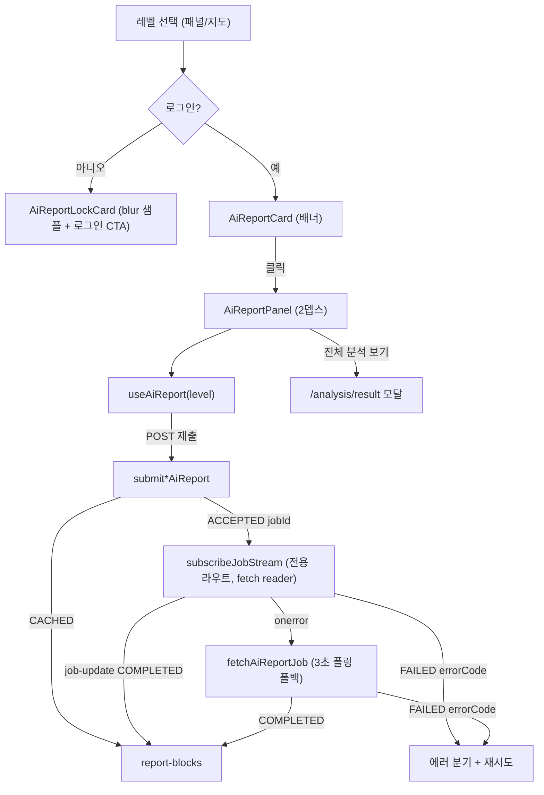

# 상권 분석 — AI 리포트 컴패니언 세부 명세서

> **작성일**: 2026-08-07 (최초) · **개편일**: 2026-08-10 (비동기/SSE 전면 개편)
> **공통 명세**: [상권 분석 공통 명세](./analysis.md)
> **연관 명세**: [분석 결과 리포트](./result.md), [지도 기반 분석 대상 탐색](./explorer.md)
> **백엔드 계약(정본)**: `backend/docs/ai-report-frontend-guide.md`
> **대상**: 웹 (Next.js App Router)
> **작성자**: Claude
> **상태**: 설계 확정 (SSE 개편 슬라이스) — 구현 예정

이 문서는 상권 분석 탐색(`/analysis`) 흐름에 **AI 리포트**를 붙이는 컴패니언 기능을, 백엔드
`ai-service`의 개편된 계약(`/api/v1/ai-reports/**`)에 맞춰 상세화한다. AI 리포트는 데이터
대시보드(결과 리포트)와 **필요 선택 깊이가 다르다**: 자치구만 골라도, 행정동·상권까지만 골라도
각 레벨의 AI 리포트를 받을 수 있다. 따라서 "분야까지 다 고른 뒤의 최종 대시보드"에 끼워넣지 않고,
**선택 화면에서 현재 선택 레벨을 따라가는 컴패니언**으로 제공한다.

[[_TOC_]]

---

## D0. 배경 / 기획 의도

| 항목              | 내용                                                                                                                                                        |
| ----------------- | ----------------------------------------------------------------------------------------------------------------------------------------------------------- |
| 충족 요구사항     | S3 상권 분석 — AI 리포트 인사이트 제공                                                                                                                      |
| 해결하려는 문제   | AI 리포트는 자치구/행정동/상권 각 레벨에서 이용 가능한데, 이를 분야까지 전부 선택해야 열리는 데이터 대시보드에 붙이면 리포트의 진짜 granularity를 낭비한다. |
| 목표 동작 (to-be) | 선택 패널 오른쪽에 "[지역] AI 리포트 분석하기" 카드 배너를 띄우고, 클릭 시 2뎁스 컴패니언 패널에서 해당 레벨 리포트를 **비동기(제출→SSE/폴링)**로 표시한다. |
| 구현 제외 범위    | 상권 비교 AI 리포트(별도 compare-mode UI 필요), 칩→차트 하이라이트, 리포트 저장/공유, PDF                                                                    |
| 연관 세부 기능    | 결과 대시보드 모달(에스컬레이션 대상), 지도 탐색 선택 상태, BFF 세션 인증                                                                                    |

**핵심 설계 결정 (2026-08-10 브레인스토밍 확정)**

1. **비동기 전면화** — 백엔드에서 동기 GET 조회 엔드포인트가 제거됐다. 자치구·행정동·상권
   **3종 모두** `POST 제출 → SSE 스트림(우선) / 폴링(폴백)` 흐름으로 통일한다. (기존 슬라이스의
   자치구·행정동 동기 GET 경로는 폐기.)
2. **SSE-over-BFF = 전용 스트리밍 라우트** — 범용 `/api/bff/*` 프록시는 응답을 `arrayBuffer()`로
   버퍼링해 SSE가 흐르지 않는다. 그래서 SSE는 **전용 스트리밍 라우트**
   (`app/api/ai-reports/jobs/[jobId]/stream/route.ts`)가 세션 Bearer를 붙여 백엔드 SSE에 연결하고
   `ReadableStream`을 **버퍼링 없이 그대로 파이프**한다. 브라우저는 same-origin이라 쿠키 세션으로
   인증되므로 Authorization 헤더 없이 **fetch reader**로 구독한다.
3. **폴링 폴백** — SSE 연결이 끊기면(네트워크 등) 기존 버퍼링 BFF 프록시를 통해 **3초 폴링**으로
   전환한다. 제출(POST)·폴링(GET job)은 그대로 `/api/bff/*`를 쓴다.
4. **카드 게이트** — 선택만으로는 호출하지 않는다. 카드 배너 클릭이 유일한 제출 트리거(비용·부하 방지).
   region도 이제 POST(LLM 비용)이므로 동일 게이트가 적용된다.
5. **레벨 = 가장 깊게 선택된 단계** — 자치구/행정동/상권. `service`(분야)는 레벨에 영향 없음.
   단, **상권 제출은 serviceCode 필수**(POST 쿼리 파라미터), region 제출은 code만 필요.
6. **선택 변경 시 리셋** — 레벨이 바뀌면 카드/패널은 새 레벨의 "분석하기" CTA로 되돌아가고,
   재클릭해야 제출한다. 같은 레벨·같은 코드 재진입은 React Query 캐시 + 백엔드 멱등으로 재사용한다.
7. **미인증 잠금 카드** — 비로그인 사용자에게 AI 리포트 영역을 숨기지 않고 **잠금 카드**(레벨별 정적
   샘플 blur + 가치 카피 + returnUrl 로그인 CTA)로 같은 자리에 노출한다. 비로그인 상태에서
   `/api/v1/ai-reports/**`는 **호출하지 않는다**.
8. **대시보드는 모달 유지** — 결과 대시보드는 기존 모달 그대로. AI 패널에서 "전체 분석 보기"로 에스컬레이션.
9. **비교/차트 연동 제외** — 상권 비교(COMMERCIAL_COMPARISON)는 compare-mode UI 전제라 후속 슬라이스.
   추천 시간·타깃 자유 텍스트의 차트 매핑도 후속.

---

## D1. 기능 개요

`/analysis` 탐색 화면에서 사용자가 자치구·행정동·상권 중 한 레벨을 선택하면, 선택 패널 오른쪽에
**AI 리포트 카드 배너**(로그인) 또는 **잠금 카드**(비로그인)가 등장한다. 로그인 사용자가 배너를
클릭하면 **2뎁스 컴패니언 패널**이 슬라이드로 열리고, 그때 해당 레벨 리포트를 **POST로 제출**한다.
`CACHED`면 즉시 렌더, `ACCEPTED`면 `jobId`로 **SSE를 구독**(끊기면 폴링 폴백)해 상태 단계를 보여주다가
`COMPLETED`에서 리포트를 렌더한다. 패널은 접을 수 있고 지도는 계속 선택 도구로 유지된다.

```text
레벨 선택 → 카드/잠금카드 등장
  · 로그인:  카드 클릭(게이트) → 패널 오픈 → POST 제출
             → CACHED 즉시 렌더 | ACCEPTED → SSE 구독(폴백: 3초 폴링)
             → PENDING/RUNNING 단계·진행문구 순환 → COMPLETED 렌더 | FAILED 에러+재시도
  · 비로그인: 잠금 카드(blur 샘플 + 가치 카피 + 로그인 CTA), API 호출 없음
```

### D1-1. UI 진입점 / 기능 연결

> **Figma 디자인**: 별도 Figma 없음. 본 명세와 `frontend/DESIGN.md`, 네이버 지도 스택 패널 레퍼런스를 구현 정본으로 사용한다.

| UI 요소              | 사용자 동작 | 트리거 기능                        | 결과 / UI 반영 상태                                            |
| -------------------- | ----------- | ---------------------------------- | -------------------------------------------------------------- |
| AI 리포트 카드 배너  | 클릭        | 패널 오픈 + 리포트 **제출(POST)**  | 2뎁스 패널이 열리고 제출→진행 단계→표시                       |
| 잠금 카드 로그인 CTA | 클릭        | `/login?redirect=<현재경로>` 이동  | 로그인 후 보던 분석 페이지로 복귀(자동 제출은 하지 않음)       |
| 레벨 선택(패널/지도) | 클릭        | 카드/패널 레벨 리셋                | 카드가 새 레벨 "분석하기" CTA로 갱신, 제출은 하지 않음         |
| 패널 접기(`<`/닫기)  | 클릭        | 패널 collapse                      | 지도 폭 복원, 카드 배너만 남김                                 |
| 다시 시도            | 클릭        | 리포트 재제출/재구독               | 실패/타임아웃 상태에서 재-POST(에러코드별 분기)               |
| 전체 분석 보기       | 클릭        | 결과 대시보드 모달 이동            | 분야 선택 완료 시 `/analysis/result` 모달로 에스컬레이션      |

---

## D2. 동작 요구사항

| #   | 요구사항                                                                                                                | 상세 참조 |
| --- | ----------------------------------------------------------------------------------------------------------------------- | --------- |
| 1   | 자치구·행정동·상권 중 한 레벨이 선택되면 선택 패널 오른쪽에 카드(로그인) 또는 잠금 카드(비로그인)를 표시한다.           | D4-1, D4-6 |
| 2   | 리포트 제출은 카드 클릭 시에만 발생한다. 레벨 선택·hover만으로는 제출하지 않는다.                                        | D4-1, D5  |
| 3   | 카드가 보고하는 레벨은 항상 가장 깊게 선택된 단계(자치구 < 행정동 < 상권)이다.                                          | D5        |
| 4   | 선택 레벨이 바뀌면 열려 있던 패널·카드는 새 레벨 "분석하기" CTA로 리셋되고, 재클릭해야 제출한다.                        | D5, D6    |
| 5   | 3종 모두 `POST` 제출한다. region은 `?periodCode=`, 상권은 `?serviceCode=&periodCode=`. 동기 GET은 쓰지 않는다.          | D4-2      |
| 6   | 제출 응답 `submissionStatus.code`가 `CACHED`면 즉시, `ACCEPTED`면 `jobId`를 SSE로 구독(폴백 폴링)해 완료 시 표시한다.    | D4-3      |
| 7   | SSE 연결이 끊기면 3초 폴링으로 폴백한다. 종결(COMPLETED/FAILED) 도달 시 구독/폴링을 정리한다.                            | D4-4      |
| 8   | `status.name`/`description`으로 PENDING/RUNNING/COMPLETED/FAILED 단계를 표시하고, `progressMessages`를 4초 순환 표시한다. | D4-5      |
| 9   | 에러코드별로 처리한다: `SECURITY_001`→잠금, `AI_005`→재제출 유도, `AI_002`/`AI_009`/기타→재시도.                        | D4-7      |
| 10  | 비로그인·미하이드레이트에서는 `/api/v1/ai-reports/**`를 호출하지 않고 잠금 카드만 렌더한다.                             | D4-6, D5  |
| 11  | 데스크톱은 2뎁스 슬라이드 패널로, 모바일은 기존 바텀시트 계열 surface로 표시한다.                                       | D4-8      |
| 12  | 결과 대시보드(`/analysis/result`)는 기존 모달을 유지하고, AI 패널은 "전체 분석 보기"로만 연결한다.                      | D4-8      |

---

## D3. 아키텍처 / 시스템 설계

기존 분석 도메인의 **표현/데이터 분리** 패턴(`src/lib/analysis/*` 순수함수 + `src/components/analysis/*`
표현)을 그대로 따른다. 차트 라이브러리·신규 색/토큰 도입 없음. 신규 의존성 없음(SSE 파서 자체 구현).

### D3-0. 인증 / 토큰 커스터디 (BFF)

이 저장소는 **BFF 토큰 커스터디** 구조다. 브라우저는 accessToken을 절대 보지 못하고, 백엔드 호출은
same-origin 서버 라우트로만 나간다.

- **제출(POST)·폴링(GET job)**: 기존 범용 `/api/bff/[...path]` 프록시 사용(세션 Bearer 주입, 응답 버퍼링 OK).
- **SSE 스트림**: 버퍼링 프록시로는 스트림이 흐르지 않으므로 **전용 스트리밍 라우트** 신설.
  같은 세션 쿠키로 인증되므로 브라우저 fetch에는 Authorization 헤더가 필요 없다.
- **인증 판별**: 기존 `useAuthStore`(`/api/auth/me` 하이드레이트)의 `hasHydrated`/`isLoggedIn` 재사용.

### D3-1. 컴포넌트 / 모듈 구성

| 모듈 / 컴포넌트                                          | 책임                                                                    | 비고                               |
| ------------------------------------------------------- | ----------------------------------------------------------------------- | ---------------------------------- |
| `app/api/ai-reports/jobs/[jobId]/stream/route.ts`       | **신규** 전용 SSE 스트리밍 라우트(세션 Bearer 주입 + ReadableStream 파이프) | `runtime='nodejs'`, `dynamic='force-dynamic'` |
| `src/lib/analysis/ai-report-sse.ts`                     | **신규** fetch reader 기반 SSE 구독기(프레임 파싱·하트비트 무시·abort)   | 순수/테스트 대상, 무의존           |
| `src/types/ai-report.ts`                                | 응답 스키마 미러(**Meta 객체 계약**으로 재작성)                          | 백엔드 DTO 일치, 레거시 문자열 금지 |
| `src/lib/api/ai-report.ts`                              | 3종 제출 어댑터 + 폴링 어댑터 + jobType별 리포트 선택                     | `apiClient`(`/api/bff`) 사용       |
| `src/lib/analysis/ai-report-poll.ts`                    | 신 객체 계약 기반 폴링/종결/에러 판정 순수함수                           | 테스트 대상                        |
| `src/lib/analysis/ai-report-presentation.ts`            | 레벨별 응답 → 뷰모델 정규화 + 가시성 헬퍼(잠금 포함)                     | 테스트 대상                        |
| `src/lib/analysis/ai-report-samples.ts`                 | **신규** 잠금 카드용 레벨별 정적 가짜 샘플                               | blur 미리보기 원천                 |
| `src/hooks/use-ai-report.ts`                            | 레벨 분기 제출 + SSE 구독/폴링 폴백 상태 머신                            | React Query + effect               |
| `src/hooks/use-progress-rotation.ts`                    | **신규** `progressMessages` 4초 순환 표시 훅                            | 표현 보조                          |
| `src/components/analysis/ai-report/ai-report-card.tsx`  | 카드 배너 CTA(레벨명·클릭)                                               | 선택 패널 옆 슬롯                  |
| `src/components/analysis/ai-report/ai-report-lock-card.tsx` | **신규** 잠금 카드(blur 샘플·가치 카피·로그인 CTA)                     | 비로그인 전용                      |
| `src/components/analysis/ai-report/ai-report-panel.tsx` | 2뎁스 패널 셸(헤더·단계·진행문구·상태 분기·전체분석)                     | 데스크톱 슬라이드 / 모바일 시트    |
| `src/components/analysis/ai-report/report-blocks.tsx`   | 상권 3블록 + 자치구/행정동 단순 블록 렌더                                | 표현 전용(잠금 샘플도 재사용)      |
| `analysis-page.tsx`                                     | 카드/잠금카드·패널 레이아웃 배치, 인증·선택 상태 연결                    | 기존 그리드 확장                   |



### D3-2. 데이터 흐름 / 상태 머신

카드 클릭 전까지 제출은 일어나지 않는다(`idle`). 클릭 시 아래 상태를 거친다(3종 공통).

```text
idle ──클릭──▶ submitting(POST)
                 ├─ CACHED ─────────────────────▶ ready
                 └─ ACCEPTED(jobId) ─▶ streaming(SSE) ──job-update──▶ (progress) ──COMPLETED──▶ ready
                                          │                                        └──FAILED──▶ error
                                          └─ onerror ─▶ polling(3s) ── COMPLETED ─▶ ready | FAILED/timeout ─▶ error
error ──재시도──▶ submitting
```

- `progress` 표시 상태: `status.code ∈ {PENDING, RUNNING}` 동안 단계 텍스트(`status.name`/`description`)와
  `progressMessages` 4초 순환을 보여준다. `streaming`/`polling`은 전송 수단 차이일 뿐 화면상 같은 진행 상태다.
- 종결(COMPLETED/FAILED) 도달 시 SSE 구독/폴링/로테이션 타이머를 모두 정리한다.

### D3-3. 데이터 모델 (백엔드 DTO 미러)

`submissionStatus`/`jobType`/`status`는 모두 `CodeNameDescriptionMetadata` = **`{ code, name, description }`**
객체다(과거 평문 문자열 아님).

```ts
type Meta<C extends string = string> = { code: C; name: string; description: string }
```

| 모델                             | 주요 필드                                                                                                                                                                                            | 비고                    |
| -------------------------------- | -------------------------------------------------------------------------------------------------------------------------------------------------------------------------------------------------- | ----------------------- |
| `CommercialAiReport`             | `summary`, `strengths[]`, `risks[]`, `recommendedBusinessCategories[]`, `recommendedCustomerSegments[]`, `recommendedOperatingHours[]`, `avoidOperatingHours[]`, `targetAgeGroups[]`, `targetGenders[]`, `operationTips[]`, `businessInsight`, `generatedAt` | 3블록 매핑 원천         |
| `RegionAiReport`                 | `summary`, `marketStatus`, `recommendedBusinessCategories[]`, `cautionBusinessCategories[]`, `businessInsight`, `generatedAt`                                                                       | 자치구·행정동 동일 구조 |
| `AiReportSubmission`             | `submissionStatus: Meta<'CACHED'\|'ACCEPTED'>`, `jobType: Meta<JobTypeCode>`, `jobId: string\|null`, `commercialReport?`/`districtReport?`/`administrationReport?`                                   | POST 응답(200/202)      |
| `AiReportJob`                    | `jobId`, `jobType: Meta<JobTypeCode>`, `status: Meta<'PENDING'\|'RUNNING'\|'COMPLETED'\|'FAILED'>`, `progressMessages: string[]\|null`, `commercialReport?`/`districtReport?`/`administrationReport?`, `errorCode: string\|null`, `errorMessage: string\|null` | SSE/폴링 응답           |

- `JobTypeCode = 'COMMERCIAL' | 'DISTRICT' | 'ADMINISTRATION'` (+ `'COMMERCIAL_COMPARISON'`는 유니온에만 두고 이번 슬라이스 미처리).
- 완료 리포트는 `jobType.code`에 해당하는 **필드 하나만** 채워진다. `reportFromJob/Submission`이 이를 선택한다.
- `progressMessages`는 PENDING/RUNNING에서만 채워지고 종결 시 `null`이다. **하드코딩 금지**(백엔드가 종류별로 관리).
- 모든 응답은 표준 envelope(`dataHeader`/`dataBody`)로 감싸지며, 어댑터가 `dataBody`를 언랩한다.

**상권 3블록 → 필드 매핑**

| 블록      | 필드                                                                                                                                                                                  |
| --------- | ------------------------------------------------------------------------------------------------------------------------------------------------------------------------------------- |
| 헤드라인  | `summary` + `businessInsight`                                                                                                                                                         |
| 강점·주의 | `strengths[]` / `risks[]`                                                                                                                                                             |
| 추천 실행 | `recommendedBusinessCategories[]`, `recommendedCustomerSegments[]`, `recommendedOperatingHours[]`, `avoidOperatingHours[]`, `targetAgeGroups[]`, `targetGenders[]`, `operationTips[]` |

**자치구/행정동 블록**: 헤드라인(`summary`+`marketStatus`) / 추천·주의 업종군(`recommendedBusinessCategories[]` / `cautionBusinessCategories[]`) / 코멘트(`businessInsight`).

### D3-4. 사용 라이브러리 / 기술

| 역할        | 요구 사항                              | 구체 구현                                                                     |
| ----------- | -------------------------------------- | ----------------------------------------------------------------------------- |
| 제출/폴링   | POST 제출, 상태 폴백 폴링, 재시도      | 기존 TanStack React Query (`enabled`, `refetchInterval`) + `apiClient(/api/bff)` |
| SSE 스트림  | 세션 Bearer 주입, 무버퍼 파이프        | 전용 라우트가 `upstream.body` 파이프. 브라우저는 fetch reader 자체 파서       |
| 폴백        | SSE 끊김 시 3초 폴링, 상한 타임아웃     | `onerror`에서 폴링 전환, `decideNextPoll` 순수함수가 종결/타임아웃 판정        |
| 진행 문구   | `progressMessages` 4초 순환            | `useProgressRotation` 훅(백엔드 배열만 순환, 문구 하드코딩 금지)              |
| 표현        | 디자인 토큰, responsive, 별도 패키지 X | 기존 CSS/SVG/semantic HTML, `DESIGN.md` 토큰만                                |
| 인증        | 로그인·세션·잠금                       | 기존 BFF 세션(`/api/bff` Bearer 주입), `useAuthStore` 게이트                  |

---

## D4. 상세 동작 정의

### D4-1. 카드 배너 게이트 (로그인)

- 표시 조건: `hasHydrated && isLoggedIn`이고, 자치구 이상 한 레벨이 선택됨.
- 문구: "[가장 깊은 레벨명] AI 리포트 분석하기".
- 위치: 데스크톱은 선택 패널(380px) 오른쪽 접합부, 모바일은 선택 시트 하단 CTA.
- 동작: 클릭 시에만 패널 오픈 + **POST 제출**. 이전 미리보기/선택 이벤트는 제출을 트리거하지 않는다.

### D4-2. 제출 (3종 공통, POST)

- 자치구: `POST /ai-reports/districts/{districtCode}?periodCode=`
- 행정동: `POST /ai-reports/administrations/{administrationCode}?periodCode=`
- 상권: `POST /ai-reports/commercials/{commercialCode}?serviceCode=&periodCode=` (**serviceCode 필수**)
- 모두 `apiClient.post('/ai-reports/...')` → BFF → 백엔드 `/api/v1/...`. 응답 `dataBody` 언랩.
- 같은 조건 중복 제출은 백엔드 멱등(in-flight면 동일 jobId, 완료면 CACHED)이라 프론트 중복 방지는 필수 아님.

### D4-3. 응답 분기 / SSE 구독

1. `submissionStatus.code === 'CACHED'` → `jobType.code`에 맞는 리포트 즉시 렌더(`ready`).
2. `submissionStatus.code === 'ACCEPTED'` → `jobId`로 **SSE 구독 시작**.
   - `fetch('/api/ai-reports/jobs/{jobId}/stream', { signal })` → `body.getReader()`.
   - `job-update` 이벤트마다 `AiReportJob` 파싱 → 단계/진행문구 갱신, `COMPLETED`→렌더, `FAILED`→에러.
   - 구독 즉시 현재 상태 스냅샷 1회가 온다(재진입 재구독에도 즉시 현재 상태 수신).

### D4-4. 폴링 폴백

- SSE `onerror`(네트워크 끊김/파싱 실패 등, 종결 아님) → 구독 abort 후 **3초 폴링**으로 전환.
- `GET /ai-reports/jobs/{jobId}`(BFF) 를 `refetchInterval`로, `status.code ∈ {PENDING, RUNNING}` 동안만 지속.
- 경과 상한(~90초) 초과 시 타임아웃 `error`. `COMPLETED`→렌더, `FAILED`→에러. 언마운트 시 잔여 폴링 없음.

### D4-5. 진행 단계 / 문구 표시

- 단계: `status.name`(예: "생성 중") + `status.description`을 그대로 노출. 별도 매핑 테이블 없음.
- 진행 문구: `progressMessages` 배열을 `useProgressRotation`으로 **4초 간격 순환**. 배열이 비면 단계 텍스트만.
- 실제 처리 단계와 무관한 UX 연출용. 진행률(%)로 해석해 표시하지 않는다.

### D4-6. 미인증 잠금 카드

- 표시 조건: `hasHydrated && !isLoggedIn`이고 레벨이 선택됨. **API 호출 없음**(`useAiReport`는 `enabled=false`).
- 구성: 레벨별 정적 가짜 샘플(`ai-report-samples.ts`)을 `report-blocks`로 렌더하되 `aria-hidden` +
  CSS blur + 오버레이. 오버레이에 자물쇠 + 가치 카피(얻는 것 설명) + 로그인 CTA.
- CTA: `/login?redirect=<encodeURIComponent(현재 경로)>`. **로그인 복귀 후 자동 제출은 하지 않는다.**

### D4-7. 에러코드 처리

| 코드                | 의미                 | 화면 처리                                            |
| ------------------- | -------------------- | ---------------------------------------------------- |
| `SECURITY_001` 등   | 미인증(401)          | 잠금 카드 상태로 전환(정상 흐름에선 게이트로 예방)   |
| `AI_005`            | 작업 없음/타인 작업(404) | jobId 폐기 안내 + **재제출**(재-POST) 유도           |
| `AI_002`            | LLM 일시 불가(503)   | "잠시 후 다시 시도" + 재시도 버튼                    |
| `AI_009`            | 작업 타임아웃        | 재시도 버튼                                          |
| 그 외 `AI_xxx`      | 생성 실패            | `errorMessage` 노출 + 재시도 버튼                    |

- 재시도는 제출 쿼리를 무효화해 재-POST한다(백엔드 멱등/캐시로 안전).

### D4-8. 패널 표면 / 에스컬레이션

- **데스크톱**: 선택 패널 오른쪽 2뎁스 슬라이드 패널. 닫기/접기로 지도 폭 복원.
- **모바일**: 기존 바텀시트 계열 surface(2뎁스 스택 미적용).
- **전체 분석 보기**: 분야까지 선택 완료된 경우에만 활성화되어 `/analysis/result` 모달로 이동. 미완료 시 남은 선택 안내.

---

## D5. 비즈니스 로직

### 레벨 결정
- 선택 코드에서 가장 깊은 단계를 레벨로 확정: `commercial` > `administration` > `district`. `service`는 레벨에 영향 없음.
- 상권 제출은 `serviceCode`가 있어야 발사(없으면 카드가 분야 선택 안내). region은 code만으로 발사.

### 선택 변경 리셋
- 레벨/코드가 바뀌면 열려 있던 리포트를 폐기하고 카드/패널을 새 레벨 `idle`("분석하기")로 되돌린다. 자동 재제출 없음.
- 같은 레벨·같은 코드 재진입/재클릭은 React Query 캐시(제출 결과·jobId) + 백엔드 멱등으로 재사용한다.

### 인증 / 노출 / 잠금
- `hasHydrated && isLoggedIn` → 카드/패널(제출 흐름).
- `hasHydrated && !isLoggedIn` → 잠금 카드. `/api/v1/ai-reports/**` 호출 금지(`enabled=false`).
- `!hasHydrated` → 카드·잠금 모두 미노출(레이아웃만 유지).

---

## D6. 주의사항

### 비용 / 발사
- POST는 LLM 비용 작업(region 포함). **자동 발사 금지**, 카드 클릭 게이트가 유일 트리거. 재방문·재클릭은 백엔드 CACHED/멱등으로 중복 제거.

### SSE / 폴링 정리
- SSE는 종결(COMPLETED/FAILED)에서 서버가 닫는다. 클라이언트는 `onerror`(비종결)에서만 폴링으로 폴백한다.
- 폴링은 상태 기반으로만 지속하고 상한 타임아웃을 둔다. 언마운트/레벨 변경 시 구독·폴링·로테이션 타이머를 모두 정리(무한 폴링·잔여 구독 금지).
- 전용 스트리밍 라우트는 `arrayBuffer()`로 버퍼링하면 안 된다(스트림이 죽음). `body`를 그대로 파이프한다.

### 상태 처리
- 각 상태(`idle`/`submitting`/`streaming`/`polling`/`progress`/`ready`/`empty`/`error`)를 패널 내부에서 분기. 실패가 선택 화면 전체를 가리지 않는다.
- 리스트/텍스트 필드는 `null`/빈 배열을 안전 fallback(해당 항목 숨김). `progressMessages` 빈 배열이면 단계 텍스트만.

### 모바일 / 레이아웃
- 2뎁스 스택은 데스크톱 전용. 모바일은 기존 시트 패턴 재사용.
- 패널 오픈/접기 시 지도 폭 변화가 레이아웃을 깨지 않도록 그리드/전이 처리.

### 잠금 카드
- blur는 CSS 연출일 뿐이므로 **정적 가짜 샘플**만 사용(실제 리포트를 비로그인에 내려보내지 않음 — 개발자도구 노출·LLM 비용 방지).

---

## D7. 테스트케이스

| ID         | 유형 | 사전 조건                          | 동작                    | 기대 결과                                                        |
| ---------- | ---- | ---------------------------------- | ----------------------- | --------------------------------------------------------------- |
| TC-AIR-001 | U    | 자치구 선택, 로그인                | 카드 클릭 → `ACCEPTED`  | 패널 오픈, POST 제출, SSE 진행 표시 후 `COMPLETED`에서 단순 블록 |
| TC-AIR-002 | U    | 상권 선택+분야, 로그인             | 카드 클릭 → `ACCEPTED`  | SSE 진행(단계+진행문구 순환) 후 `COMPLETED`에서 3블록 표시       |
| TC-AIR-003 | U    | 상권 선택, 캐시 존재               | 카드 클릭 → `CACHED`    | 구독 없이 즉시 3블록 표시                                        |
| TC-AIR-004 | U    | 스트리밍 중 SSE 끊김               | `onerror`               | 3초 폴링으로 폴백, 이어서 완료/에러 판정                         |
| TC-AIR-005 | U    | 폴링 상한 초과까지 미완료          | —                       | 타임아웃 에러 + 재시도, 잔여 폴링/구독 없음                      |
| TC-AIR-006 | U    | `FAILED` errorCode=`AI_005`        | —                       | jobId 폐기 안내 + 재제출 CTA                                     |
| TC-AIR-007 | U    | `FAILED` errorCode=`AI_002`        | —                       | "잠시 후 다시 시도" + 재시도 버튼                                |
| TC-AIR-008 | U    | 패널 오픈(자치구) 상태             | 다른 자치구/행정동 선택 | 리포트 폐기, 새 레벨 "분석하기" CTA로 리셋(자동 제출 안 함)      |
| TC-AIR-009 | B    | 비로그인                           | 레벨 선택               | 잠금 카드 노출(blur 샘플+로그인 CTA), `ai-reports` 호출 0        |
| TC-AIR-010 | U    | SSE 파서                           | 프레임/하트비트/종결    | `job-update` 파싱 정확, `:` 하트비트 무시, 종결 시 done          |
| TC-AIR-011 | U    | 순수함수 presentation/poll         | 각 레벨 응답 정규화·판정 | 뷰모델·`decideNextPoll`(신 객체 계약)·빈/`null` fallback 정확    |
| TC-AIR-012 | D    | 모바일 뷰포트                      | 카드 CTA 클릭           | 2뎁스 스택 대신 시트 surface로 표시                              |
| TC-AIR-013 | U    | 분야까지 선택 완료                 | "전체 분석 보기" 클릭   | `/analysis/result` 모달로 이동                                   |

---

## D8. 미결 사항 / 후속 슬라이스

- **상권 비교 AI 리포트(COMMERCIAL_COMPARISON)**: compare-mode UI(상권 2개 선택) 전제 → 별도 슬라이스.
- **차트 연동(칩→차트 강조)**: 추천 시간·타깃 자유 텍스트 매핑 안정화 필요 → 후속.
- **로그인 복귀 후 자동 제출**: 이번 슬라이스 제외(카드 클릭 게이트 유지). 필요 시 후속.
- **폴링/타임아웃 파라미터 실측 튜닝**: 백엔드 실제 생성 시간 확인 후 조정.
- **공유 비주얼 언어 정합**: AI 패널 카드/토큰을 결과 대시보드 카드와 시각적으로 통일.

---

## 변경 이력

| 날짜       | 작성자 | 변경                                                                                     |
| ---------- | ------ | ---------------------------------------------------------------------------------------- |
| 2026-08-10 | Claude | 비동기/SSE 전면 개편(동기 GET 폐기 → 3종 POST+SSE/폴링, 전용 스트리밍 라우트, 잠금 카드, progressMessages, status 메타, 에러코드, 재구독) |
| 2026-08-07 | Claude | 첫 슬라이스 구현 완료(자치구·행정동·상권 컴패니언)                                        |
| 2026-08-07 | Claude | 최초 작성 (첫 슬라이스: 자치구·행정동·상권 컴패니언)                                       |
