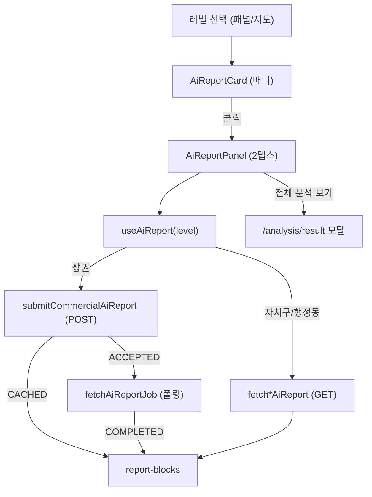

# 상권 분석 — AI 리포트 컴패니언 세부 명세서

> **작성일**: 2026-08-07
> **공통 명세**: [상권 분석 공통 명세](./analysis.md)
> **연관 명세**: [분석 결과 리포트](./result.md), [지도 기반 분석 대상 탐색](./explorer.md)
> **대상**: 웹 (Next.js App Router)
> **작성자**: Claude
> **상태**: 구현 완료 (첫 슬라이스)

이 문서는 상권 분석 탐색(`/analysis`) 흐름에 **AI 리포트**를 붙이는 첫 슬라이스를 구현 수준으로 상세화한다. AI 리포트는 데이터 대시보드(결과 리포트)와 **필요 선택 깊이가 다르다**는 점에서 출발한다: 자치구만 골라도, 행정동·상권까지만 골라도 각 레벨의 AI 리포트를 받을 수 있다. 따라서 "분야까지 다 고른 뒤의 최종 대시보드"에 끼워넣지 않고, **선택 화면에서 현재 선택 레벨을 따라가는 컴패니언**으로 제공한다.

[[_TOC_]]

---

## D0. 배경 / 기획 의도

| 항목              | 내용                                                                                                                                                        |
| ----------------- | ----------------------------------------------------------------------------------------------------------------------------------------------------------- |
| 충족 요구사항     | S3 상권 분석 — AI 리포트 인사이트 제공 (신규 세부)                                                                                                          |
| 해결하려는 문제   | AI 리포트는 자치구/행정동/상권 각 레벨에서 이용 가능한데, 이를 분야까지 전부 선택해야 열리는 데이터 대시보드에 붙이면 리포트의 진짜 granularity를 낭비한다. |
| 목표 동작 (to-be) | 선택 패널 오른쪽에 "[지역] AI 리포트 분석하기" 카드 배너를 띄우고, 클릭 시 2뎁스 컴패니언 패널을 열어 해당 레벨의 AI 리포트를 표시한다.                     |
| 구현 제외 범위    | 상권 비교 AI 리포트, AI 리포트 값을 차트에 강조 연결(칩→차트 하이라이트), 리포트 저장/공유, PDF                                                             |
| 연관 세부 기능    | 결과 대시보드 모달(에스컬레이션 대상), 지도 탐색 선택 상태                                                                                                  |

**핵심 설계 결정 (브레인스토밍 확정)**

1. **컴패니언 모델** — AI 리포트는 선택 화면의 2뎁스 패널(네이버 지도 스택 패턴). 지도를 대체하지 않고 선택 패널 오른쪽에 쌓인다.
2. **카드 게이트** — 선택만으로는 호출하지 않는다. 카드 배너 클릭이 유일한 트리거(비용·부하 방지).
3. **레벨 = 가장 깊게 선택된 단계** — 자치구/행정동/상권.
4. **선택 변경 시 리셋** — 레벨이 바뀌면 카드/패널은 새 레벨의 "분석하기" CTA로 되돌아가고, 재클릭해야 호출한다.
5. **대시보드는 모달 유지** — 결과 대시보드는 기존 모달(넓은 캔버스) 그대로. AI 패널에서 "전체 분석 보기"로 에스컬레이션.
6. **차트 연동 제외** — 추천 시간·타깃 필드는 enum 없는 자유 텍스트라 차트 버킷 매핑이 취약. 컴패니언이 차트와 분리되는 이 슬라이스에서 자연히 후속으로 미룬다.

---

## D1. 기능 개요

`/analysis` 탐색 화면에서 사용자가 자치구·행정동·상권 중 한 레벨을 선택하면, 선택 패널 오른쪽에 **AI 리포트 카드 배너**가 등장한다. 배너를 클릭하면 **2뎁스 컴패니언 패널**이 슬라이드로 열리고, 그때 해당 레벨의 AI 리포트를 조회해 표시한다. 자치구·행정동은 동기 GET으로 즉시, 상권은 비동기 POST + 작업 폴링으로 표시한다. 패널은 접을 수 있고 지도는 계속 선택 도구로 유지된다.

```text
레벨 선택(패널/지도) → 카드 배너 등장 → 클릭(게이트) → 2뎁스 패널 오픈 → 레벨별 리포트 조회 → 표시(접기/재시도/전체분석)
```

### D1-1. UI 진입점 / 기능 연결

> **Figma 디자인**: 별도 Figma 없음. 본 명세와 `frontend/DESIGN.md`, 네이버 지도 스택 패널 레퍼런스를 구현 정본으로 사용한다.

| UI 요소              | 사용자 동작 | 트리거 기능                      | 결과 / UI 반영 상태                                            |
| -------------------- | ----------- | -------------------------------- | -------------------------------------------------------------- |
| AI 리포트 카드 배너  | 클릭        | 컴패니언 패널 오픈 + 리포트 조회 | 2뎁스 패널이 열리고 현재 레벨 리포트를 로딩→표시               |
| 레벨 선택(패널/지도) | 클릭        | 카드/패널 레벨 리셋              | 카드가 새 레벨 "분석하기" CTA로 갱신, 호출은 하지 않음         |
| 패널 접기(`<`)       | 클릭        | 패널 collapse                    | 지도 폭 복원, 카드 배너만 남김                                 |
| 다시 시도            | 클릭        | 리포트 재조회                    | 실패/타임아웃 상태에서 재호출(상권은 재-POST)                  |
| 전체 분석 보기       | 클릭        | 결과 대시보드 모달 이동          | 분야 선택이 완료된 경우 `/analysis/result` 모달로 에스컬레이션 |

---

## D2. 동작 요구사항

| #   | 요구사항                                                                                                    | 상세 참조 |
| --- | ----------------------------------------------------------------------------------------------------------- | --------- |
| 1   | 자치구·행정동·상권 중 한 레벨이 선택되면 선택 패널 오른쪽에 해당 레벨명을 담은 카드 배너를 표시한다.        | D4-1      |
| 2   | 리포트 조회는 카드 배너 클릭 시에만 발생한다. 레벨 선택·미리보기(hover)만으로는 조회하지 않는다.            | D4-1, D5  |
| 3   | 카드가 보고하는 레벨은 항상 가장 깊게 선택된 단계(자치구 < 행정동 < 상권)이다.                              | D5        |
| 4   | 선택 레벨이 바뀌면 열려 있던 패널·카드는 새 레벨의 "분석하기" CTA 상태로 리셋되고, 재클릭해야 조회한다.     | D5, D6    |
| 5   | 자치구·행정동 리포트는 동기 GET으로 조회한다.                                                               | D4-2      |
| 6   | 상권 리포트는 POST 제출 후 `CACHED`면 즉시, `ACCEPTED`면 작업(`jobId`)을 폴링해 `COMPLETED`에서 표시한다.   | D4-3      |
| 7   | 조회 중/실패/타임아웃/빈 결과 상태를 패널 내부에서 분기해 표시하고, 실패·타임아웃은 재시도를 제공한다.      | D6        |
| 8   | 데스크톱은 2뎁스 슬라이드 패널로, 모바일은 기존 바텀시트 계열 surface로 표시한다.                           | D4-4, D6  |
| 9   | 결과 대시보드(`/analysis/result`)는 기존 모달을 유지하고, AI 패널은 "전체 분석 보기"로만 연결한다.          | D4-4      |
| 10  | 비로그인·미하이드레이트·유효하지 않은 코드에서는 카드 배너를 노출하지 않는다(기존 `enabled` 게이트 재사용). | D5        |

---

## D3. 아키텍처 / 시스템 설계

기존 분석 도메인의 **표현/데이터 분리** 패턴(`src/lib/analysis/*` 순수함수 + `src/components/analysis/*` 표현)을 그대로 따른다. 차트 라이브러리·신규 색/토큰 도입 없음.

### D3-1. 컴포넌트 / 모듈 구성

| 모듈 / 컴포넌트                                         | 책임                                                         | 비고                            |
| ------------------------------------------------------- | ------------------------------------------------------------ | ------------------------------- |
| `src/types/ai-report.ts`                                | OpenAPI(`docs/api/openapi/ai-report.json`) 응답 스키마 미러  | 레거시 field 금지               |
| `src/lib/api/ai-report.ts`                              | 4개 호출 어댑터 + 응답 envelope 언랩                         | `apiClient`(`/api/bff`) 사용    |
| `src/lib/analysis/ai-report-presentation.ts`            | 레벨별 응답 → 뷰모델(블록/리스트) 정규화 순수함수            | 테스트 대상                     |
| `src/components/analysis/ai-report/use-ai-report.ts`    | 레벨 분기 조회 훅(동기 GET / 상권 POST+폴링), 상태 머신 반환 | React Query                     |
| `src/components/analysis/ai-report/ai-report-card.tsx`  | 카드 배너 CTA(레벨명·아이콘·클릭)                            | 선택 패널 옆 슬롯               |
| `src/components/analysis/ai-report/ai-report-panel.tsx` | 2뎁스 패널 셸(헤더·접기·상태 분기·전체분석 링크)             | 데스크톱 슬라이드 / 모바일 시트 |
| `src/components/analysis/ai-report/report-blocks.tsx`   | 상권 3블록 + 자치구/행정동 단순 블록 렌더                    | 표현 전용                       |
| `analysis-page.tsx`                                     | 카드 슬롯·2뎁스 패널 레이아웃 배치, 선택 상태 연결           | 기존 그리드 확장                |
| `analysis-mobile-sheet.tsx`                             | 모바일 카드 CTA·리포트 시트 연결                             | 기존 시트 재사용                |



### D3-2. 데이터 흐름 / 상태 머신

카드 클릭 전까지 조회는 일어나지 않는다(`idle`). 클릭 시 레벨에 따라 아래 상태를 거친다.

```text
idle ──클릭──▶ loading ──성공──▶ ready
                 │
                 ├──실패/타임아웃──▶ error ──재시도──▶ loading
                 └──빈 결과──▶ empty
```

- **자치구/행정동**: `loading`(GET in-flight) → `ready` | `error` | `empty`.
- **상권**: `loading`(POST) → (`CACHED`→`ready`) | (`ACCEPTED`→ `polling`) → `COMPLETED`(`ready`) | `FAILED`/timeout(`error`).

### D3-3. 데이터 모델 (OpenAPI 미러)

| 모델                             | 주요 필드                                                                                                                                                                                                                                                    | 비고                    |
| -------------------------------- | ------------------------------------------------------------------------------------------------------------------------------------------------------------------------------------------------------------------------------------------------------------ | ----------------------- |
| `DistrictAiReportResponse`       | `summary`, `marketStatus`, `recommendedBusinessCategories[]`, `cautionBusinessCategories[]`, `businessInsight`, `generatedAt`                                                                                                                                | 자치구·행정동 동일 구조 |
| `AdministrationAiReportResponse` | 위와 동일                                                                                                                                                                                                                                                    |                         |
| `CommercialAiReportResponse`     | `summary`, `strengths[]`, `risks[]`, `recommendedBusinessCategories[]`, `recommendedCustomerSegments[]`, `recommendedOperatingHours[]`, `avoidOperatingHours[]`, `targetAgeGroups[]`, `targetGenders[]`, `operationTips[]`, `businessInsight`, `generatedAt` | 3블록 매핑 원천         |
| `AiReportSubmissionResponse`     | `submissionStatus`(`CACHED`\|`ACCEPTED`), `jobType`, `jobId?`, `commercialReport?`                                                                                                                                                                           | POST 응답               |
| `AiReportJobStatusResponse`      | `jobId`, `jobType`, `status`(`PENDING`\|`RUNNING`\|`COMPLETED`\|`FAILED`), `commercialReport?`, `errorCode?`, `errorMessage?`                                                                                                                                | 폴링 응답               |

모든 응답은 표준 envelope(`dataHeader`/`dataBody`)로 감싸지며, 어댑터가 `dataBody`를 언랩해 위 모델을 반환한다(기존 도메인과 동일).

**상권 3블록 → 필드 매핑**

| 블록      | 필드                                                                                                                                                                                  |
| --------- | ------------------------------------------------------------------------------------------------------------------------------------------------------------------------------------- |
| 헤드라인  | `summary` + `businessInsight`                                                                                                                                                         |
| 강점·주의 | `strengths[]` / `risks[]`                                                                                                                                                             |
| 추천 실행 | `recommendedBusinessCategories[]`, `recommendedCustomerSegments[]`, `recommendedOperatingHours[]`, `avoidOperatingHours[]`, `targetAgeGroups[]`, `targetGenders[]`, `operationTips[]` |

**자치구/행정동 블록**: 헤드라인(`summary`+`marketStatus`) / 추천·주의 업종군(`recommendedBusinessCategories[]` / `cautionBusinessCategories[]`) / 코멘트(`businessInsight`).

### D3-4. 사용 라이브러리 / 기술

| 역할      | 요구 사항                              | 구체 구현                                                                     |
| --------- | -------------------------------------- | ----------------------------------------------------------------------------- |
| 서버 상태 | 조건부 조회, 폴링, 재시도              | 기존 TanStack React Query (`enabled`, `refetchInterval`)                      |
| 폴링      | PENDING/RUNNING 동안만, 상한 타임아웃  | `refetchInterval` 콜백으로 상태 기반 on/off + 경과시간 상한 가드              |
| 표현      | 디자인 토큰, responsive, 별도 패키지 X | 기존 CSS/SVG/semantic HTML, `DESIGN.md` 토큰만                                |
| 인증      | 로그인·세션                            | 기존 BFF 세션 쿠키(`/api/bff`가 Bearer 주입), `useAuthStore` `enabled` 게이트 |

---

## D4. 상세 동작 정의

### D4-1. 카드 배너 게이트

- 표시 조건: `enabled`(하이드레이트 + 로그인 + 유효 코드)이고, 자치구 이상 한 레벨이 선택됨.
- 문구: "[가장 깊은 레벨명] AI 리포트 분석하기" (예: "삼평동 AI 리포트 분석하기").
- 위치: 데스크톱은 선택 패널(380px) 오른쪽 접합부, 모바일은 선택 시트 하단 CTA.
- 동작: 클릭 시에만 패널 오픈 + 조회 시작. 이전 미리보기/선택 이벤트는 조회를 트리거하지 않는다.

### D4-2. 자치구·행정동 리포트 (동기)

- `GET /ai-reports/districts/{districtCode}` / `GET /ai-reports/administrations/{administrationCode}`.
- `apiClient.get('/ai-reports/districts/${code}')` → BFF → 백엔드 `/api/v1/...`.
- 응답 언랩 → 단순 블록 렌더. 실패 시 `error` + 재시도, 본문 없으면 `empty`.

### D4-3. 상권 리포트 (비동기 폴링)

1. `POST /ai-reports/commercials/{commercialCode}` 제출.
2. `submissionStatus === 'CACHED'` → `commercialReport` 즉시 렌더(`ready`).
3. `submissionStatus === 'ACCEPTED'` → `jobId` 저장 후 `GET /ai-reports/jobs/{jobId}` 폴링.
   - 폴링 간격 2초, 상태 `PENDING`/`RUNNING` 동안만 지속, 경과 상한 ~90초.
   - `status === 'COMPLETED'` → `commercialReport` 렌더(`ready`).
   - `status === 'FAILED'` → `errorMessage`와 함께 `error` + 재시도(재-POST).
   - 상한 초과 → 타임아웃 `error` + 재시도.

- 폴링 중에는 진행 상태(생성 중 스켈레톤 + 경과 안내)를 패널 내부에 표시한다.
- deprecated 동기 GET(`GET /ai-reports/commercials/{code}`)은 사용하지 않는다.

### D4-4. 패널 표면 / 에스컬레이션

- **데스크톱**: 선택 패널 오른쪽 2뎁스 슬라이드 패널. `<`로 접기, 지도 폭 복원.
- **모바일**: 기존 바텀시트 계열 surface로 리포트 표시(2뎁스 스택 미적용).
- **전체 분석 보기**: 분야까지 선택 완료된 경우에만 활성화되어 `/analysis/result` 모달로 이동(기존 라우트 재사용). 미완료 시 남은 선택 안내.

---

## D5. 비즈니스 로직

### 레벨 결정

- 선택 코드에서 가장 깊은 단계를 레벨로 확정: `commercial` > `administration` > `district`. `service`(분야)는 AI 리포트 레벨에 영향 없음.

### 선택 변경 리셋

- 레벨 코드가 바뀌면(자치구 교체, 더 깊은 단계 선택 등) 열려 있던 리포트를 폐기하고 카드/패널을 새 레벨 `idle`("분석하기") 상태로 되돌린다. 자동 재조회 없음(비용·부하 방지).
- 같은 레벨·같은 코드 재클릭은 캐시(React Query / 상권 `CACHED`)로 재사용한다.

### 인증 / 노출

- `enabled === false`(비로그인·미하이드레이트·유효하지 않은 코드)면 카드·패널을 노출하지 않는다. 별도 로그인 프롬프트는 이 슬라이스에서 두지 않는다(결과 데이터 자체가 로그인 필요라 일관).

---

## D6. 주의사항

### 비용 / 폴링

- 상권 POST는 LLM 비용 작업. **자동 발사 금지**, 카드 클릭 게이트가 유일 트리거. 재방문·재클릭은 백엔드 `CACHED`로 중복 제거.
- 폴링은 상태 기반으로만 지속하고 상한 타임아웃을 둔다. 무한 폴링·언마운트 후 잔여 폴링을 남기지 않는다.

### 상태 처리

- 각 상태(`idle`/`loading`/`polling`/`ready`/`empty`/`error`)를 패널 내부에서 분기. 실패가 선택 화면 전체를 가리지 않는다.
- 리스트 필드는 `null`/빈 배열을 안전 fallback(해당 항목 숨김).

### 모바일 / 레이아웃

- 2뎁스 스택은 데스크톱 전용. 모바일은 기존 시트 패턴 재사용.
- 데스크톱 패널 오픈/접기 시 지도 폭 변화가 레이아웃을 깨지 않도록 그리드/전이 처리.

### 데이터 검증 제약

- 추천 시간·타깃 필드는 enum·example 없는 자유 텍스트. 이 슬라이스에서 값 파싱/차트 매핑을 하지 않고 텍스트·칩으로만 표시한다.

---

## D7. 테스트케이스

| ID         | 유형 | 사전 조건                         | 동작                    | 기대 결과                                                   |
| ---------- | ---- | --------------------------------- | ----------------------- | ----------------------------------------------------------- |
| TC-AIR-001 | U    | 자치구 선택, 로그인               | 카드 클릭               | 패널 오픈, 자치구 리포트 GET 후 단순 블록 표시              |
| TC-AIR-002 | U    | 상권 선택, 로그인                 | 카드 클릭 → `ACCEPTED`  | 폴링 진행 표시 후 `COMPLETED`에서 3블록 표시                |
| TC-AIR-003 | U    | 상권 선택                         | 카드 클릭 → `CACHED`    | 폴링 없이 즉시 3블록 표시                                   |
| TC-AIR-004 | U    | 상권 폴링 중 `FAILED`             | —                       | 에러 메시지 + 다시 시도(재-POST) 노출                       |
| TC-AIR-005 | U    | 상한 초과까지 미완료              | —                       | 타임아웃 에러 + 재시도, 잔여 폴링 없음                      |
| TC-AIR-006 | U    | 패널 오픈(자치구 리포트) 상태     | 다른 자치구/행정동 선택 | 리포트 폐기, 새 레벨 "분석하기" CTA로 리셋(자동 조회 안 함) |
| TC-AIR-007 | B    | 비로그인                          | 레벨 선택               | 카드 배너 미노출                                            |
| TC-AIR-008 | U    | 순수함수 `ai-report-presentation` | 각 레벨 응답 정규화     | 블록/리스트 뷰모델과 빈/`null` fallback이 정확              |
| TC-AIR-009 | D    | 모바일 뷰포트                     | 카드 CTA 클릭           | 2뎁스 스택 대신 시트 surface로 리포트 표시                  |
| TC-AIR-010 | U    | 분야까지 선택 완료                | "전체 분석 보기" 클릭   | `/analysis/result` 모달로 이동                              |

---

## D8. 미결 사항 / 후속 슬라이스

- **상권 비교 AI 리포트**: 비교 모드(상권 2개) 전제 → 별도 슬라이스.
- **차트 연동(칩→차트 강조)**: 추천 시간·타깃을 결과 대시보드 차트에 강조 연결. 자유 텍스트 매핑 안정화 필요 → 후속.
- **공유 비주얼 언어 정합**: AI 패널 카드/토큰을 결과 대시보드 카드와 시각적으로 통일.
- **폴링 파라미터(간격/타임아웃) 실측 튜닝**: 백엔드 실제 생성 시간 확인 후 조정.

---

## 변경 이력

| 날짜       | 작성자 | 변경                                                 |
| ---------- | ------ | ---------------------------------------------------- |
| 2026-08-07 | Claude | 첫 슬라이스 구현 완료(자치구·행정동·상권 컴패니언)   |
| 2026-08-07 | Claude | 최초 작성 (첫 슬라이스: 자치구·행정동·상권 컴패니언) |
