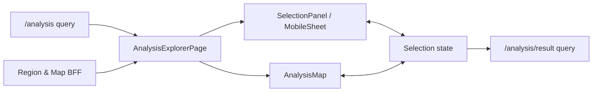
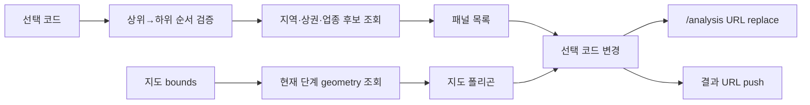

# 상권 분석 — 지도 기반 분석 대상 탐색 세부 명세서

> **작성일**: 2026-07-24
> **공통 명세**: [상권 분석 공통 명세](./analysis.md)
> **대상**: 웹 (Next.js App Router)
> **작성자**: Codex
> **상태**: 명세 완료

이 문서는 상권 분석 공통 명세의 **지도 기반 분석 대상 탐색** 기능을 구현 수준으로 상세화한다.

[[_TOC_]]

---

## D0. 배경 / 기획 의도

| 항목              | 내용                                                                                                                                      |
| ----------------- | ----------------------------------------------------------------------------------------------------------------------------------------- |
| 충족 요구사항     | S3-1 지도 기반 분석 대상 탐색                                                                                                             |
| 해결하려는 문제   | 기존 카드형 선택 UI는 지역의 공간 관계를 보여주지 못하고, 레거시의 줌 기반 단계 전환은 현재 선택 상태가 불명확하며 URL 복원이 불가능하다. |
| 목표 동작 (to-be) | 패널에서 명시적으로 단계를 진행하면서 동일 후보를 지도 폴리곤으로 확인하고, 선택 상태를 URL에 즉시 보존한다.                              |
| 구현 제외 범위    | 지도 기반 지표 heatmap, 자유 반경 검색, 위치 검색, GPS 기반 자동 선택, 시점 선택                                                          |
| 연관 세부 기능    | [분석 결과 리포트](./result.md), [지도 셸 + URL 카메라](./map-shell.md), `/recommend` 지도 구현                                           |

---

## D1. 기능 개요

`/analysis`는 자치구 → 행정동 → 상권 → 업종의 4단계를 제공한다. 목록과 폴리곤은 동일한 선택 상태를 공유하며, 마지막 단계가 완료되면 선택 코드가 담긴 `/analysis/result`로 이동한다.

```text
공개 지역 API → 단계형 선택 상태 → bounds 기반 폴리곤 → URL 동기화 → 결과 CTA
```

### D1-1. UI 진입점 / 기능 연결

> **Figma 디자인**: 별도 Figma 없음. 본 명세와 `frontend/DESIGN.md`를 구현 정본으로 사용한다.

| UI 요소          | 사용자 동작           | 트리거 기능             | 결과 / UI 반영 상태                                              |
| ---------------- | --------------------- | ----------------------- | ---------------------------------------------------------------- |
| 헤더의 상권 분석 | 메뉴 선택             | `/analysis` 진입        | 지도와 4단계 선택 패널을 표시한다.                               |
| 단계 탭/요약 행  | 클릭 또는 키보드 선택 | 활성 단계 변경          | 이미 선택한 상위 단계 범위 안에서 해당 단계의 후보를 표시한다.   |
| 후보 목록        | 클릭/Enter/Space      | 후보 코드 선택          | 하위 선택을 초기화하고 URL, 폴리곤 강조, 지도 bounds를 갱신한다. |
| 지도 폴리곤      | hover/focus/click     | 후보 미리보기 또는 선택 | 패널의 동일 후보와 상태를 동기화한다.                            |
| 분석 결과 CTA    | 클릭                  | 결과 URL 생성           | 지도 셸 위에 결과 레이어가 열린다([map-shell](./map-shell.md)).  |

---

## D2. 동작 요구사항

| #   | 요구사항                                                                                                   | 상세 참조                       |
| --- | ---------------------------------------------------------------------------------------------------------- | ------------------------------- |
| 1   | 단계는 `district → administration → commercial → service` 순서로만 진행한다.                               | D5                              |
| 2   | 상위 단계가 변경되면 그 아래 단계의 선택과 쿼리 캐시 의존 상태를 초기화한다.                               | D5                              |
| 3   | 선택 코드는 `/analysis` 쿼리 문자열에 반영하고 새로고침 시 유효한 순서만 복원한다.                         | D5                              |
| 4   | 지도 bounds API는 현재 화면 범위와 활성 지역 단계에 맞춰 호출한다.                                         | D4                              |
| 5   | 지도 이동 또는 줌만으로 활성 단계와 선택 코드를 변경하지 않는다.                                           | D5                              |
| 6   | 패널 후보와 지도 폴리곤은 hover/focus/selected 상태를 양방향 동기화한다.                                   | D5                              |
| 7   | 업종까지 선택되기 전에는 결과 CTA를 비활성화하고 부족한 조건을 설명한다.                                   | D6                              |
| 8   | 모바일에서는 지도 위 하단 선택 시트를 사용하되 결과 리포트는 시트가 아닌 전체 화면 결과 레이어로 이동한다. | D6, [map-shell](./map-shell.md) |
| 9   | 지도 SDK나 geometry API가 실패해도 목록 기반 선택은 계속 사용할 수 있어야 한다.                            | D6                              |
| 10  | 지역·상권·업종의 로딩, 오류, 빈 데이터 상태를 각 단계 안에서 독립적으로 표시한다.                          | D6                              |

---

## D3. 아키텍처 / 시스템 설계

### D3-1. 시스템 구성

| 모듈 / 컴포넌트          | 책임                                                    | 비고                                                        |
| ------------------------ | ------------------------------------------------------- | ----------------------------------------------------------- |
| `AnalysisExplorerPage`   | URL 상태 해석, 선택 흐름 조율, 데스크톱/모바일 레이아웃 | Client orchestration                                        |
| `AnalysisSelectionPanel` | 단계 표시, 후보 목록, 선택 요약, CTA                    | 목록 기반 선택은 지도와 독립적으로 동작                     |
| `AnalysisMap`            | Kakao Map 초기화, bounds 이벤트, 폴리곤/marker 렌더링   | 브라우저 전용, 동적 로딩                                    |
| `AnalysisMobileSheet`    | 모바일 선택 패널의 접힘/펼침/드래그 상태                | `/recommend`의 검증된 UX 규칙 재사용                        |
| `useAnalysisSelection`   | 상·하위 선택 초기화와 URL 직렬화                        | 전역 저장소 대신 라우트 상태 사용                           |
| `region-map API adapter` | 지역 후보·지도 geometry 응답을 내부 모델로 정규화       | OpenAPI 필드만 사용                                         |
| `map/geometry`           | 좌표 정규화, bounds 생성, 유효 좌표 필터                | 추천의 범용 geometry를 추출하고 추천에서도 동일 모듈을 사용 |
| 기존 `kakao-map` loader  | Kakao SDK 단일 로딩                                     | PR #54 구현 직접 재사용                                     |



### D3-2. 데이터 흐름



### D3-3. 데이터 모델

| 모델                | 필드                     | 타입                                                          | 설명                                                         |
| ------------------- | ------------------------ | ------------------------------------------------------------- | ------------------------------------------------------------ |
| `AnalysisSelection` | `districtCode`           | `string \| null`                                              | 선택 자치구 코드                                             |
|                     | `administrationCode`     | `string \| null`                                              | 선택 행정동 코드                                             |
|                     | `commercialCode`         | `string \| null`                                              | 선택 상권 코드                                               |
|                     | `serviceCode`            | `string \| null`                                              | 선택 업종 코드                                               |
|                     | `periodCode`             | `"20233"`                                                     | 고정 분석 기준 시점                                          |
| `AnalysisStep`      | `value`                  | `"district" \| "administration" \| "commercial" \| "service"` | 현재 활성 선택 단계                                          |
| `MapCandidate`      | `code`, `name`           | `string`                                                      | 패널과 폴리곤을 연결하는 식별자                              |
|                     | `boundary`               | 좌표 배열 또는 `null`                                         | 유효하지 않거나 비어 있으면 폴리곤 대신 center fallback 사용 |
|                     | `center`                 | 좌표 또는 `null`                                              | 폴리곤이 없을 때 marker/지도 이동에 사용                     |
| `ViewportBounds`    | `southWest`, `northEast` | 위·경도                                                       | bounds API 요청 범위                                         |

### D3-4. 사용 라이브러리 / 기술

| 역할          | 요구 사항                               | 구체 구현                                    |
| ------------- | --------------------------------------- | -------------------------------------------- |
| 서버 상태     | 쿼리 캐시, 단계별 loading/error, 재시도 | 기존 TanStack React Query                    |
| 라우트 상태   | 선택 복원, 공유, 브라우저 뒤로가기      | Next.js App Router `useSearchParams`, router |
| 지도 SDK      | 중복 script 방지, 브라우저 전용 로딩    | 기존 `src/lib/kakao-map.ts`                  |
| 지도 geometry | 유효 좌표 정규화, bounds 계산           | 추천에서 범용 모듈로 최소 추출               |
| 반응형        | CSS breakpoint, safe-area, `dvh`        | 기존 Tailwind/CSS와 `frontend/DESIGN.md`     |

---

## D4. 상세 동작 정의

> **API 문서**: `frontend/docs/api/openapi/region-map.json`, `commercial-analysis.json`, `endpoints.md`

요청 파라미터·응답 전체 필드·오류 코드는 저장된 OpenAPI를 정본으로 한다. 브라우저에서는 기존 BFF 규칙에 따라 `/api/v1`을 제거한 `/api/bff/...` 경로를 호출한다.

### D4-1. 단계별 후보 조회

| 사용 엔드포인트                                                                                 | 용도                                 | 응답 → 내부 모델 매핑                  | 비고        |
| ----------------------------------------------------------------------------------------------- | ------------------------------------ | -------------------------------------- | ----------- |
| `GET /api/v1/map/districts`                                                                     | 초기 viewport의 자치구 geometry 조회 | 코드·이름·경계·중심 → `MapCandidate[]` | bounds 필수 |
| `GET /api/v1/regions/districts/{districtCode}/administrations`                                  | 선택 자치구의 행정동 목록 조회       | 코드·이름 → 패널 후보                  | 공개 API    |
| `GET /api/v1/map/administrations`                                                               | 현재 viewport의 행정동 geometry 조회 | 코드·이름·경계·중심 → `MapCandidate[]` | bounds 필수 |
| `GET /api/v1/regions/districts/{districtCode}/administrations/{administrationCode}/commercials` | 선택 행정동의 상권 목록 조회         | 코드·이름 → 패널 후보                  | 공개 API    |
| `GET /api/v1/map/commercials`                                                                   | 현재 viewport의 상권 geometry 조회   | 코드·이름·경계·중심 → `MapCandidate[]` | bounds 필수 |
| `GET /api/v1/commercials/{commercialCode}/service-categories`                                   | 선택 상권의 분석 가능 업종 목록 조회 | 업종 코드·이름 → 패널 후보             | 공개 API    |

### D4-2. 지도 조회 규칙

> 카메라(center·level)의 URL 계약, 첫 페인트 bounds, 쓰로틀 수치는 [map-shell.md D4](./map-shell.md#d4-상세-동작-정의)가 정본이다. 아래는 그 전제 위의 조회 규칙이다.

- 최초 지도는 URL 카메라의 근사 bounds로 시작한다(카메라가 없으면 서울 기본 bounds).
- Kakao `idle` 이후 유효한 viewport bounds를 저장하고 현재 활성 단계의 map endpoint만 조회한다.
- 자치구 선택 후 행정동 단계로 전환할 때 선택 자치구 geometry에 `fitBounds`한다.
- 행정동 선택 후 상권 단계로 전환할 때 선택 행정동 geometry에 `fitBounds`한다.
- 상권 선택 후 업종 단계에서는 상권 profile의 경계가 아니라 이미 확보한 상권 geometry를 유지한다.
- bounds 이벤트는 debounce하고, 동일 bounds/query key의 중복 요청은 React Query 캐시로 합친다.
- geometry 응답이 없거나 유효하지 않아도 목록 API 결과는 유지한다.

### D4-3. 결과 화면 이동

분석 결과 CTA는 현재 `/analysis` URL에도 선택 코드를 먼저 반영한 뒤 다음 경로를 `push`한다.

```text
/analysis/result
  ?districtCode={code}
  &administrationCode={code}
  &commercialCode={code}
  &serviceCode={code}
  &periodCode=20233
  &tab=summary
```

이름은 URL에 넣지 않고 대상 API 응답으로 복원한다.

---

## D5. 비즈니스 로직

### 선택 상태 전환


| 변경한 단계 | 유지                             | 초기화                                                | 다음 활성 단계 |
| ----------- | -------------------------------- | ----------------------------------------------------- | -------------- |
| 자치구      | `districtCode`                   | `administrationCode`, `commercialCode`, `serviceCode` | 행정동         |
| 행정동      | 자치구, `administrationCode`     | `commercialCode`, `serviceCode`                       | 상권           |
| 상권        | 자치구, 행정동, `commercialCode` | `serviceCode`                                         | 업종           |
| 업종        | 모든 선택 코드                   | 없음                                                  | 완료           |

### URL 복원 규칙

1. 쿼리 코드는 문자열로만 읽고 서버 응답 후보에 존재하는지 상위 단계부터 검증한다.
2. 상위 코드가 없거나 유효하지 않으면 모든 하위 코드를 무시한다.
3. 유효하지 않은 하위 코드부터 제거한 정규화 URL로 `replace`한다.
4. URL 변경은 선택 동작 단위로 수행하며 타이핑 상태나 hover 상태는 URL에 저장하지 않는다.
5. `periodCode`는 이번 범위에서 `20233`만 허용한다.

### 지도와 패널 상호작용

| 상태        | 지도 폴리곤                      | 패널 후보                           |
| ----------- | -------------------------------- | ----------------------------------- |
| 기본        | 디자인 토큰의 약한 채움/윤곽     | 기본 행                             |
| hover/focus | 강조 채움과 굵은 윤곽            | 동일 후보에 preview 상태            |
| selected    | 브랜드 강조색, 가장 높은 z-order | 선택 체크와 선택 요약               |
| unavailable | 렌더링 제외 또는 비활성 표현     | 선택 불가 사유가 있으면 텍스트 제공 |

hover는 미리보기일 뿐 선택이나 API 후보 범위를 바꾸지 않는다. 터치 환경에서는 첫 탭을 선택으로 처리한다.

---

## D6. 주의사항

### 데스크톱 구조

- 헤더 아래 가용 높이를 지도와 좌측 고정 패널이 채운다.
- 패널은 약 360~400px 너비로 독립 스크롤하며 지도는 나머지 영역을 사용한다.
- 선택 요약과 CTA는 패널 하단에서 쉽게 접근할 수 있도록 유지한다.
- 전역 푸터는 `data-hide-footer` 기존 패턴으로 숨긴다.

### 모바일 구조

- 지도는 화면 배경으로 유지하고, 상단에는 현재 단계와 뒤로가기를 간결하게 배치한다.
- 선택 UI는 safe-area를 반영한 하단 시트로 제공한다.
- 시트는 접힘/중간/확장 상태를 가지며 손잡이, 스크롤 경계, reduced-motion을 처리한다.
- 결과 CTA 선택 시 큰 바텀시트를 확장하지 않고 `/analysis/result` 전체 화면 결과 레이어로 이동한다.

### 상태 처리

| 상태                     | UI 처리                                          |
| ------------------------ | ------------------------------------------------ |
| 지도 SDK 로딩            | 지도 skeleton, 패널은 즉시 사용 가능             |
| 지도 SDK 실패            | 지도 영역 오류 + 재시도, 패널 선택 유지          |
| geometry 로딩/실패/빈 값 | 지도 skeleton 또는 안내, 목록 선택 유지          |
| 후보 목록 로딩           | 해당 단계 skeleton, 이전 선택 요약 유지          |
| 후보 목록 실패           | 해당 단계 오류 + 재시도, 상위 선택 유지          |
| 후보 목록 빈 값          | “선택 가능한 항목이 없어요”와 상위 단계 변경 CTA |
| 잘못된 URL 코드          | 유효한 상위 단계까지만 복원하고 하위 코드를 정리 |
| 결과 조건 미완료         | CTA 비활성 + “상권과 업종을 선택해 주세요”       |

### 접근성·인증

- 폴리곤만으로 정보를 전달하지 않고 동일한 후보 목록을 항상 제공한다.
- 후보 목록은 키보드로 선택 가능하고 `aria-selected`, 현재 단계, 로딩 상태를 노출한다.
- 모바일 sheet가 확장되면 배경의 불필요한 포커스 이동을 제한한다.
- `/analysis`는 공개 경로다.
- middleware의 기존 `/analysis` 전체 보호는 제거하되 `/analysis/simulation/:path*`는 명시적으로 보호한다.

### 재사용 범위

- `src/lib/kakao-map.ts`는 그대로 재사용한다.
- 추천의 좌표 정규화·bounds 계산은 범용 `src/lib/map/geometry.ts`로 최소 추출하고 추천 import도 동일 모듈을 바라보게 한다.
- 추천의 900줄 이상 지도 컴포넌트 전체를 공통화하지 않는다.
- 모바일 sheet의 interaction은 동작 규칙을 재사용하되, 공통화가 오히려 조건 분기를 늘리면 분석 전용 컴포넌트로 둔다.

---

## D7. 테스트케이스

| TC ID     | 범위 | 사전 조건            | 수행 절차                                  | 기대 결과                                                       |
| --------- | ---- | -------------------- | ------------------------------------------ | --------------------------------------------------------------- |
| TC-AN-001 | D    | `/analysis` 진입     | 자치구→행정동→상권→업종을 순서대로 선택    | 각 선택이 URL에 반영되고 하위 단계가 순서대로 열린다.           |
| TC-AN-002 | D    | 모든 단계 선택       | 자치구를 다른 값으로 변경                  | 행정동·상권·업종 선택이 초기화되고 CTA가 비활성화된다.          |
| TC-AN-003 | D    | 지도 표시            | 지도를 이동·확대·축소                      | geometry 조회 bounds만 바뀌고 현재 단계·선택 코드는 유지된다.   |
| TC-AN-004 | D    | 폴리곤과 목록 표시   | 목록 후보 hover/focus 후 폴리곤 클릭       | 양쪽 preview/selected 상태가 동일 코드로 동기화된다.            |
| TC-AN-005 | D    | 유효한 선택 URL      | 새로고침                                   | 상위 단계부터 선택이 복원되고 동일 상권·업종이 선택된다.        |
| TC-AN-006 | D    | 잘못된 하위 코드 URL | 직접 접근                                  | 유효한 상위 선택만 남고 잘못된 하위 쿼리는 제거된다.            |
| TC-AN-007 | D    | 지도 SDK 오류 모킹   | 단계별 후보 선택                           | 목록 선택과 URL 갱신은 정상 동작하고 지도에 재시도를 표시한다.  |
| TC-AN-008 | D    | 후보 API 빈 배열     | 해당 단계 진입                             | 빈 상태 안내와 상위 단계 변경 동작을 제공한다.                  |
| TC-AN-009 | D    | 모바일 viewport      | 시트를 펼치고 목록 스크롤 후 결과 CTA 선택 | 시트와 지도 스크롤이 충돌하지 않고 전체 결과 페이지로 이동한다. |
| TC-AN-010 | D    | 키보드 사용자        | Tab, Enter, Space, Escape로 탐색           | 포커스가 보이고 후보 선택·단계 이동을 수행할 수 있다.           |

---

## D8. 미결 사항 / 데이터 검증 제약

아래는 구현 결정을 막는 미결 사항이 아니라, 실제 백엔드 데이터가 준비되면 추가 검증해야 하는 항목이다.

| #   | 항목                                                                  | 대응                                                                                         |
| --- | --------------------------------------------------------------------- | -------------------------------------------------------------------------------------------- |
| 1   | 개발 환경의 지역·지도 API가 성공 응답과 빈 배열을 반환한 이력이 있다. | API adapter 단위 테스트와 fixture로 구현하고, 실데이터 적재 후 폴리곤·목록 E2E를 재검증한다. |
| 2   | 일부 `boundaryCoords`가 비어 있거나 잘못된 좌표일 수 있다.            | 잘못된 좌표를 제거하고 center marker 또는 목록 전용 상태로 fallback한다.                     |
| 3   | API에 사용 가능한 분석 시점 목록 endpoint가 없다.                     | `20233`을 고정 사용하고 시점 선택기는 노출하지 않는다.                                       |

---

## 변경 이력

| 버전 | 날짜       | 변경 내용                                                                                                  | 작성자 |
| ---- | ---------- | ---------------------------------------------------------------------------------------------------------- | ------ |
| 1.0  | 2026-07-24 | URL 동기화 지도 탐색과 반응형 선택 패널 명세 최초 작성                                                     | Codex  |
| 1.1  | 2026-08-26 | 지도 셸 도입에 맞춰 결과 이동 서술 정정, 카메라·첫 페인트 bounds 정본을 [map-shell](./map-shell.md)로 위임 | Claude |
