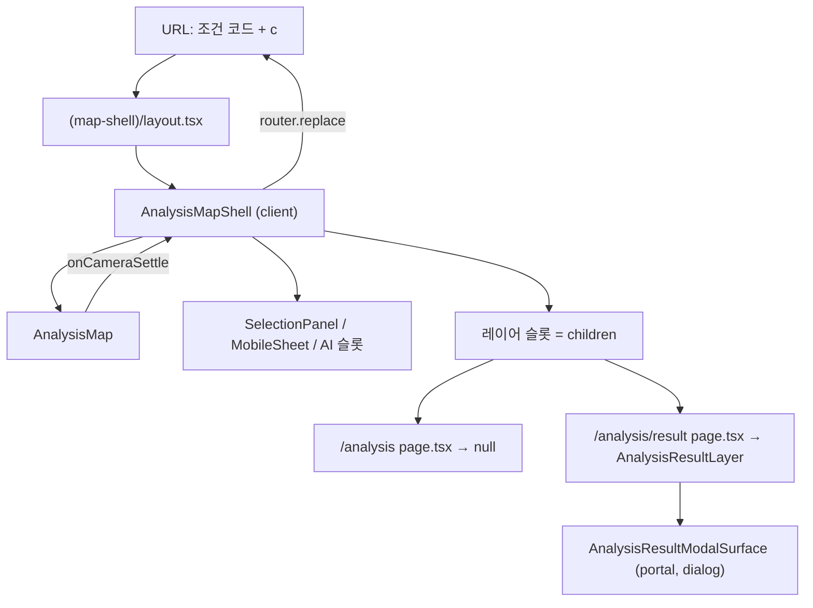
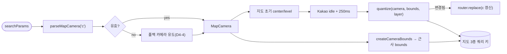
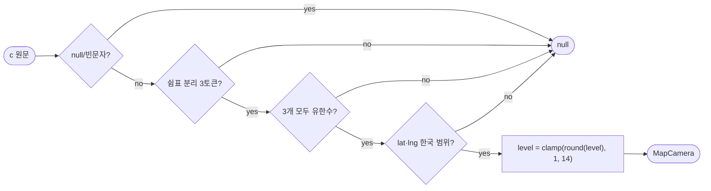

# 상권 분석 — 지도 셸 + URL 카메라 상태 세부 명세서

> **작성일**: 2026-08-26
> **공통 명세**: [상권 분석 공통 명세](./analysis.md)
> **연관 명세**: [지도 기반 분석 대상 탐색](./explorer.md), [분석 결과 리포트](./result.md), [모바일 반응형 바텀시트](./mobile-responsive.md)
> **대상**: 웹 (Next.js App Router)
> **작성자**: Claude
> **상태**: 초안

이 문서는 상권 분석 공통 명세의 **지도 셸(map shell) + URL 카메라 상태** 기능을 구현 수준으로 상세화한다.

- 공통 명세에 이미 기술된 전체 흐름·요구사항은 반복하지 않고 참조한다.
- 이 문서는 **`/analysis` 와 `/analysis/result` 의 라우팅 구조**와 **지도 카메라의 URL 계약**을 정본으로 정의한다. 두 화면의 지표·리포트 내용은 [result.md](./result.md), 단계형 선택 규칙은 [explorer.md](./explorer.md)가 계속 정본이다.
- 이 문서가 정의하는 구조는 **explorer.md·result.md 의 일부 서술을 대체**한다. 대체 지점은 D0 표에 명시한다.

[[_TOC_]]

---

## D0. 배경 / 기획 의도

| 항목              | 내용                                                                                                                                                                                                                                                                                                                                                                                                                                                          |
| ----------------- | ------------------------------------------------------------------------------------------------------------------------------------------------------------------------------------------------------------------------------------------------------------------------------------------------------------------------------------------------------------------------------------------------------------------------------------------------------------- |
| 충족 요구사항     | 공통 명세 S2-4(선택 상태 URL 보존), S2-5(지도 이동은 조회 범위만 변경), S3-1·S3-2(탐색·결과가 한 공간 맥락 안에 있어야 함)                                                                                                                                                                                                                                                                                                                                    |
| 해결하려는 문제   | ① `/analysis/result?...` 를 **새로고침·직접 접근하면 지도가 사라지고 리포트만 있는 단독 페이지**가 뜬다. 조건 코드는 남지만 공간 맥락(지도·선택 폴리곤·중심·줌)은 전부 사라진다. intercepting route(`@modal`)가 **소프트 내비게이션만** 가로채기 때문이다. ② 지도 카메라가 URL에 없어서, 탐색 화면조차 새로고침하면 항상 `SEOUL_CENTER` / `level: 8`(하드코딩, `analysis-map.tsx:211-212`)로 되돌아간다. 공유 링크·보관함으로 받은 링크도 같은 문제를 겪는다. |
| 목표 동작 (to-be) | **지도가 셸**이다. `/analysis` 와 `/analysis/result` 는 같은 지도 위에서 열리고, 결과는 그 위의 레이어다. `@modal` 을 제거해 소프트/하드 두 벌 구조를 한 경로로 합친다. 지도 카메라(center + level)를 URL 파라미터 `c` 에 실어, 하드 로드·공유 링크·보관함 진입에서 **선택된 상권·지도 중심·줌**이 함께 복원된다.                                                                                                                                             |
| 구현 제외 범위    | **결과 뷰를 네이버식 좁은 도킹 패널로 바꾸는 시각 재설계.** 현재 결과 표면은 `min(1400px,100%) × min(920px, …)` 로 지도를 거의 덮는다. 이를 좁히는 일은 7개 섹션 롱스크롤 리포트의 정보구조를 다시 짜는 작업(차트 폭·사이드바 내비·스크롤스파이 전부 영향)이라 이 문서의 라우팅·URL 작업과 성격이 다르다. **Level 1(지도가 셸이 되고 카메라가 복원됨)을 먼저 넣고 실제로 써 본 뒤** 도킹 패널 필요 여부를 판단한다. 이 판단은 D8-1에 미결로 남긴다.           |
|                   | 그 외 제외: 지도 회전·기울기(카카오 지도 미지원 범위), 지도 heatmap·검색, `periodCode` 를 URL 정본으로 승격하는 작업, `/analysis/report`·`/analysis/simulation` 의 레이아웃 변경, 백엔드 계약 변경                                                                                                                                                                                                                                                            |
| 연관 세부 기능    | [explorer](./explorer.md), [result](./result.md), [mobile-responsive](./mobile-responsive.md), [share](../share/share.md)                                                                                                                                                                                                                                                                                                                                     |

### 기존 명세 중 이 문서로 대체되는 서술

| 위치                                              | 기존 서술                                                  | 이 문서의 결정                                                                            |
| ------------------------------------------------- | ---------------------------------------------------------- | ----------------------------------------------------------------------------------------- |
| analysis.md S5 TC-005                             | "배경 지도 없이 독립 결과 페이지가 복원된다"               | 지도 셸 위 결과 레이어로 복원된다 (D7 TC-MS-030)                                          |
| explorer.md D1-1 / D2-8                           | "데스크톱은 라우트 모달, 모바일은 전체 결과 페이지로 이동" | 두 경우 모두 같은 결과 레이어. 모바일은 레이어가 전체화면이고 뒤 지도를 언마운트한다 (D5) |
| result.md D3-1 (`@modal/*` 3행) · D3-2 · D5 표    | intercepting route + canonical route 두 표면               | `@modal` 제거, `(map-shell)` 라우트 그룹 단일 표면 (D3-1)                                 |
| result.md D2-2, D6 "모바일·독립 페이지"           | "모바일·직접 접근·새로고침은 독립 전체 페이지"             | 독립 페이지 개념을 폐기. 결과는 항상 셸 위 레이어 (D3-1)                                  |
| explorer.md D4-2 "최초 지도는 서울 기본 bounds로" | 항상 `SEOUL_MAP_BOUNDS` 로 시작                            | URL 카메라가 있으면 카메라 근사 bounds로 시작 (D4-4)                                      |

---

## D1. 기능 개요

`/analysis` 와 `/analysis/result` 를 감싸는 라우트 그룹 레이아웃이 지도·카메라·지도 데이터·선택 패널을 소유한다. 각 라우트의 `page.tsx` 는 그 위에 올릴 레이어만 결정한다(`/analysis` = 없음, `/analysis/result` = 결과 리포트 레이어). 지도 카메라는 URL 파라미터 `c=lat,lng,level` 로 직렬화되어, 하드 로드·공유·보관함 진입에서 같은 카메라로 복원된다.

```
URL(조건 코드 + c) → 카메라 파싱/폴백 → 지도 초기화 → 근사 bounds로 지도 데이터 조회
→ 지도 idle(250ms 디바운스) → 카메라·bounds·레이어 emit → router.replace(c 갱신) + 활성 레이어 재조회
```

### D1-1. UI 진입점 / 기능 연결

> **Figma 디자인**: 별도 Figma 없음. 본 명세와 `frontend/DESIGN.md` 를 구현 정본으로 사용한다.

| UI 요소 (Figma 참조)                | 사용자 동작                       | 트리거 기능 | 결과 / UI 반영 상태                                                                                   |
| ----------------------------------- | --------------------------------- | ----------- | ----------------------------------------------------------------------------------------------------- |
| 지도 캔버스                         | 드래그(팬) / 휠·핀치(줌)          | D4-2        | 제스처가 끝나면 URL `c` 가 `replace` 로 갱신되고, 활성 레이어 지도 데이터가 새 bounds로 최대 1회 조회 |
| 지도 폴리곤·라벨                    | 클릭                              | D4-3        | 기존 선택 동작 유지 + 프로그래매틱 fit → 그 결과 카메라도 URL에 반영                                  |
| 선택 패널 후보                      | 클릭                              | D4-3        | 동일                                                                                                  |
| 분석 결과 CTA                       | 클릭                              | D4-3        | `push` 로 `/analysis/result?…&c=…` 이동 → 지도 위에 결과 레이어가 열림                                |
| 결과 레이어 닫기(X) / Escape / 배경 | 클릭 / 키 / 배경 mousedown        | D4-5        | 결과 레이어가 닫히고 같은 카메라의 `/analysis?…&c=…` 로 복귀 (사이트를 벗어나지 않음)                 |
| 브라우저 새로고침 / 공유 링크 진입  | F5 / `/s/{shareCode}` → `replace` | D4-4        | 지도 셸 + 결과 레이어가 함께 뜬다. `c` 가 있으면 그 카메라, 없으면 선택 기준 폴백 카메라              |
| 브라우저 뒤로가기                   | Back                              | D4-5        | 결과 레이어를 `push` 로 열었으면 닫힌다. 카메라 변경은 `replace` 라 히스토리에 남지 않는다            |

---

## D2. 동작 요구사항

| #   | 요구사항                                                                                                                               | 상세 참조 |
| --- | -------------------------------------------------------------------------------------------------------------------------------------- | --------- |
| 1   | `/analysis` 와 `/analysis/result` 는 같은 지도 셸 레이아웃 아래에서 렌더된다. 하드 로드·소프트 내비게이션의 결과 표면이 동일해야 한다. | D3-1      |
| 2   | `@modal` 병렬·인터셉팅 라우트를 제거한다. 결과 표면은 한 벌만 존재한다.                                                                | D3-1, D6  |
| 3   | 지도 셸 레이아웃은 `/analysis/report`·`/analysis/simulation/**` 에는 적용되지 않는다.                                                  | D3-1      |
| 4   | 지도 카메라는 `c=lat,lng,level` 한 개 파라미터로 URL에 보존한다. `viewportBounds` 는 URL에 넣지 않는다.                                | D4-1      |
| 5   | 카메라 URL 갱신은 항상 `router.replace` 다. `push` 를 쓰지 않는다.                                                                     | D4-2, D5  |
| 6   | 카메라 갱신·지도 데이터 재조회는 지도 `idle` + 250ms 디바운스 뒤 **제스처당 각각 최대 1회**만 발생한다.                                | D4-2      |
| 7   | 잘못된 `c` 값(토큰 수 불일치, NaN, 좌표 범위 밖)은 조용히 폐기하고 폴백 카메라를 쓴다. 사용자에게 오류를 노출하지 않는다.              | D5        |
| 8   | `c` 가 없는 URL(기존 링크, 이미 저장된 보관함 항목)도 정상 동작해야 한다. 선택 코드에서 폴백 카메라를 유도한다.                        | D4-4, D5  |
| 9   | 조건 코드를 쓰는 모든 URL 빌더(`/analysis`, `/analysis/result`, 결과 탭 전환)는 현재 카메라를 **보존**해야 한다.                       | D4-1      |
| 10  | 결과 레이어 닫기는 어떤 진입 경로에서도 사이트를 벗어나지 않는다.                                                                      | D4-5      |
| 11  | 공유 링크·분석 보관함 payload 에는 카메라를 담지 않는다.                                                                               | D4-6      |
| 12  | 좁은 뷰포트(≤1024px)에서 결과 레이어가 열려 있는 동안 지도를 언마운트하고 지도 데이터 조회를 중단한다.                                 | D5, D6    |
| 13  | 결과 레이어는 `role="dialog"`·`aria-modal="true"`·포커스 트랩·Escape·배경 inert 를 하드 로드 경로에서도 유지한다.                      | D6        |

---

## D3. 아키텍처 / 시스템 설계

### D3-1. 시스템 구성

라우팅은 **라우트 그룹**으로 나눈다. `app/(shell)/analysis/layout.tsx` 는 `/analysis/**` 전체(= simulation·report 포함)에 걸리므로 그 자리에 지도를 올릴 수 없다. 지도를 원하는 두 라우트만 URL에 영향 없는 그룹 `(map-shell)` 안으로 옮긴다.

| 파일 / 모듈                                              | 처리                                          | 책임                                                                                                                                                                        |
| -------------------------------------------------------- | --------------------------------------------- | --------------------------------------------------------------------------------------------------------------------------------------------------------------------------- |
| `app/(shell)/analysis/layout.tsx`                        | **삭제**                                      | `{children}{modal}` 8줄. `@modal` 이 없어지면 존재 이유가 없다                                                                                                              |
| `app/(shell)/analysis/@modal/(.)result/page.tsx`         | **삭제**                                      | intercepting route                                                                                                                                                          |
| `app/(shell)/analysis/@modal/default.tsx`                | **삭제**                                      | 병렬 슬롯 기본값                                                                                                                                                            |
| `app/(shell)/analysis/(map-shell)/layout.tsx`            | **신규**                                      | 서버 컴포넌트. `<AnalysisMapShell>{children}</AnalysisMapShell>` 만 렌더                                                                                                    |
| `app/(shell)/analysis/(map-shell)/page.tsx`              | **이동** (`../page.tsx`)                      | `/analysis`. 메타데이터 유지. 본문은 `return null` — 탐색 화면의 UI는 전부 셸이 소유한다                                                                                    |
| `app/(shell)/analysis/(map-shell)/result/page.tsx`       | **이동** (`../result/page.tsx`)               | `/analysis/result`. 메타데이터 유지. `<AnalysisResultLayer/>` 렌더                                                                                                          |
| `app/(shell)/analysis/report/**`, `simulation/**`        | 변경 없음                                     | 그룹 밖이라 지도 셸이 걸리지 않는다                                                                                                                                         |
| `src/components/analysis/analysis-map-shell.tsx`         | **신규** (기존 `analysis-page.tsx` 개명·확장) | 클라이언트. 카메라·bounds·mapLayer·fit·preview·requestedStep 소유, 지도 3종 + 후보 4종 쿼리, 지도·패널·시트·AI 슬롯 렌더, `children` 을 레이어 슬롯에 렌더, 컨텍스트 제공   |
| `src/components/analysis/analysis-map-shell-context.tsx` | **신규**                                      | `useAnalysisMapShell()` — 결과 레이어가 `closeResultLayer`·현재 카메라를 읽는 통로                                                                                          |
| `src/components/analysis/analysis-result-layer.tsx`      | **신규**                                      | `AnalysisResultModalSurface` + `AnalysisResultView` 조립. 닫기는 셸 컨텍스트의 `closeResultLayer`                                                                           |
| `src/components/analysis/analysis-result-modal.tsx`      | 축소                                          | `AnalysisResultModalSurface`(포털·포커스 트랩·Escape·스크롤 락)는 **유지** — `ai-report-panel.tsx` 가 재사용 중. 기본 export `AnalysisResultModal`(=`router.back()`)만 삭제 |
| `src/components/analysis/analysis-result-page.tsx`       | **삭제**                                      | `AnalysisResultPageSurface` 는 "지도 없는 독립 페이지" 전용. 개념 자체가 폐기됨. 동반 테스트도 삭제                                                                         |
| `src/components/analysis/analysis-map.tsx`               | 수정                                          | 초기 카메라를 prop 으로 받는다(하드코딩 제거). `onViewportBoundsChange`·`onZoomLayerChange` → `onCameraSettle` 단일 콜백으로 통합                                           |
| `src/lib/analysis/map-camera.ts`                         | **신규**                                      | 카메라 파싱·직렬화·양자화·클램프·근사 bounds·기본 카메라. 순수 함수만                                                                                                       |
| `src/lib/analysis/selection.ts`                          | 수정                                          | href 빌더 3종이 카메라를 옵션으로 받아 `c` 를 보존                                                                                                                          |
| `src/hooks/use-narrow-viewport.ts`                       | **신규**                                      | `matchMedia('(max-width: 1024px)')` SSR 안전 래퍼. 모바일 지도 언마운트 판정에만 사용                                                                                       |



### D3-2. 데이터 흐름



### D3-3. 데이터 모델

| 모델                           | 필드               | 타입         | 설명                                                |
| ------------------------------ | ------------------ | ------------ | --------------------------------------------------- |
| `MapCamera`                    | `lat`              | `number`     | 지도 중심 위도. 직렬화 시 소수 5자리                |
|                                | `lng`              | `number`     | 지도 중심 경도. 직렬화 시 소수 5자리                |
|                                | `level`            | `number`     | 카카오 지도 level(정수). 작을수록 확대              |
| `CameraSettle`                 | `camera`           | `MapCamera`  | 양자화된 카메라                                     |
|                                | `bounds`           | `GeoBounds`  | 외향 양자화된 조회 bounds (기존 `GeoBounds` 그대로) |
|                                | `layer`            | `MapLayer`   | `resolveMapLayerByZoom(level)` 결과                 |
| `AnalysisMapShellContextValue` | `camera`           | `MapCamera`  | 현재 카메라(URL 정본)                               |
|                                | `closeResultLayer` | `() => void` | 결과 레이어 닫기. D4-5 규칙 내장                    |
|                                | `openedByPush`     | `boolean`    | 결과 레이어를 이 셸 인스턴스가 `push` 로 열었는가   |

**상수**

| 상수                       | 값                                                  | 근거                                                                                |
| -------------------------- | --------------------------------------------------- | ----------------------------------------------------------------------------------- |
| `MAP_CAMERA_PARAM`         | `'c'`                                               | 네이버 지도와 같은 키. 기존 파라미터(`districtCode`·…·`tab`)와 충돌 없음(실측 확인) |
| `MAP_CAMERA_PRECISION`     | `5` (소수 자리)                                     | 1e-5° ≈ 1.1m. 모든 level 에서 육안 차이 없음. D4-1 참조                             |
| `MAP_CAMERA_LEVEL_MIN/MAX` | `1` / `14`                                          | 앱이 실제로 쓰는 범위는 3~8. 여유를 두고 클램프                                     |
| `SEOUL_DEFAULT_CAMERA`     | `{ lat: 37.5665, lng: 126.978, level: 8 }`          | 기존 `analysis-map.tsx` 의 `SEOUL_CENTER` + `level: 8` 을 상수로 승격               |
| `MAP_IDLE_DEBOUNCE_MS`     | `250`                                               | 기존 `VIEWPORT_DEBOUNCE_MS` 값 그대로 유지                                          |
| `MAP_BOUNDS_QUANTIZE_STEP` | `0.001` (도)                                        | ≈ 111m(위도) / 88m(경도). 외향 라운딩과 결합해 미세 팬을 캐시 히트로 흡수           |
| `CAMERA_LEVEL_BY_DEPTH`    | `district: 6`, `administration: 4`, `commercial: 3` | 기존 `PANEL_FIT_LEVEL_BY_STEP` 과 동일 값 재사용                                    |

### D3-4. 사용 라이브러리 / 기술 (역할 기준)

| 역할                  | 요구 사항                                          | 구체 구현                                                                                |
| --------------------- | -------------------------------------------------- | ---------------------------------------------------------------------------------------- |
| 라우팅 셸             | URL 세그먼트 없이 두 라우트만 감싸는 공통 레이아웃 | Next App Router **라우트 그룹** `(map-shell)`                                            |
| 레이아웃 상태 보존    | `/analysis` ↔ `/analysis/result` 전환 시 지도 유지 | App Router 레이아웃은 형제 라우트 이동 시 리마운트되지 않음                              |
| URL 상태              | 카메라 읽기/쓰기                                   | `useSearchParams` + `router.replace`                                                     |
| 지도 SDK              | 중복 로딩 방지, 브라우저 전용                      | 기존 `src/lib/kakao-map.ts` (재로딩 캐시 있음 — 언마운트 후 재마운트 시 재다운로드 없음) |
| 서버 상태             | bounds 기반 지도 3종, 후보 4종                     | 기존 TanStack React Query (전역 `staleTime: 5분`)                                        |
| 뷰포트 분기(언마운트) | SSR 안전한 `matchMedia`                            | 신규 `use-narrow-viewport.ts` (초기값 `false`, 마운트 후 갱신)                           |
| dialog 접근성         | 포털·포커스 트랩·Escape·스크롤 락                  | 기존 `AnalysisResultModalSurface` 그대로 재사용                                          |

---

## D4. 상세 동작 정의

> **API 문서**: 실행 중 Swagger — `https://api-dev.bosspickseoul.com/district-service/v3/api-docs`(지도 3종·상권 profile), `https://api-dev.bosspickseoul.com/commercial-service/v3/api-docs`(공유 링크·분석 보관함)

이 기능은 **새 엔드포인트를 추가하지 않는다.** 기존 호출의 **파라미터 값(bounds)** 과 **호출 시점**만 바꾼다.

| 사용 엔드포인트                                        | 용도                      | 이 기능이 바꾸는 것                                                             | 비고                                                                                         |
| ------------------------------------------------------ | ------------------------- | ------------------------------------------------------------------------------- | -------------------------------------------------------------------------------------------- |
| `GET /api/v1/map/districts`                            | 자치구 폴리곤             | 첫 호출 bounds 가 `SEOUL_MAP_BOUNDS` → **카메라 근사 bounds**. 재조회 빈도 D4-2 | 필수 파라미터 `lngSW`·`latSW`·`lngNE`·`latNE` 4개뿐(실측). zoom 파라미터 없음                |
| `GET /api/v1/map/administrations`                      | 행정동 폴리곤             | 동일                                                                            | 동일                                                                                         |
| `GET /api/v1/map/commercials`                          | 상권 폴리곤               | 동일                                                                            | 동일                                                                                         |
| `GET /api/v1/map/commercials/{commercialCode}/profile` | 카메라 폴백용 상권 중심점 | `c` 가 없고 `commercialCode` 가 있을 때 셸이 같은 쿼리 키로 1회 참조            | 응답에 `centerLat`·`centerLng`·`boundaryCoords`(빈 배열 가능) 존재(실측). `serviceCode` 필수 |

> 요청 파라미터·응답 전체 필드·에러 코드는 Swagger 를 정본으로 한다. 이 표는 호출 흐름과 이 기능이 바꾸는 지점만 정의한다.

### D4-1. URL 파라미터 설계

**키와 포맷**

```
/analysis/result
  ?districtCode=11200
  &administrationCode=11200790
  &commercialCode=3110130
  &serviceCode=CS100001
  &periodCode=20233
  &tab=summary
  &c=37.54893,127.06612,3      ← 신규. lat,lng,level
```

| 결정 항목        | 결정                                    | 근거                                                                                                                                                                                                                                                                                      |
| ---------------- | --------------------------------------- | ----------------------------------------------------------------------------------------------------------------------------------------------------------------------------------------------------------------------------------------------------------------------------------------- |
| 키 이름          | `c`                                     | 네이버 지도와 동일해 팀 내 인지 비용이 없다. 기존 6개 파라미터와 충돌하지 않는다(실측). 로그인 `redirect` 등 다른 화면의 키와도 충돌 없음                                                                                                                                                 |
| 패킹 vs 분리     | **1개 키에 패킹**(`lat,lng,level`)      | ① 카메라는 "있다/없다"가 하나의 사건이다 — 폴백 규칙(D4-4)과 payload 제외 필터(D4-6)가 키 1개만 보면 된다. 분리형(`lat`·`lng`·`z`)은 3개 중 2개만 있는 반쪽 상태를 만들 수 있다. ② 파라미터 3개가 늘면 이미 6개인 쿼리가 9개가 되어 육안 가독성이 오히려 나빠진다. ③ URL 길이도 짧다      |
| 값 순서          | `lat,lng,level`                         | 소비처가 카카오 지도 `new maps.LatLng(lat, lng)` 하나뿐이라 위도 우선이 변환 없이 맞는다. 프로젝트의 `GeoBounds`·`MapPoint` 는 경도 우선이므로 **혼동 위험이 있다** → D5 검증 규칙에서 좌표 범위 가드로 뒤바뀐 값을 폐기한다                                                              |
| 소수 자리        | **5자리** (`Math.round(v * 1e5) / 1e5`) | 1e-5° ≈ 1.1m. 가장 확대된 level 1 에서도 육안 차이가 없다. 4자리(≈11m)는 level 1~2 에서 미세 점프가 보이고, 6자리(≈0.11m)는 **팬마다 URL 뒷자리가 요동친다** — 지도 관성·픽셀 반올림만으로도 값이 바뀌어 `replace` 가 무의미하게 발생한다. 5자리는 그 요동을 흡수하면서 정확도를 유지한다 |
| level 표현       | 정수                                    | 카카오 지도 level 은 정수 단계다. 소수는 `Math.round` 로 정수화                                                                                                                                                                                                                           |
| 파라미터 위치    | 쿼리 문자열 **마지막**                  | 조건 코드가 앞에 모여 있어야 사람이 URL 을 읽을 때 "무엇을 분석하는지"가 먼저 보인다                                                                                                                                                                                                      |
| 네이버식 `dh` 등 | 채택하지 않음                           | 네이버의 `c=…,0,0,0,dh` 뒤 4개 토큰은 회전·기울기·표시모드다. 카카오 지도 + 우리 화면에 대응 개념이 없어 자리표시자만 남는다                                                                                                                                                              |

**기존 파라미터와의 관계**

| 파라미터                                                           | 성격                   | 카메라와의 관계                                                                                                                                 |
| ------------------------------------------------------------------ | ---------------------- | ----------------------------------------------------------------------------------------------------------------------------------------------- |
| `districtCode`·`administrationCode`·`commercialCode`·`serviceCode` | **분석 조건**(정본)    | 카메라와 **독립**. 카메라 변경이 조건을 바꾸지 않고(공통 S2-5), 조건 변경은 fit 을 통해 카메라를 바꿀 수 있다(D4-3)                             |
| `periodCode`                                                       | 분석 조건              | 무관. 결과 화면은 URL 의 `periodCode` 를 읽지 않고 자체 로컬 상태를 쓴다(실측 `analysis-result-view.tsx`) — 이 문서의 범위 밖이며 D8-4에 남긴다 |
| `tab`                                                              | 결과 뷰 상태           | 무관하되 **함께 보존**돼야 한다. 탭 전환(`replace`)이 `c` 를 지우면 안 된다                                                                     |
| `c`                                                                | **뷰 상태**(파생 가능) | 없어도 화면이 성립한다(폴백 존재). 그래서 공유 payload 에 넣지 않는다(D4-6)                                                                     |
| `viewportBounds`                                                   | URL에 넣지 않음        | 카메라에서 파생되는 값이고, 이미 idle 마다 갱신된다. URL에 넣으면 같은 정보가 두 벌이 되어 어긋난다                                             |

**빌더 계약** — `selection.ts` 의 href 빌더 3종은 카메라를 옵션 인자로 받아 `c` 를 마지막에 붙인다. 카메라가 `null` 이면 `c` 를 생략한다.

```ts
createAnalysisExplorerHref(selection, camera?: MapCamera | null): string
createAnalysisResultHref(selection, tab, camera?: MapCamera | null): string
createResultTabHref(selection, tab, camera?: MapCamera | null): string // result-view 내부
createAiReportHref(selection): string // 카메라 미포함 — /analysis/report 에는 지도가 없다
```

### D4-2. 카메라 → URL 갱신과 쓰로틀

**현재 동작(코드 실측)**

- `analysis-map.tsx` 는 카카오 `idle` **한 종류만** 구독한다(`center_changed`·`zoom_changed` 미구독). `idle` 은 제스처가 끝났을 때 발생하며, 관성 스크롤 중 여러 번 올 수 있다.
- `idle` 핸들러 안에서 `setTimeout(250ms)`(=`VIEWPORT_DEBOUNCE_MS`)로 디바운스한 뒤 `onViewportBoundsChange(bounds)` + `onZoomLayerChange(layer)` 를 호출한다.
- `viewportBounds` 는 `analysis-page.tsx:318` 등에서 **React Query 키**다. bounds 는 `normalizeViewportBounds` 가 소수 **6자리**로 라운딩하므로, 실질적으로 **팬 1회 = 새 키 = 새 요청**이다(전역 `staleTime: 5분` 은 동일 키에만 유효).
- 결론: 오늘도 "제스처당 1회 요청"이지 "초당 수십 회"는 아니다. 다만 **6자리 키 때문에 1m 짜리 미세 팬도 재요청**을 만든다.

**결정한 수치**

| 항목                  | 수치 / 규칙                                                                                              | 근거                                                                                                                                                                    |
| --------------------- | -------------------------------------------------------------------------------------------------------- | ----------------------------------------------------------------------------------------------------------------------------------------------------------------------- |
| 구독 이벤트           | `idle` 만 유지                                                                                           | `center_changed` 는 드래그 중 프레임마다 온다. 구독하지 않는 현재 설계가 옳다 — 바꾸지 않는다                                                                           |
| 디바운스              | **250ms** (`MAP_IDLE_DEBOUNCE_MS`, 기존 값 유지)                                                         | 이미 프로덕션에서 검증된 값. `idle` 자체가 제스처 종료 신호라 250ms 면 관성 종료까지 흡수한다. 값을 흔들 이유가 없다                                                    |
| 콜백 구조             | `onViewportBoundsChange` + `onZoomLayerChange` → **`onCameraSettle({camera, bounds, layer})` 단일 콜백** | 세 값이 모두 같은 타이머에서 나오는데 콜백이 갈리면 렌더가 두 번 일어난다. 하나로 묶어 한 커밋에 반영                                                                   |
| URL `replace` 조건    | 양자화(5자리 + 정수 level) 후 **직전 URL 카메라와 다를 때만**                                            | 같은 값으로 `replace` 하면 렌더만 낭비된다. 프로그래매틱 fit 직후의 idle 도 이 검사로 중복이 걸러진다                                                                   |
| URL `replace` 상한    | **제스처당 1회** (연속 드래그 중에는 `idle` 이 오지 않아 0회)                                            | 사용자가 250ms 미만 간격으로 짧은 팬을 반복하면 최대 약 4회/초. `replace` 는 네트워크가 없고 히스토리도 늘지 않아 이 상한은 안전하다                                    |
| 지도 데이터 쿼리 키   | bounds 를 **외향 양자화**: SW 는 `floor(v/0.001)*0.001`, NE 는 `ceil(v/0.001)*0.001`                     | ① 111m 미만 미세 팬이 **같은 키**가 되어 재요청이 사라진다. ② 외향(SW 내림/NE 올림)이라 양자화된 사각형은 항상 실제 뷰포트를 **포함**한다 — 경계 폴리곤이 잘리지 않는다 |
| 지도 데이터 요청 상한 | **제스처당 활성 레이어 1회** (양자화 키가 같으면 0회). 활성 레이어 외 쿼리는 기존대로 `enabled: false`   | `mapLayer` 별로 하나만 켜져 있는 현재 구조를 유지한다                                                                                                                   |
| 지도 언마운트 시      | 지도 3종 쿼리 `enabled: false`                                                                           | 폴리곤을 그릴 대상이 없는데 받을 이유가 없다. 재마운트 시 5분 `staleTime` 캐시로 대부분 즉시 복원                                                                       |

**피드백 루프 방지(핵심)** — URL → 지도 방향은 **마운트 시점과 명시적 fit 에서만** 적용한다.

```
셸은 lastEmittedCameraRef 를 갖는다.
searchParams 의 c 가 바뀌어 리렌더될 때:
  if (isSameMapCamera(urlCamera, lastEmittedCameraRef.current)) → 지도에 적용하지 않음(에코)
  else → map.setCenter/setLevel 적용 (예: 뒤로가기로 다른 카메라 진입)
지도가 onCameraSettle 을 올릴 때: lastEmittedCameraRef.current = camera → router.replace
```

이 가드가 없으면 `replace` → 리렌더 → `setCenter` → `idle` → `replace` 로 무한 진동한다.

### D4-3. 선택 동작과 카메라의 상호작용

기존 선택 규칙(explorer.md D5)은 그대로다. 카메라 관련 추가 규칙만 정의한다.

| 동작                      | 카메라 처리                                                                                        |
| ------------------------- | -------------------------------------------------------------------------------------------------- |
| 패널/지도에서 자치구 선택 | `router.replace(explorerHref(next, 현재카메라))` → fit(level 6) → idle → `replace(c 갱신)`         |
| 행정동 선택               | 동일, fit level 4                                                                                  |
| 상권 선택                 | 동일, fit level 3                                                                                  |
| 업종 선택                 | fit 없음(기존과 동일). 카메라 변화 없음 → `replace` 없음                                           |
| 결과 CTA                  | `router.push(resultHref(selection, 'summary', 현재카메라))`                                        |
| 결과 탭 전환              | `router.replace(resultTabHref(selection, tab, 현재카메라))` — 기존 `replace` 유지, `c` 보존만 추가 |

- 선택 1회에 `replace` 가 최대 2번 발생한다(조건 반영 → fit 후 카메라 반영). 둘 다 `replace` 라 히스토리는 늘지 않는다. 200~300ms 안에 연달아 일어나므로 사용자에게는 한 동작으로 보인다.
- 결과 레이어가 열려 있는 동안에는 배경이 inert 이므로 사용자 팬·줌이 불가능하다 → 카메라는 변하지 않는다.

### D4-4. 첫 페인트 — 카메라 결정과 지도 데이터

**카메라 결정 우선순위** (위에서 처음 성립하는 것 채택)

| 순위 | 조건                                 | 카메라                                               | 지도 데이터 첫 조회 bounds                                                          |
| ---- | ------------------------------------ | ---------------------------------------------------- | ----------------------------------------------------------------------------------- |
| 1    | `c` 가 유효                          | 그 값 그대로                                         | `createCameraBounds(camera)` (근사)                                                 |
| 2    | `c` 없음 + `commercialCode` 있음     | `{ profile.centerLat, profile.centerLng, level: 3 }` | 우선 `createCameraBounds(SEOUL_DEFAULT_CAMERA)`, profile 도착 후 fit → idle 로 교체 |
| 3    | `c` 없음 + `administrationCode` 있음 | 행정동 geometry 중심, `level: 4`                     | `SEOUL_MAP_BOUNDS` → 자치구 응답에서 행정동 조상 fit → 수렴                         |
| 4    | `c` 없음 + `districtCode` 있음       | 자치구 geometry 중심, `level: 6`                     | `SEOUL_MAP_BOUNDS`(자치구 25건 한 번에 옴) → fit                                    |
| 5    | 아무 조건도 없음                     | `SEOUL_DEFAULT_CAMERA`                               | `createCameraBounds(SEOUL_DEFAULT_CAMERA)`                                          |

- 순위 2의 중심점은 **이미 결과 화면이 호출하는** `GET /map/commercials/{commercialCode}/profile` 에서 얻는다(응답에 `centerLat`·`centerLng` 존재, 실측). 셸은 `AnalysisResultView` 와 **같은 쿼리 키**(`['analysis','profile',commercialCode,serviceCode,periodCode]`)로 참조해 React Query 캐시를 공유한다 → **추가 네트워크 요청 0회**. `serviceCode` 가 없으면 순위 3으로 내려간다.
- 순위 2~4의 fit 은 기존 `fitRequest` 메커니즘을 그대로 쓰고, fit 후 idle 이 `c` 를 URL에 처음 기록한다. 즉 **`c` 없는 링크는 한 번 열면 스스로 `c` 를 얻는다**(단, 링크 원본은 바뀌지 않는다 — `replace` 이므로).
- 순위 3의 행정동은 `/map/administrations` 를 받아야 geometry 를 알 수 있고, 그건 bounds 를 알아야 받는다. 그래서 자치구 코드로 먼저 fit → idle → 행정동 조회 → 행정동 fit 으로 **단계적으로 수렴**한다(2단계, 사용자에게는 부드러운 연속 이동으로 보인다).
- 하위호환: `c` 가 없는 URL 은 위 폴백으로 전부 처리된다. **URL을 자동 정규화하지 않는다** — 로드 즉시 `c` 를 붙이는 `replace` 를 쏘지 않고, 실제 카메라가 정해지는 첫 idle 에서만 쓴다. 로드 직후 `replace` 를 쏘면 지도 준비 전 값으로 URL이 오염된다.

**`createCameraBounds` 근사식** (구현 중 실측 보정 완료 — D8-5 참조)

```
lngSpan(level) = 0.6  * 2^(level - 8) * 2    // 앵커: level 8 = SEOUL_MAP_BOUNDS lng span
latSpan(level) = 0.35 * 2^(level - 8) * 2    // 앵커: level 8 = SEOUL_MAP_BOUNDS lat span
bounds = center ± (span / 2)  → 외향 양자화(0.001)
```

- 이 값은 **조회 창(window)** 일 뿐이라 정확할 필요가 없다. 넉넉하면 화면 밖 폴리곤을 조금 더 받을 뿐이고, 첫 idle 에서 실제 bounds 로 교체된다. 반대로 부족하면 첫 페인트에 폴리곤이 빈다 — 그래서 여유를 넉넉한 쪽(×2)으로 잡는다.
- **한 단계마다 정확히 2배**는 SDK 소스 실측으로 확인했다: 카카오 지도 뷰포트 클래스가 픽셀↔내부좌표 배율을 `D(2, -this.H)`(= `2^-level`)로 계산한다(`kakao.js` 4.5.26, `c.ra`). `getLevel()` 은 그 `H` 를 그대로 돌려준다(`c.hd=function(){return this.b.i()}`, `c.i=n("H")`).
- **절대 배율의 앵커는 `SEOUL_MAP_BOUNDS`(0.6° × 0.35°) @ level 8** 이다. 이 앱이 기본 level 8 의 첫 조회 창으로 프로덕션에서 써 온 값이므로 추정이 아니라 운영으로 검증된 기준점이다. 종횡비(0.35/0.6 ≈ 0.583)도 같은 앵커에서 상속하므로 별도 추정이 없다.
- 결과적으로 level 8 에서 `createCameraBounds` 가 `SEOUL_MAP_BOUNDS` 를 **포함**함이 구성상 보장된다(TC-MS-013).

### D4-5. 결과 레이어 열기·닫기와 `router.back()` 폴백

| 동작                    | 처리                                                                                                                                                |
| ----------------------- | --------------------------------------------------------------------------------------------------------------------------------------------------- |
| 열기(결과 CTA)          | `router.push(resultHref(...))` + 셸의 `openedByPushRef.current = true`                                                                              |
| 닫기(X · Escape · 배경) | `openedByPushRef.current === true` → `router.back()` 후 ref 를 `false` 로 되돌린다<br>그 외 → `router.replace(explorerHref(selection, 현재카메라))` |
| 브라우저 뒤로가기       | `push` 로 열렸으면 닫힌다. 카메라 `replace` 는 히스토리를 늘리지 않으므로 "뒤로가기 지옥"이 생기지 않는다                                           |

**왜 히스토리 길이를 추측하지 않는가** — `history.length` 나 `document.referrer` 는 신뢰할 수 없다. 대신 **셸이 `push` 를 직접 했는지**를 ref 로 기억한다. 이 판정이 정확한 이유는 App Router 레이아웃이 `/analysis` ↔ `/analysis/result` 이동에서 **리마운트되지 않기** 때문이다. 하드 로드·새 탭·`/s/{shareCode}` 의 `replace` 진입은 셸이 새로 마운트되므로 ref 가 `false` 이고, 따라서 `replace` 경로를 탄다 — 사이트를 벗어나지 않는다.

- `/s/{shareCode}` 는 `share-entry-page.tsx` 에서 `router.replace(href)` 로 진입한다(실측). `replace` 는 진입 엔트리를 **대체**하므로 그 이전 엔트리는 외부 사이트다 → `back()` 을 쓰면 사이트를 이탈한다. 이 경로가 폴백 규칙의 주된 근거다.
- 하드 로드 후 사용자가 **브라우저 Back** 을 직접 누르면 사이트를 벗어난다. 이는 브라우저 기본 동작이며 우리가 가로채지 않는다(History API 조작으로 뒤로가기를 막는 것은 UX 안티패턴).
- 닫기 버튼의 문구·아이콘: 이제 **모든 경로에서 `onClose` 가 존재**하므로 `X` 아이콘 + `aria-label="상권 분석 결과 닫기"` 로 통일한다. 기존의 하드 로드 전용 분기(`ArrowLeft` + `aria-label="조건 다시 선택"`)는 제거한다. 근거: 닫으면 실제로 뒤에 지도가 있으므로 "닫기"가 정직한 표현이다.

### D4-6. 공유 링크 · 분석 보관함 payload

**결정: 카메라를 payload 에 넣지 않는다.**

| 근거                                                                                                                                                                                                                                                                                                                                                                                                           |
| -------------------------------------------------------------------------------------------------------------------------------------------------------------------------------------------------------------------------------------------------------------------------------------------------------------------------------------------------------------------------------------------------------------- |
| **① 중복 판정이 깨진다.** 백엔드는 payload 를 정규화(key 정렬)해 같은 화면 상태면 **기존 shareCode 를 재사용**하고, 보관함은 같은 payload 에 **409 + `existingBookmarkId`** 를 돌려준다(`backend/docs/share-link-frontend-guide.md`, FE 실측 `classifyAnalysisBookmarkSaveError`). 카메라가 들어가면 지도를 1m 움직인 것만으로 다른 상태가 되어 **공유 코드가 무한 증식**하고 보관함이 같은 화면으로 가득 찬다 |
| **② "보관됨" 배지가 팬마다 풀린다.** FE 는 `sharePayloadKey`(= 정규화 payload 문자열) 비교로 `isArchived` 를 판정한다(실측 `analysis-result-view.tsx`). 카메라가 payload 에 있으면 지도를 조금 움직일 때마다 배지가 "보관됨"→"화면 보관"으로 돌아간다                                                                                                                                                          |
| **③ 계약 위반.** payload 는 "화면 재현에 필요한 **최소 상태**"이며 분석 조건이 그 단위다(`src/lib/share/payload.ts` 주석, 백엔드 가이드). 카메라는 조건이 아니라 뷰 상태다 — 카메라만 다른 두 링크는 **같은 분석 화면**이다                                                                                                                                                                                    |
| **④ 복원 품질이 떨어지지 않는다.** D4-4 순위 2 폴백이 선택된 상권 중심으로 level 3 에 맞춘다. 공유받은 사람은 "선택한 상권이 화면 중앙에 보이는" 화면을 얻는다 — 공유한 사람이 우연히 멈춰 둔 팬 위치보다 오히려 낫다                                                                                                                                                                                          |
| **⑤ 2000자 제한은 이유가 아니다.** 카메라는 약 23자뿐이다. 제외 이유는 길이가 아니라 **해시 동일성**이다. 이 구분을 흐리지 않는다                                                                                                                                                                                                                                                                              |

따라서:

- `buildCommercialAnalysisPayload` / `buildAiReportPayload` / `buildAdministrationAnalysisPayload` 는 **변경하지 않는다.**
- `buildCommercialAnalysisRoute`(`src/lib/share/routes.ts`)도 변경하지 않는다 → 공유·보관함으로 진입한 URL 에는 `c` 가 없고 D4-4 폴백이 적용된다.
- `routes.test.ts` 의 라운드트립(상태 → payload → URL → payload)에 **카메라가 끼어들지 않음**을 못 박는 TC 를 추가한다(D7 TC-MS-024).
- 공유 버튼이 만드는 문자열 URL(현재 URL 복사가 아니라 `shareCode` 기반)에도 카메라가 없다. **주소창의 `c` 는 공유 대상이 아니다** — 이 비대칭은 의도된 것이며 사용자에게 노출되지 않는다.

---

## D5. 비즈니스 로직

### 카메라 파싱



```
parseMapCamera(raw):
  tokens = raw.split(',')                      // 정확히 3개가 아니면 null
  lat, lng, level = Number(각 토큰)             // 하나라도 !Number.isFinite → null
  if (lat < 32 || lat > 40 || lng < 123 || lng > 133) return null   // 좌표 범위 가드
  return { lat: q5(lat), lng: q5(lng), level: clamp(Math.round(level), 1, 14) }

serializeMapCamera({lat,lng,level}) = `${q5(lat)},${q5(lng)},${level}`
q5(v) = Math.round(v * 1e5) / 1e5
```

| 판정 대상          | 잘못된 값 처리                | 근거                                                                                                                                                                                                               |
| ------------------ | ----------------------------- | ------------------------------------------------------------------------------------------------------------------------------------------------------------------------------------------------------------------ |
| 토큰 수 ≠ 3        | 카메라 전체 폐기              | 반쪽 카메라는 복원이 불가능하다                                                                                                                                                                                    |
| NaN / 무한         | 카메라 전체 폐기              | 동일                                                                                                                                                                                                               |
| lat·lng 범위 밖    | **카메라 전체 폐기**          | 중심이 틀리면 복원 자체가 무의미하다. 범위를 한국(위 32~40 / 경 123~133)으로 좁게 잡아 **lat·lng 뒤바뀜**(예: `127.03,37.54,…`)도 함께 걸러낸다 — 프로젝트 안에 경도 우선 모델이 공존하므로 실수 가능성이 실재한다 |
| level 범위 밖·소수 | **클램프**(1~14) 후 중심 유지 | 중심이 유효하면 위치 복원은 성립한다. `level=0`·`level=99` 같은 손편집 URL도 "올바른 장소"로 열어 주는 편이 사용자에게 이득이다                                                                                    |

- 폐기 시 **사용자에게 아무 안내도 하지 않는다.** 카메라는 조건이 아니라 뷰 상태이고, 폴백 결과가 사용자 의도와 거의 같다. 잘못된 **조건 코드**는 explorer.md D5 규칙대로 안내·정리하는 것과 대비된다.

### 히스토리 정책

| 이벤트           | 메서드                | 근거                                                                              |
| ---------------- | --------------------- | --------------------------------------------------------------------------------- |
| 카메라 변경      | `replace`             | `push` 면 팬·줌 한 번마다 히스토리가 쌓여 뒤로가기가 지도 이동 이력으로 가득 찬다 |
| 조건(선택) 변경  | `replace`             | 기존 동작 유지(`createAnalysisExplorerHref`)                                      |
| 결과 탭 전환     | `replace`             | 기존 동작 유지(`analysis-result-view.tsx:743`)                                    |
| 결과 레이어 열기 | `push`                | 브라우저 뒤로가기로 닫히는 자연스러운 동작을 위해 유일하게 `push` 다              |
| 결과 레이어 닫기 | `back` 또는 `replace` | D4-5 규칙                                                                         |

### 지도 마운트 판정

```
narrow = useNarrowViewport()          // matchMedia('(max-width: 1024px)'), SSR 초기값 false
resultOpen = 현재 라우트가 /analysis/result
shouldMountMap = !(resultOpen && narrow)
```

| 뷰포트               | 결과 레이어 | 지도            | 지도 3종 쿼리   | 근거                                                                                                                                            |
| -------------------- | ----------- | --------------- | --------------- | ----------------------------------------------------------------------------------------------------------------------------------------------- |
| 데스크탑(>1024px)    | 닫힘        | 마운트          | 활성            | 탐색 화면                                                                                                                                       |
| 데스크탑             | 열림        | **마운트 유지** | 활성            | 결과 표면 바깥에 24~32px 여백이 있어 지도가 실제로 보인다(dim + blur). 공간 맥락이 이 기능의 목적이다                                           |
| 좁은 뷰포트(≤1024px) | 닫힘        | 마운트          | 활성            | 지도가 배경, 바텀시트가 전경(mobile-responsive.md)                                                                                              |
| 좁은 뷰포트          | 열림        | **언마운트**    | `enabled:false` | 결과가 `100dvh` 전체화면이라 지도가 1px도 보이지 않는다 → 맥락 이득 0. 카카오 지도 인스턴스 + 폴리곤 오버레이는 모바일에서 가장 무거운 자원이다 |

- 재마운트해도 **SDK 는 다시 다운로드되지 않는다**(`loadKakaoMapSdk` 단일 로딩 캐시, 실측).
- 재마운트 시 카메라는 **URL `c` 에서 그대로 복원**된다. 이것이 URL 카메라의 가장 값진 부수 효과다 — 언마운트를 안전하게 만들어 준다.
- `useNarrowViewport()` 초기값이 `false` 이므로 하드 로드 시 첫 페인트에서 지도가 잠깐 마운트되는 것을 피하기 위해, **결과 레이어가 열린 상태로 하드 로드되면 hydration 완료 전까지 지도를 마운트하지 않는다**(`shouldMountMap = !resultOpen || isHydratedWide`). 데스크탑에서 지도가 한 프레임 늦게 뜨는 비용은 무해하다(SDK 로딩 자체가 비동기다).

---

## D6. 주의사항

| 항목                           | 내용                                                                                                                                                                                                                                                                                                                      |
| ------------------------------ | ------------------------------------------------------------------------------------------------------------------------------------------------------------------------------------------------------------------------------------------------------------------------------------------------------------------------- |
| 라우트 그룹 누락 시 사고       | `(map-shell)` 그룹을 만들지 않고 `analysis/layout.tsx` 에 지도를 올리면 `/analysis/report`·`/analysis/simulation/**` **모두**에 지도가 깔린다. 그룹 경계를 반드시 확인한다                                                                                                                                                |
| 피드백 루프                    | `replace` → 리렌더 → `setCenter` → `idle` → `replace` 무한 진동. `lastEmittedCameraRef` 에코 가드(D4-2)가 유일한 방어선이다. 이 가드의 단위 테스트를 반드시 둔다                                                                                                                                                          |
| 선택 1회당 `replace` 2회       | 조건 반영 → fit → 카메라 반영. 둘 다 `replace` 라 히스토리는 안전하지만, `useSearchParams` 리렌더가 2회 발생한다. 무거운 하위 컴포넌트(선택 패널·차트)의 `memo` 비교가 깨지지 않는지 확인한다 — 기존 코드가 참조 안정화에 상당히 신경 쓴 부분이다(`analysis-page.tsx` 주석 참조)                                          |
| `page.tsx` 가 `null` 인 라우트 | `/analysis` 의 `page.tsx` 는 `return null` 이다. 탐색 UI 전체를 셸이 소유하기 때문이다. 이 파일의 메타데이터(`createPageMetadata`)와 `Suspense` 폴백은 **삭제하지 말고** 유지한다                                                                                                                                         |
| `data-hide-footer`             | 셸의 최상위 `Page` 에 `data-hide-footer="true"` 가 있으므로 두 라우트 모두 푸터가 숨는다(공통 S2-3 충족). 결과 레이어에서 중복 지정할 필요 없다                                                                                                                                                                           |
| 접근성 — 배경 inert            | 결과 레이어는 `aria-modal="true"` 다. 뒤의 지도·선택 패널·바텀시트가 포커스 트랩 밖으로 새면 규약 위반이다. 기존 `AnalysisResultModalSurface` 의 Tab 순환은 **surface 내부만** 순환시키므로 그대로 유효하다. 지도 라벨은 `<button>` 이라 잠재적 포커스 대상이므로, 배경 컨테이너에 `inert` 또는 `aria-hidden` 을 적용한다 |
| 하드 로드 시 요청 수           | 결과 URL 하드 로드는 결과 쿼리(10여 개) + 지도 3종 중 1개 + 후보 목록 4종이 함께 뜬다. 후보 목록은 상위 코드 의존 `enabled` 라 결과 URL 에서는 4개 모두 켜진다(작은 목록 API). 실측 후 과하다면 D8-3의 지연 활성화를 검토한다                                                                                             |
| `createCameraBounds` 상수 보정 | 배수 2 가정과 기저값 `0.004` 는 근사다. 구현 중 첫 `idle` 의 실제 bounds 와 근사 bounds 를 한 번 비교해 상수를 보정한다. 근사가 실제를 **포함**하지 못하면 첫 페인트에 폴리곤이 비어 보인다                                                                                                                               |
| 카카오 level 범위              | **완료(D8-6).** SDK 자체 클램프는 `0~14` 다(`kakao.js` 4.5.26: `c.A=0; c.L=14`, `c.la=function(a){this.H=C(this.A,T(this.L,a))}`). 우리는 로드맵 타일이 없는 level 0 을 피해 `1~14` 로 한 단계 좁게 클램프한다. 범위를 벗어난 값은 SDK 가 스스로 자르므로 크래시는 없다(현재 코드가 3~8만 사용)                           |
| lat/lng 순서 혼동              | `c` 는 위도 우선, 프로젝트 `GeoBounds`·`MapPoint` 는 경도 우선이다. 좌표 범위 가드(D5)가 뒤바뀜을 걸러내지만, 함수 시그니처에 `MapCamera` 타입을 강제해 실수 자체를 줄인다                                                                                                                                                |
| 모바일 재마운트 깜빡임         | 결과 레이어를 닫는 순간 지도가 다시 마운트되며 "지도를 준비하고 있어요" 상태가 짧게 보인다. 폴리곤은 5분 캐시로 즉시 오지만 SDK 초기화 프레임은 남는다. 허용한다 — 대안(지도 유지)의 메모리 비용이 더 크다                                                                                                                |
| 삭제 파일의 테스트             | `analysis-result-page.test.ts`, `analysis-result-modal.test.ts`(기본 export 검증 부분)를 함께 정리한다. `analysis-result-modal.portal.test.ts` 와 `ai-report-panel.test.ts` 는 `AnalysisResultModalSurface` 를 계속 검증하므로 **남긴다**                                                                                 |

---

## D7. 테스트케이스

TC ID 접두사 `TC-MS`. 순수 함수(`map-camera.ts`, `selection.ts`) 중심으로 두고, 셸 동작은 소스 계약·컨텍스트 단위로 검증한다.

| TC ID     | 범위 | 사전 조건                                | 수행 절차                                                            | 기대 결과                                                                                                                                             |
| --------- | ---- | ---------------------------------------- | -------------------------------------------------------------------- | ----------------------------------------------------------------------------------------------------------------------------------------------------- |
| TC-MS-001 | D    | —                                        | `serializeMapCamera` → `parseMapCamera` 라운드트립                   | 입력과 동일한 `MapCamera` 가 돌아온다 (여러 level·좌표 조합)                                                                                          |
| TC-MS-002 | D    | —                                        | `parseMapCamera('37.5665123,126.9780456,4')`                         | `{lat:37.56651, lng:126.97805, level:4}` — 소수 5자리로 양자화된다                                                                                    |
| TC-MS-003 | D    | —                                        | `serializeMapCamera({lat:37.5665123,…})`                             | 문자열에 소수 6자리 이상이 나타나지 않는다                                                                                                            |
| TC-MS-004 | D    | —                                        | `parseMapCamera('abc,126.97,4')`, `'NaN,NaN,NaN'`                    | `null`                                                                                                                                                |
| TC-MS-005 | D    | —                                        | `parseMapCamera('37.56,126.97')`, `'37.56,126.97,4,0'`, `''`, `null` | 모두 `null` (토큰 수 불일치·빈 값)                                                                                                                    |
| TC-MS-006 | D    | —                                        | `parseMapCamera('90,126.97,4')`, `'37.56,10,4'`                      | `null` — 좌표 범위 밖은 카메라 전체 폐기                                                                                                              |
| TC-MS-007 | D    | —                                        | `parseMapCamera('127.033,37.548,4')` (lat/lng 뒤바뀜)                | `null` — 한국 범위 가드가 걸러낸다                                                                                                                    |
| TC-MS-008 | D    | —                                        | `parseMapCamera('37.56,126.97,0')`, `'…,99'`, `'…,4.7'`              | level 이 각각 `1`, `14`, `5` 로 클램프·라운드되고 **중심은 유지**된다                                                                                 |
| TC-MS-009 | D    | —                                        | `isSameMapCamera` 를 1e-6 차이 값끼리 비교                           | `true` — 양자화 후 동일하므로 `replace` 를 유발하지 않는다                                                                                            |
| TC-MS-010 | D    | —                                        | `quantizeBoundsOutward` 로 임의 bounds 양자화                        | SW 는 내림, NE 는 올림. 결과 사각형이 원본을 **포함**한다 (무작위 20케이스 속성 검증)                                                                 |
| TC-MS-011 | D    | —                                        | 100m 미만 차이 나는 두 bounds 를 양자화                              | 같은 키(깊은 동등)로 떨어진다 → 재조회가 발생하지 않음을 보장                                                                                         |
| TC-MS-012 | D    | —                                        | `createCameraBounds(camera)` vs 같은 카메라의 이상적 뷰포트          | 근사 bounds 가 이상적 뷰포트를 포함한다 (level 1·4·8)                                                                                                 |
| TC-MS-013 | D    | —                                        | `createCameraBounds(SEOUL_DEFAULT_CAMERA)`                           | `SEOUL_MAP_BOUNDS` 와 같은 자릿수(서울 전체를 덮는다)                                                                                                 |
| TC-MS-020 | D    | 완전한 선택 + 카메라                     | `createAnalysisExplorerHref(sel, cam)`                               | `c=lat,lng,level` 이 쿼리 **마지막**에 붙는다                                                                                                         |
| TC-MS-021 | D    | 카메라 `null`                            | 동일 호출                                                            | `c` 파라미터가 아예 없다 (기존 출력과 완전히 동일 — 하위호환)                                                                                         |
| TC-MS-022 | D    | 완전한 선택 + 카메라                     | `createAnalysisResultHref(sel,'summary',cam)`                        | 조건 6개 + `tab` + `c` 를 모두 포함한다                                                                                                               |
| TC-MS-023 | D    | 결과 URL(`c` 포함)                       | 탭 전환 href 빌더 호출                                               | `tab` 만 바뀌고 `c` 가 **보존**된다                                                                                                                   |
| TC-MS-024 | D    | 카메라 포함 결과 URL                     | `buildCommercialAnalysisPayload` → `normalizeSharePayload`           | payload 문자열에 `c`·`lat`·`lng`·`level` 이 없다. 카메라만 다른 두 URL 이 **같은 payload 키**                                                         |
| TC-MS-025 | D    | 보관함 payload 라운드트립                | 상태 → payload → URL → payload                                       | 카메라가 끼어들지 않고 기존 라운드트립이 유지된다                                                                                                     |
| TC-MS-026 | D    | `createAiReportHref`                     | 호출                                                                 | `c` 가 붙지 않는다 (`/analysis/report` 에는 지도가 없다)                                                                                              |
| TC-MS-030 | D    | 결과 URL(`c` 포함) 하드 로드             | 새 탭에서 직접 접근                                                  | 지도 셸 + 결과 레이어가 함께 뜨고 지도 중심·줌이 URL 값과 일치한다                                                                                    |
| TC-MS-031 | D    | 결과 URL(`c` 없음, 상권 코드 있음)       | 직접 접근                                                            | 상권 profile 중심 + level 3 으로 지도가 맞춰지고, 이후 URL에 `c` 가 `replace` 로 기록된다                                                             |
| TC-MS-032 | D    | 자치구 코드만 있는 `/analysis`(`c` 없음) | 직접 접근                                                            | 해당 자치구 중심 + level 6                                                                                                                            |
| TC-MS-033 | D    | 조건·카메라 모두 없음                    | `/analysis` 접근                                                     | `SEOUL_DEFAULT_CAMERA`(37.5665, 126.978, level 8)                                                                                                     |
| TC-MS-034 | D    | 지도 표시                                | 지도를 팬 → 정지                                                     | 250ms 뒤 `replace` **1회**, 활성 레이어 지도 요청 **최대 1회**. 조건 코드·활성 단계는 불변                                                            |
| TC-MS-035 | D    | 지도 표시                                | 드래그를 유지한 채 2초 이동                                          | 이동 중 `replace`·요청 0회. 놓은 뒤에만 1회                                                                                                           |
| TC-MS-036 | D    | 지도 표시                                | 1m 수준 미세 팬                                                      | 양자화 결과가 같으면 `replace`·재조회 모두 0회. 단 양자화 경계(0.001° 격자선)를 넘는 미세 팬은 정의상 새 키가 되므로 1회 재조회가 정상이다(실측 확인) |
| TC-MS-037 | D    | 카메라 emit 직후                         | URL `c` 가 emit 값과 동일한 리렌더 발생                              | 지도에 `setCenter`/`setLevel` 을 다시 적용하지 않는다 (에코 가드)                                                                                     |
| TC-MS-038 | D    | 지도 팬 10회                             | 히스토리 길이 확인                                                   | 증가하지 않는다 (모두 `replace`)                                                                                                                      |
| TC-MS-040 | D    | `/analysis` 에서 결과 CTA 로 진입        | 결과 레이어 닫기                                                     | `router.back()` 이 호출되고 `/analysis?…&c=…` 로 복귀한다                                                                                             |
| TC-MS-041 | D    | 결과 URL 하드 로드                       | 결과 레이어 닫기                                                     | `router.replace(explorerHref + c)` 가 호출된다. **사이트를 벗어나지 않는다**                                                                          |
| TC-MS-042 | D    | `/s/{shareCode}` → 결과 URL(`replace`)   | 결과 레이어 닫기                                                     | 동일하게 `replace` 경로. 외부 이탈 없음                                                                                                               |
| TC-MS-043 | D    | 결과 레이어 열림                         | Escape / 배경 mousedown / X 버튼                                     | 세 경로 모두 같은 `closeResultLayer` 를 호출한다                                                                                                      |
| TC-MS-044 | D    | 결과 레이어 열림, 키보드 사용자          | Tab 순환                                                             | 포커스가 레이어 밖(지도 라벨·선택 패널)으로 나가지 않는다                                                                                             |
| TC-MS-050 | D    | 좁은 뷰포트(≤1024px)                     | 결과 레이어 열기                                                     | 지도가 언마운트되고 지도 3종 쿼리가 `enabled:false` 가 된다                                                                                           |
| TC-MS-051 | D    | 좁은 뷰포트, 결과 열림                   | 결과 레이어 닫기                                                     | 지도가 재마운트되고 **URL `c` 와 동일한** 카메라로 복원된다                                                                                           |
| TC-MS-052 | D    | 데스크탑(>1024px)                        | 결과 레이어 열기                                                     | 지도가 마운트 상태를 유지한다                                                                                                                         |
| TC-MS-060 | D    | 소스 계약                                | `app/(shell)/analysis` 트리 검사                                     | `@modal` 디렉터리가 존재하지 않는다. `(map-shell)` 안에 `page.tsx`·`result/page.tsx`·`layout.tsx` 만 있다                                             |
| TC-MS-061 | D    | 소스 계약                                | `/analysis/report`·`/analysis/simulation` 접근                       | 지도 셸이 렌더되지 않는다                                                                                                                             |
| TC-MS-062 | D    | 소스 계약                                | `analysis-result-modal.tsx` 검사                                     | `AnalysisResultModalSurface` export 가 유지되고 `router.back()` 이 사라졌다                                                                           |
| TC-MS-063 | D    | 카메라 level 8                           | 셸 마운트 직후 `mapLayer`                                            | `idle` 을 기다리지 않고 `resolveMapLayerByZoom(8)='district'` 로 초기화된다 (level 3 → `commercial`)                                                  |

---

## D8. 미결 사항

| #   | 항목                                                                                                                                                                                                                                                                                                                                                                                                                                                                                                                                                                                                                                                                                                                                                                              | 담당       | 기한              |
| --- | --------------------------------------------------------------------------------------------------------------------------------------------------------------------------------------------------------------------------------------------------------------------------------------------------------------------------------------------------------------------------------------------------------------------------------------------------------------------------------------------------------------------------------------------------------------------------------------------------------------------------------------------------------------------------------------------------------------------------------------------------------------------------------- | ---------- | ----------------- |
| 1   | **결과 뷰를 네이버식 좁은 도킹 패널로 바꿀지.** 선택지 (a) 현행 유지 — 지도를 거의 덮는 대형 레이어, (b) 좌/우 도킹 패널(약 420~520px)로 좁히고 지도를 상시 노출, (c) 데스크탑만 (b), 모바일은 전체화면. **추천: 이번 슬라이스는 (a) 로 릴리스하고, 실제로 써 본 뒤 (c) 를 별도 슬라이스로 판단.** 근거는 D0 "구현 제외 범위"                                                                                                                                                                                                                                                                                                                                                                                                                                                     | FE + 기획  | Level 1 릴리스 후 |
| 2   | **카메라를 어디까지 "선택과 연동"할지.** 현재는 선택 → fit → 카메라만 단방향이다. 네이버처럼 "지도를 움직이면 화면 밖 선택이 자동 해제/변경"되는 동작은 공통 S2-5(지도 이동이 선택을 바꾸지 않는다)와 충돌한다. **추천: S2-5 유지(현행).** 변경하려면 공통 명세부터 개정                                                                                                                                                                                                                                                                                                                                                                                                                                                                                                          | FE + 기획  | —                 |
| 3   | **결과 레이어가 열린 동안 후보 목록 4종 쿼리를 지연할지.** 하드 로드 시 요청 수를 줄이지만 닫는 순간 패널이 스켈레톤을 보인다. **추천: Level 1 은 즉시 활성(현행 유지)하고, 실측 후 느리면 지연으로 전환.** 판단 기준은 결과 URL 하드 로드의 첫 상호작용 지연 실측치                                                                                                                                                                                                                                                                                                                                                                                                                                                                                                              | FE         | Level 1 릴리스 후 |
| 4   | ~~**`periodCode` 를 URL 정본으로 승격할지.**~~ **이번 슬라이스에 포함해 완료.** `parseAnalysisSelection` 이 URL 의 `periodCode` 를 읽고, 기간 드롭다운은 카메라와 같은 `replace` 정책으로 URL 을 갱신한다. 해시 영향 없음 — `buildCommercialAnalysisPayload` 는 **이미** `periodCode` 를 담고 있었고 기본값도 `20233` 그대로라, 기존 보관함 항목의 payload 키가 바뀌지 않는다. 검증 범위는 드롭다운이 제공하는 연/분기로 좁혔다(`isSupportedAnalysisPeriod`) — `<select>` 가 옵션에 없는 값을 첫 옵션으로 그려 헤더와 어긋나는 화면이 되는 것을 막기 위함                                                                                                                                                                                                                         | FE         | 완료              |
| 5   | ~~**`createCameraBounds` 상수 실측 보정.**~~ **완료.** ⚠️ 단, 브라우저에서 `map.getBounds()` 를 직접 비교하는 방식은 **쓰지 못했다** — 검증 환경(Claude Code 브라우저 페인)이 외부 서브리소스를 차단해 카카오 지도 SDK 자체가 로드되지 않는다. 대신 ① SDK 스크립트를 내려받아 소스에서 **배수 2** 를 확정(`D(2,-this.H)`)하고 ② 절대 배율은 프로덕션에서 검증된 `SEOUL_MAP_BOUNDS` @ level 8 을 앵커로 삼았다. 기저 0.004 / 종횡비 0.6 / 여유 1.4 는 **폐기**하고 앵커 기반 식 + 여유 ×2 로 대체. **남은 리스크**: 앵커 레이아웃보다 지도 컨테이너가 2배 이상 넓은 초광폭 모니터에서는 첫 조회 창이 실제 뷰포트를 덮지 못할 수 있다(첫 `idle` 이 곧바로 교체하므로 폴리곤이 한 프레임 비는 정도). 실기기에서 첫 페인트 폴리곤 누락이 보이면 `CAMERA_BOUNDS_MARGIN` 만 올리면 된다 | FE(구현자) | 완료              |
| 6   | ~~**카카오 지도 level 유효 범위 확인.**~~ **완료.** SDK 소스 실측으로 자체 클램프가 `0~14` 임을 확인했다(`kakao.js` 4.5.26: `c.A=0; c.L=14`). 우리는 로드맵 타일이 없는 level 0 을 피해 `1~14` 를 유지한다 — 명세값이 옳았다                                                                                                                                                                                                                                                                                                                                                                                                                                                                                                                                                      | FE(구현자) | 완료              |

### BE 후속 요청

**이번 범위에 백엔드 변경 요청은 없다.** 실측으로 확인한 근거:

- 지도 3종(`/map/districts`·`/map/administrations`·`/map/commercials`)은 `lngSW`·`latSW`·`lngNE`·`latNE` 4개만 받는다. **줌·level 파라미터가 없으므로** 카메라는 순수 FE 상태로 충분하다.
- `/map/commercials/{commercialCode}/profile` 이 이미 `centerLat`·`centerLng`·`boundaryCoords` 를 준다 → 카메라 폴백(D4-4 순위 2)에 새 엔드포인트가 필요 없다.
- 공유 링크·분석 보관함 `payload` 는 `JsonNode` 자유 형식이며 백엔드가 해석하지 않는다 → 카메라를 넣지 **않는** 결정도 백엔드에 아무 영향이 없다.

향후 "카메라까지 포함한 뷰 프리셋을 별도로 저장·공유"하는 요구가 생기면, payload 에 카메라를 끼워 넣는 방식은 D4-6 ①②의 중복 판정을 깨뜨린다. 그때는 **중복 판정 대상에서 제외되는 키**라는 개념이 필요하므로 백엔드와 별도 협의 항목으로 올린다(현재 요청 아님).

---

## 변경 이력

| 버전 | 날짜       | 변경 내용                                                                                                                                                                                      | 작성자 |
| ---- | ---------- | ---------------------------------------------------------------------------------------------------------------------------------------------------------------------------------------------- | ------ |
| 1.0  | 2026-08-26 | 지도 셸(`(map-shell)` 라우트 그룹, `@modal` 제거) + URL 카메라 `c=lat,lng,level` 명세 최초 작성                                                                                                | Claude |
| 1.1  | 2026-08-26 | 구현 반영: `createCameraBounds` 상수를 `SEOUL_MAP_BOUNDS` @ level 8 앵커 기반으로 재유도(D8-5), 카카오 level 범위 SDK 소스 실측 확정(D8-6), `periodCode` URL 승격을 이번 슬라이스로 편입(D8-4) | Claude |

> 세부 변경 이력은 Azure DevOps Wiki 페이지의 **Revisions** 탭에서 확인합니다.
