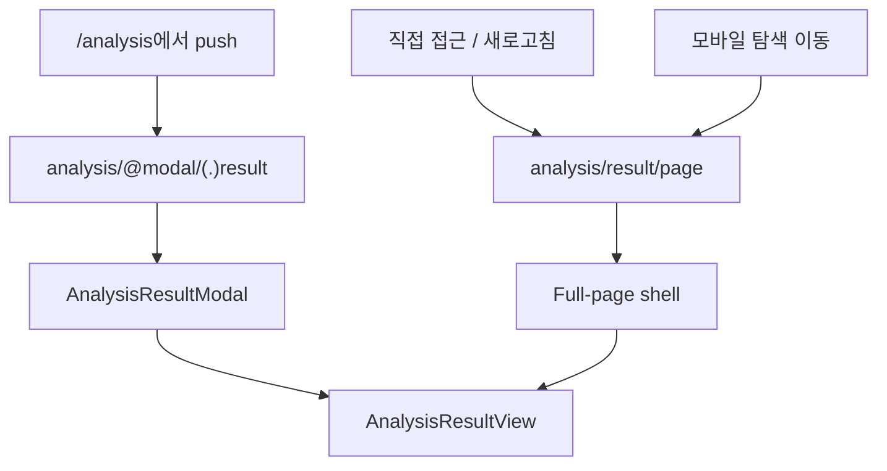
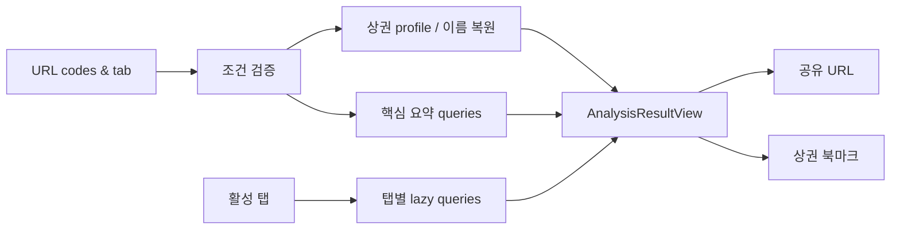

# 상권 분석 — 분석 결과 리포트 세부 명세서

> **작성일**: 2026-07-24
> **공통 명세**: [상권 분석 공통 명세](./analysis.md)
> **대상**: 웹 (Next.js App Router)
> **작성자**: Codex
> **상태**: 명세 완료

이 문서는 상권 분석 공통 명세의 **분석 결과 리포트** 기능을 구현 수준으로 상세화한다.

[[_TOC_]]

---

## D0. 배경 / 기획 의도

| 항목              | 내용                                                                                                                                     |
| ----------------- | ---------------------------------------------------------------------------------------------------------------------------------------- |
| 충족 요구사항     | S3-2 분석 결과 리포트                                                                                                                    |
| 해결하려는 문제   | 기존 결과 화면은 지표를 한 번에 조회·표시하는 긴 페이지라 핵심 판단이 어렵고, 탐색 맥락 복원과 부분 실패 대응이 약하다.                  |
| 목표 동작 (to-be) | 결과를 공유 가능한 독립 URL로 제공하고, 데스크톱 탐색 흐름에서는 지도 맥락을 남긴 큰 라우트 모달로, 모바일에서는 전체 페이지로 표시한다. |
| 구현 제외 범위    | PDF 다운로드, 사용자 정의 비교 대상 추가, 분석 결과 전체 북마크, 서버 측 보고서 생성, 차트 라이브러리 신규 도입                          |
| 연관 세부 기능    | [지도 기반 분석 대상 탐색](./explorer.md), `/analysis/simulation`, 회원 북마크                                                           |

---

## D1. 기능 개요

`/analysis/result`는 URL의 자치구·행정동·상권·업종·시점 코드를 검증한 후 공통 리포트 컴포넌트로 분석 지표를 표시한다. 탐색 화면에서 데스크톱으로 이동하면 동일 라우트를 인터셉트한 큰 모달로 열고, 직접 접근·새로고침·모바일에서는 독립 전체 페이지로 렌더링한다.

```text
결과 URL → 조건 검증·이름 복원 → 핵심 요약 조회 → 선택 탭 지연 조회 → 공유/상권 저장/시뮬레이션
```

### D1-1. UI 진입점 / 기능 연결

> **Figma 디자인**: 별도 Figma 없음. 본 명세와 `frontend/DESIGN.md`를 구현 정본으로 사용한다.

| UI 요소        | 사용자 동작      | 트리거 기능                 | 결과 / UI 반영 상태                                                 |
| -------------- | ---------------- | --------------------------- | ------------------------------------------------------------------- |
| 탐색 결과 CTA  | 클릭             | `/analysis/result?...` push | 데스크톱 라우트 모달 또는 모바일 전체 페이지                        |
| 결과 탭        | 클릭/키보드      | `tab` query replace         | 해당 지표를 지연 조회하고 URL에 현재 탭을 보존                      |
| 닫기/뒤로가기  | 클릭 또는 Escape | 탐색 history 복원           | 기존 `/analysis` 선택 상태와 지도 viewport로 복귀                   |
| 공유           | 클릭             | 현재 URL 복사/공유          | 동일 조건과 탭의 직접 접근 URL 제공                                 |
| 상권 저장      | 클릭             | 회원 북마크 API             | 로그인 사용자는 상권 저장, 비로그인은 현재 결과 URL을 보존해 로그인 |
| 시뮬레이션 CTA | 클릭             | 보호된 simulation 경로 이동 | 비로그인은 로그인 후 목적지로 복귀                                  |

---

## D2. 동작 요구사항

| #   | 요구사항                                                                                           | 상세 참조 |
| --- | -------------------------------------------------------------------------------------------------- | --------- |
| 1   | 데스크톱 탐색 흐름은 지도 위에 상하좌우 24~32px 여백이 있는 큰 라우트 모달로 결과를 표시한다.      | D3, D6    |
| 2   | 모바일, 직접 URL 접근, 새로고침은 동일 결과를 독립 전체 페이지로 표시한다.                         | D3, D6    |
| 3   | 모달 닫기, Escape, 브라우저 뒤로가기는 기존 `/analysis` 선택 상태로 복귀한다.                      | D5        |
| 4   | 결과 탭은 `summary`, `foot-traffic`, `sales`, `stores`, `living`, `trend`, `benchmark`를 제공한다. | D4        |
| 5   | 최초 진입은 핵심 요약 데이터만 우선 조회하고 상세 탭 데이터는 활성화 시 조회한다.                  | D4        |
| 6   | 섹션별 API 실패는 다른 성공 섹션을 가리지 않으며 섹션 단위 재시도를 제공한다.                      | D6        |
| 7   | 필수 쿼리가 없거나 유효하지 않으면 오류 페이지 대신 조건 재선택 안내와 `/analysis` CTA를 제공한다. | D5, D6    |
| 8   | 현재 탭과 모든 선택 코드는 공유 URL에 포함하고, 표시 이름은 API 응답에서 복원한다.                 | D5        |
| 9   | `keyMetrics`의 nullable 값과 빈 경계·빈 지표 배열을 정상적으로 fallback한다.                       | D6        |
| 10  | 리포트 저장 표현은 API 범위에 맞춰 “상권 저장”으로 제한하고 업종·시점 저장을 암시하지 않는다.      | D4        |

---

## D3. 아키텍처 / 시스템 설계

### D3-1. 라우팅과 컴포넌트 구성

| 모듈 / 컴포넌트                      | 책임                                                    | 비고                           |
| ------------------------------------ | ------------------------------------------------------- | ------------------------------ |
| `analysis/layout.tsx`                | `children`과 `@modal` slot 구성, 분석 범위 footer 숨김  | App Router parallel route      |
| `analysis/@modal/default.tsx`        | 모달이 없는 기본 상태                                   | `null` 반환                    |
| `analysis/@modal/(.)result/page.tsx` | 탐색에서 이동한 결과 라우트 intercept                   | 데스크톱에서만 모달 shell 사용 |
| `analysis/result/page.tsx`           | 직접 접근·새로고침·모바일의 독립 결과 페이지            | canonical route                |
| `AnalysisResultView`                 | 두 surface가 공유하는 조건 헤더, 탭, 섹션, 액션         | 데이터/표현 중복 금지          |
| `AnalysisResultModal`                | dialog semantics, focus trap, Escape, scroll lock, 닫기 | 데스크톱 전용                  |
| `AnalysisResultSection`              | section loading/error/empty/success 경계                | 부분 실패 격리                 |
| `analysis result API adapter`        | OpenAPI DTO를 화면 모델로 매핑                          | 레거시 field 사용 금지         |



인터셉트 라우트가 모바일에서 매칭되더라도 modal shell은 viewport 조건을 확인해 독립 페이지와 동일한 full-screen surface를 사용한다. 핵심 데이터와 UI는 `AnalysisResultView` 하나만 유지한다.

### D3-2. 데이터 흐름



### D3-3. 데이터 모델

| 모델                      | 필드                       | 타입                                                                            | 설명                                   |
| ------------------------- | -------------------------- | ------------------------------------------------------------------------------- | -------------------------------------- |
| `AnalysisResultParams`    | 선택 코드                  | `districtCode`, `administrationCode`, `commercialCode`, `serviceCode`: `string` | 모든 코드 필수                         |
|                           | `periodCode`               | `"20233"`                                                                       | 고정 기준 시점                         |
|                           | `tab`                      | `summary \| foot-traffic \| sales \| stores \| living \| trend \| benchmark`    | 잘못된 값은 `summary`로 정규화         |
| `AnalysisContext`         | 이름·경계·핵심 지표        | profile API 기반                                                                | URL의 사용자 제공 이름을 신뢰하지 않음 |
| `SectionState<T>`         | `status`, `data`           | loading/error/empty/success                                                     | 섹션별 독립 상태                       |
| `TrendMetric`             | `metricType`               | `SALES \| FOOT_TRAFFIC \| STORE`                                                | trend endpoint의 Swagger enum          |
| `CommercialBookmarkInput` | `targetType`               | `"COMMERCIAL"`                                                                  | 회원 API 고정                          |
|                           | `targetCode`, `targetName` | `string`                                                                        | 업종·시점은 저장하지 않음              |

### D3-4. 사용 라이브러리 / 기술

| 역할          | 요구 사항                                      | 구체 구현                             |
| ------------- | ---------------------------------------------- | ------------------------------------- |
| 라우트 모달   | URL 유지, 직접 접근 fallback, history 복원     | Next.js parallel/intercepting routes  |
| 서버 상태     | 섹션별 query, 조건부 조회, 재시도              | 기존 TanStack React Query             |
| dialog 접근성 | focus trap, Escape, focus restore, scroll lock | 기존 dialog primitive가 있으면 재사용 |
| 지표 시각화   | 디자인 토큰, responsive, 별도 패키지 없음      | 기존 CSS/SVG/semantic HTML            |
| 공유          | 현재 URL 복사, 지원 시 native share            | Web Share API + Clipboard fallback    |

---

## D4. 상세 동작 정의

> **API 문서**: `frontend/docs/api/openapi/commercial-analysis.json`, `region-map.json`, `auth-member.json`, `endpoints.md`

브라우저 호출은 기존 BFF 규칙에 따라 `/api/v1`을 제거한 `/api/bff/...` 경로를 사용한다.

### D4-1. 컨텍스트와 요약 조회

| 사용 엔드포인트                                                          | 용도                                   | 결과 화면 매핑                      | 조회 시점 |
| ------------------------------------------------------------------------ | -------------------------------------- | ----------------------------------- | --------- |
| `GET /api/v1/map/commercials/{commercialCode}/profile`                   | 상권 이름·경계·핵심 지표·기준 컨텍스트 | 헤더, 요약 hero, 지도 미니 컨텍스트 | 최초      |
| `GET /api/v1/commercials/{commercialCode}/summaries/sales`               | 상권과 비교 기준의 매출 요약           | 요약 매출 카드                      | 최초      |
| `GET /api/v1/commercials/{commercialCode}/services/{serviceCode}/stores` | 점포 핵심 수치                         | 요약 점포 카드                      | 최초      |
| `GET /api/v1/commercials/{commercialCode}/population`                    | 생활인구 핵심 수치                     | 요약 생활권 카드                    | 최초      |
| `GET /api/v1/commercials/{commercialCode}/summaries/income`              | 소득·지출 비교 요약                    | 요약 생활권 카드                    | 최초      |
| `GET /api/v1/commercials/{commercialCode}/facilities`                    | 시설·교통 요약                         | 요약 입지 카드                      | 최초      |

최초 요청은 병렬로 수행하되 profile을 제외한 실패는 전체 결과 진입을 막지 않는다. profile도 실패하면 URL의 코드와 재시도 UI를 유지하며 이름을 임의로 생성하지 않는다.

### D4-2. 탭별 지연 조회

| 탭                      | 표시 목적                                | 사용 endpoint                                                                                 |
| ----------------------- | ---------------------------------------- | --------------------------------------------------------------------------------------------- |
| `summary` 요약          | 핵심 판단 카드와 비교 하이라이트         | D4-1의 최초 queries                                                                           |
| `foot-traffic` 유동인구 | 시간·요일·연령 등 유동 특성              | `GET /api/v1/commercials/{commercialCode}/foot-traffic`                                       |
| `sales` 매출            | 업종 매출 규모·구성                      | `GET /api/v1/commercials/{commercialCode}/services/{serviceCode}/sales`                       |
| `stores` 점포           | 점포 수와 개·폐업 관련 제공 지표         | `GET /api/v1/commercials/{commercialCode}/services/{serviceCode}/stores`                      |
| `living` 생활권         | 상주/생활인구, 소득·지출, 시설·교통      | population, income, facilities                                                                |
| `trend` 트렌드          | 최근 최대 4개 시점의 매출·유동·점포 변화 | `GET /api/v1/commercials/{commercialCode}/trend`를 `SALES`, `FOOT_TRAFFIC`, `STORE` 각각 호출 |
| `benchmark` 비교        | 제공되는 동일 업종 기준 비교             | `GET /api/v1/commercials/{commercialCode}/benchmarks`                                         |

활성화하지 않은 탭은 요청하지 않는다. 요약에서 이미 받은 동일 endpoint 결과는 query key를 공유해 재사용한다.

### D4-3. 상권 저장과 인증

| 사용 엔드포인트                     | 용도      | 요청 매핑                                                                            | 인증 |
| ----------------------------------- | --------- | ------------------------------------------------------------------------------------ | ---- |
| `POST /api/v1/members/me/bookmarks` | 상권 저장 | `targetType: "COMMERCIAL"`, `targetCode: commercialCode`, `targetName: profile.name` | 필요 |

- UI 문구는 “상권 저장”으로 한정한다.
- 업종·시점·현재 탭은 북마크 데이터에 저장되지 않는다.
- 비로그인 사용자가 선택하면 현재 결과 URL 전체를 return URL로 보존해 로그인 경로로 이동한다.
- 기존 `/profile/bookmarks/analysis`의 레거시 분석 결과 복원은 이번 범위에 포함하지 않는다.

### D4-4. 공유와 시뮬레이션

- 공유는 현재 origin 기준 절대 URL을 사용하고 현재 `tab`까지 포함한다.
- Web Share API가 있으면 공유 sheet를 열고, 없으면 clipboard 복사 후 완료 메시지를 표시한다.
- 시뮬레이션 CTA는 현재 선택 코드를 지원 범위 안에서 전달하되, simulation의 기존 입력 계약을 임의로 확장하지 않는다.
- `/analysis/simulation`은 인증 보호를 유지한다.

---

## D5. 비즈니스 로직

### URL 검증

```text
필수 코드 4개 존재
AND periodCode == "20233"
AND tab ∈ allowedTabs
```

- 필수 코드가 빠지면 데이터 요청을 시작하지 않고 조건 재선택 상태를 표시한다.
- `tab`만 잘못되면 다른 조건은 유지하고 `summary`로 `replace`한다.
- 코드가 존재하지만 API 후보와 일치하지 않으면 해당 컨텍스트 오류를 표시하고 `/analysis`에서 다시 선택하게 한다.
- 결과 URL에 이름, 가격, 지표 값 등 표시 데이터를 저장하지 않는다.

### 표시 surface 결정

| 진입 환경                 | 결과 surface             | 닫기 동작                                              |
| ------------------------- | ------------------------ | ------------------------------------------------------ |
| 데스크톱 `/analysis` 이력 | 지도 위 인셋 라우트 모달 | `router.back()`으로 선택 URL 복원                      |
| 모바일 `/analysis` 이력   | 전체 화면 결과           | browser back으로 선택 URL 복원                         |
| 직접 URL/새 탭/새로고침   | 독립 전체 페이지         | 헤더 “조건 다시 선택”으로 코드가 담긴 `/analysis` 이동 |

### 탭 URL 동기화

- 탭 전환은 `router.replace`로 현재 result URL의 `tab`만 바꾼다.
- 뒤로가기를 탭 history로 과도하게 채우지 않는다.
- 탭 query 변경으로 모달/전체 페이지 surface가 바뀌지 않는다.

### 비교 표현 규칙

- API가 제공한 비교 기준과 단위를 그대로 표시하고 임의 z-score나 등급을 계산하지 않는다.
- 값이 `null`이면 0으로 표현하지 않고 “데이터 없음”으로 표시한다.
- 백분율·통화·인원·점포 수는 기존 포맷 유틸을 우선 사용하고 단위 중복을 방지한다.

---

## D6. 주의사항

### 데스크톱 라우트 모달

- viewport 상하좌우 24~32px 여백을 두고 최대 너비 약 1400px, 최대 높이 `calc(100dvh - 48~64px)` 안에서 자체 스크롤한다.
- 배경 지도는 dim 처리하되 현재 선택 맥락을 알아볼 수 있어야 한다.
- 헤더와 탭은 리포트 내부에서 sticky 처리한다.
- `role="dialog"`, `aria-modal="true"`, 제목 연결, focus trap, Escape 닫기, 닫은 뒤 트리거 focus 복원을 제공한다.
- body scroll은 잠그고 리포트 내부만 스크롤한다.

### 모바일·독립 페이지

- 모바일은 모달 외곽 여백이나 큰 바텀시트를 사용하지 않고 `100dvh` 전체 페이지로 표시한다.
- 헤더, 탭, 핵심 액션은 safe-area를 반영한다.
- 탭은 수평 스크롤 또는 접근 가능한 압축형 탐색을 사용하고 현재 탭을 항상 식별할 수 있게 한다.
- 직접 접근 페이지에는 지도 배경에 의존하지 않는 상권·업종·기준 시점 요약을 제공한다.
- 전역 푸터는 렌더링하지 않는다.

### 상태 처리

| 상태               | UI 처리                                                        |
| ------------------ | -------------------------------------------------------------- |
| 필수 쿼리 누락     | “분석 조건을 다시 선택해 주세요” + `/analysis` CTA, API 미호출 |
| profile 로딩       | 헤더·요약 skeleton, 닫기/뒤로가기는 사용 가능                  |
| profile 실패       | 코드 표시 + 재시도 + 조건 재선택, 임의 이름 생성 금지          |
| 요약 일부 실패     | 성공 카드 유지, 실패 카드만 재시도                             |
| 탭 로딩            | 탭 내용 영역 skeleton, 헤더·다른 탭 유지                       |
| 탭 빈 데이터       | 지표 성격에 맞는 “이 조건의 데이터가 없어요” 안내              |
| 탭 실패            | 탭 영역 오류 + 재시도, URL·선택 컨텍스트 유지                  |
| `keyMetrics` null  | “데이터 없음”, 0으로 대체하지 않음                             |
| boundary 없음      | 미니 지도/경계 표현 생략 또는 center marker fallback           |
| 비로그인 상권 저장 | 현재 결과 URL을 보존한 로그인 이동                             |

### 실제 데이터 검증 제약

- 개발 환경에 실제 상권 분석 응답이 없으면 숫자·단위·빈 값 조합은 fixture 기반으로 검증한다.
- 실데이터가 준비되면 최소 1개 상권에 대해 7개 탭, 3개 trend metric, benchmark의 실제 단위와 nullable 조합을 재검증한다.
- facilities는 Swagger가 제공하는 학교 수와 교통 총계 범위를 넘는 세부 시설 정보를 만들지 않는다.
- benchmark는 Swagger가 제공하는 매출·소득 요약과 highlights만 표현하며 임의 경쟁력 점수를 만들지 않는다.

---

## D7. 테스트케이스

| TC ID     | 범위 | 사전 조건                     | 수행 절차             | 기대 결과                                                                 |
| --------- | ---- | ----------------------------- | --------------------- | ------------------------------------------------------------------------- |
| TC-AR-001 | D    | 데스크톱 탐색 화면            | 결과 CTA 선택         | URL 변경과 함께 인셋 dialog가 열리고 배경 지도 선택이 유지된다.           |
| TC-AR-002 | D    | 결과 모달 열림                | Escape 또는 닫기 선택 | 기존 선택 코드가 담긴 `/analysis`로 돌아가고 트리거에 포커스가 복원된다.  |
| TC-AR-003 | D    | 유효한 결과 URL               | 새 탭 직접 접근       | 모달 배경 없이 전체 결과 페이지가 열린다.                                 |
| TC-AR-004 | D    | 모바일 탐색 화면              | 결과 CTA 선택         | 전체 페이지 결과가 열리고 body/리포트 이중 스크롤이 생기지 않는다.        |
| TC-AR-005 | D    | 필수 코드 누락                | 결과 URL 직접 접근    | API를 호출하지 않고 조건 재선택 상태를 표시한다.                          |
| TC-AR-006 | D    | 잘못된 `tab`                  | 결과 URL 직접 접근    | `summary`로 정규화되고 나머지 선택 코드는 유지된다.                       |
| TC-AR-007 | D    | summary 성공, facilities 실패 | 결과 진입             | 다른 요약 카드는 표시되고 시설 카드만 오류·재시도를 표시한다.             |
| TC-AR-008 | D    | summary 진입                  | `trend` 탭 선택       | 세 metric query가 활성화되고 URL `tab=trend`가 replace된다.               |
| TC-AR-009 | D    | nullable 지표 fixture         | 각 탭 확인            | null을 0으로 표시하지 않고 데이터 없음으로 표시한다.                      |
| TC-AR-010 | D    | 비로그인                      | 상권 저장 선택        | 현재 결과 URL을 return URL로 보존해 로그인 화면으로 이동한다.             |
| TC-AR-011 | D    | 로그인, profile 성공          | 상권 저장 선택        | `COMMERCIAL` target으로 저장되고 “분석 결과 저장” 문구를 사용하지 않는다. |
| TC-AR-012 | D    | 공유 API 미지원               | 공유 선택             | 현재 탭을 포함한 URL이 clipboard에 복사되고 완료 피드백이 표시된다.       |
| TC-AR-013 | D    | 키보드 사용자, 모달 진입      | Tab 순환, Escape      | 포커스가 dialog 밖으로 빠지지 않고 Escape로 닫힌다.                       |

---

## D8. 미결 사항 / 데이터 검증 제약

아래 항목은 API 확장 전에는 기능적으로 해결할 수 없으며 이번 구현에서는 명시된 fallback을 사용한다.

| #   | 항목                                                                               | 이번 구현의 결정                                                                 |
| --- | ---------------------------------------------------------------------------------- | -------------------------------------------------------------------------------- |
| 1   | 사용 가능한 분석 시점 목록 endpoint가 없다.                                        | `20233` 고정, “2023년 3분기 기준” 표시, 시점 선택기 미노출                       |
| 2   | 북마크 API는 상권만 저장하며 업종·시점·탭을 저장하지 않는다.                       | “상권 저장”만 제공하고 공유 URL을 상세 조건 보존 수단으로 사용                   |
| 3   | 비교 API는 모든 지표의 지역 간 비교나 사용자 정의 비교를 제공하지 않는다.          | Swagger의 benchmark와 sales/income summary 범위만 표시                           |
| 4   | 개발 데이터가 비어 있으면 실제 단위·nullable·부분 데이터 조합의 E2E 검증이 어렵다. | contract fixture로 검증하고 실데이터 적재 후 추가 브라우저 검증 항목으로 남긴다. |

---

## 변경 이력

| 버전 | 날짜       | 변경 내용                                                          | 작성자 |
| ---- | ---------- | ------------------------------------------------------------------ | ------ |
| 1.0  | 2026-07-24 | 데스크톱 라우트 모달 + 모바일/직접 접근 전체 페이지 명세 최초 작성 | Codex  |
