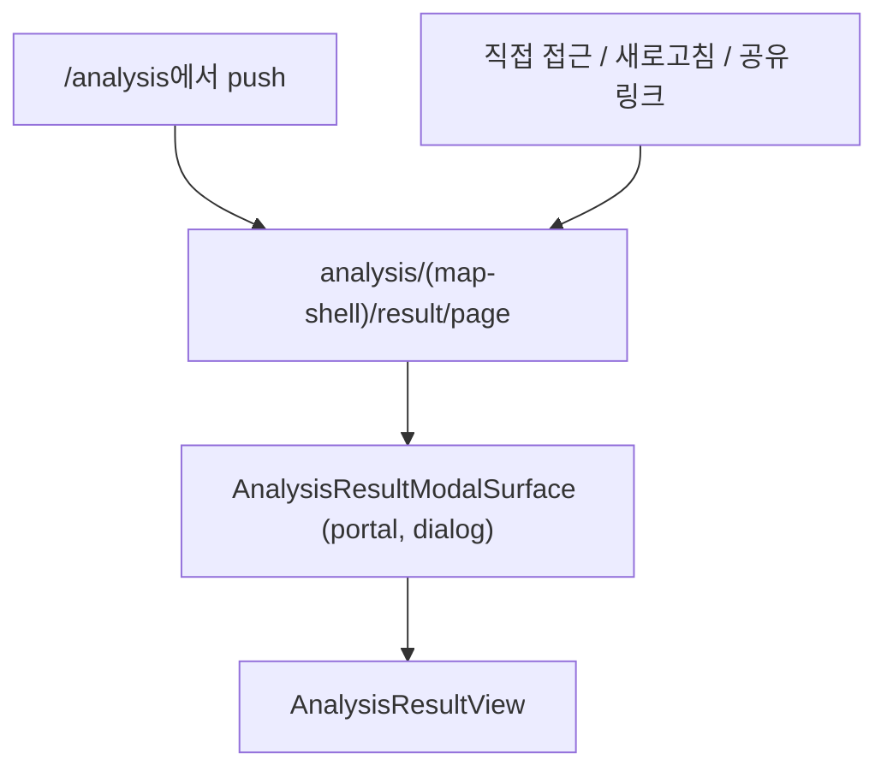
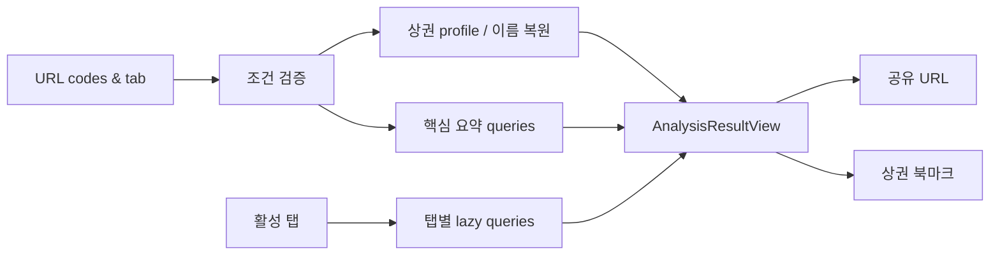

# 상권 분석 — 분석 결과 리포트 세부 명세서

> **작성일**: 2026-07-24
> **공통 명세**: [상권 분석 공통 명세](./analysis.md)
> **대상**: 웹 (Next.js App Router)
> **작성자**: Codex
> **상태**: 명세 완료

이 문서는 상권 분석 공통 명세의 **분석 결과 리포트** 기능을 구현 수준으로 상세화한다.

[[_TOC_]]

---

## D0. 배경 / 기획 의도

| 항목              | 내용                                                                                                                                     |
| ----------------- | ---------------------------------------------------------------------------------------------------------------------------------------- |
| 충족 요구사항     | S3-2 분석 결과 리포트                                                                                                                    |
| 해결하려는 문제   | 기존 결과 화면은 지표를 한 번에 조회·표시하는 긴 페이지라 핵심 판단이 어렵고, 탐색 맥락 복원과 부분 실패 대응이 약하다.                  |
| 목표 동작 (to-be) | 결과를 공유 가능한 독립 URL로 제공하고, 데스크톱 탐색 흐름에서는 지도 맥락을 남긴 큰 라우트 모달로, 모바일에서는 전체 페이지로 표시한다. |
| 구현 제외 범위    | PDF 다운로드, 사용자 정의 비교 대상 추가, 분석 결과 전체 북마크, 서버 측 보고서 생성                                                     |
| 연관 세부 기능    | [지도 기반 분석 대상 탐색](./explorer.md), [지도 셸 + URL 카메라](./map-shell.md), `/analysis/simulation`, 회원 북마크                   |

---

## D1. 기능 개요

`/analysis/result`는 URL의 자치구·행정동·상권·업종·시점 코드를 검증한 후 공통 리포트 컴포넌트로 분석 지표를 표시한다.

> **⚠️ 표시 표면 구조는 [map-shell.md](./map-shell.md)가 정본이다(2026-08-26 개정).** 아래 D2-1·D2-2, D3-1의 `@modal` 관련 행, D3-2 다이어그램, D5 "표시 surface 결정", D6 "모바일·독립 페이지"의 _독립 전체 페이지_ 서술은 폐기됐다. 결과는 진입 경로와 무관하게 **지도 셸 위의 단일 레이어**로 열린다. 지표·탭·부분 실패·저장·공유 규칙은 이 문서가 계속 정본이다.

```text
결과 URL → 조건 검증·이름 복원 → 핵심 요약 조회 → 선택 탭 지연 조회 → 공유/상권 저장/시뮬레이션
```

### D1-1. UI 진입점 / 기능 연결

> **Figma 디자인**: 별도 Figma 없음. 본 명세와 `frontend/DESIGN.md`를 구현 정본으로 사용한다.

| UI 요소        | 사용자 동작      | 트리거 기능                 | 결과 / UI 반영 상태                                                 |
| -------------- | ---------------- | --------------------------- | ------------------------------------------------------------------- |
| 탐색 결과 CTA  | 클릭             | `/analysis/result?...` push | 데스크톱 라우트 모달 또는 모바일 전체 페이지                        |
| 결과 탭        | 클릭/키보드      | `tab` query replace         | 해당 지표를 지연 조회하고 URL에 현재 탭을 보존                      |
| 닫기/뒤로가기  | 클릭 또는 Escape | 탐색 history 복원           | 기존 `/analysis` 선택 상태와 지도 viewport로 복귀                   |
| 공유           | 클릭             | 현재 URL 복사/공유          | 동일 조건과 탭의 직접 접근 URL 제공                                 |
| 상권 저장      | 클릭             | 회원 북마크 API             | 로그인 사용자는 상권 저장, 비로그인은 현재 결과 URL을 보존해 로그인 |
| 시뮬레이션 CTA | 클릭             | 보호된 simulation 경로 이동 | 비로그인은 로그인 후 목적지로 복귀                                  |

---

## D2. 동작 요구사항

| #   | 요구사항                                                                                             | 상세 참조                                                                    |
| --- | ---------------------------------------------------------------------------------------------------- | ---------------------------------------------------------------------------- |
| 1   | ~~데스크톱 탐색 흐름은 지도 위 라우트 모달~~ → 데스크톱은 지도 셸 위 인셋 레이어(여백 24–32px).      | [map-shell D3-1](./map-shell.md#d3-1-시스템-구성)                            |
| 2   | ~~모바일·직접 접근·새로고침은 독립 전체 페이지~~ → 모든 진입이 같은 레이어. 좁은 뷰포트는 전체 화면. | [map-shell D5](./map-shell.md#d5-비즈니스-로직)                              |
| 3   | 닫기·Escape·브라우저 뒤로가기는 카메라를 유지한 `/analysis` 선택 상태로 복귀한다.                    | [map-shell D4-5](./map-shell.md#d4-5-결과-레이어-열기닫기와-routerback-폴백) |
| 4   | 결과 탭은 `summary`, `foot-traffic`, `sales`, `stores`, `living`, `trend`, `benchmark`를 제공한다.   | D4                                                                           |
| 5   | 최초 진입은 핵심 요약 데이터만 우선 조회하고 상세 탭 데이터는 활성화 시 조회한다.                    | D4                                                                           |
| 6   | 섹션별 API 실패는 다른 성공 섹션을 가리지 않으며 섹션 단위 재시도를 제공한다.                        | D6                                                                           |
| 7   | 필수 쿼리가 없거나 유효하지 않으면 오류 페이지 대신 조건 재선택 안내와 `/analysis` CTA를 제공한다.   | D5, D6                                                                       |
| 8   | 현재 탭과 모든 선택 코드는 공유 URL에 포함하고, 표시 이름은 API 응답에서 복원한다.                   | D5                                                                           |
| 9   | `keyMetrics`의 nullable 값과 빈 경계·빈 지표 배열을 정상적으로 fallback한다.                         | D6                                                                           |
| 10  | 리포트 저장 표현은 API 범위에 맞춰 “상권 저장”으로 제한하고 업종·시점 저장을 암시하지 않는다.        | D4                                                                           |

---

## D3. 아키텍처 / 시스템 설계

### D3-1. 라우팅과 컴포넌트 구성

| 모듈 / 컴포넌트 | 책임 | 비고 |
| ~~`analysis/layout.tsx`~~ | ~~`children`과 `@modal` slot~~ | **폐기** → `(map-shell)/layout.tsx` |
| ~~`analysis/@modal/**`~~ | ~~intercepting route~~ | **폐기**([map-shell D3-1](./map-shell.md#d3-1-시스템-구성)) |
| `analysis/(map-shell)/result/page.tsx` | 결과 레이어 라우트 (유일한 결과 표면) | 메타데이터 유지 |
| `AnalysisResultView` | 두 surface가 공유하는 조건 헤더, 탭, 섹션, 액션 | 데이터/표현 중복 금지 |
| `AnalysisResultModalSurface` | dialog semantics, focus trap, Escape, scroll lock, 닫기 | 전 경로 공용(AI 리포트도 재사용) |
| `AnalysisResultSection` | section loading/error/empty/success 경계 | 부분 실패 격리 |
| `analysis result API adapter` | OpenAPI DTO를 화면 모델로 매핑 | 레거시 field 사용 금지 |


```mermaid
flowchart TD
  Nav["/analysis에서 push"] --> Route["analysis/(map-shell)/result/page"]
  Direct["직접 접근 / 새로고침 / 공유 링크"] --> Route
  Route --> Surface["AnalysisResultModalSurface (portal, dialog)"]
  Surface --> View["AnalysisResultView"]
```

진입 경로가 무엇이든 표면은 한 벌이다. 좁은 뷰포트에서는 같은 surface가 `100dvh` 전체 화면이 된다. 핵심 데이터와 UI는 `AnalysisResultView` 하나만 유지한다.

### D3-2. 데이터 흐름


```mermaid
flowchart LR
  Query["URL codes & tab"] --> Validate["조건 검증"]
  Validate --> Profile["상권 profile / 이름 복원"]
  Validate --> Summary["핵심 요약 queries"]
  Tab["활성 탭"] --> Lazy["탭별 lazy queries"]
  Profile --> View["AnalysisResultView"]
  Summary --> View
  Lazy --> View
  View --> Share["공유 URL"]
  View --> Bookmark["상권 북마크"]
```

### D3-3. 데이터 모델

| 모델                      | 필드                       | 타입                                                                            | 설명                                                                                                                |
| ------------------------- | -------------------------- | ------------------------------------------------------------------------------- | ------------------------------------------------------------------------------------------------------------------- |
| `AnalysisResultParams`    | 선택 코드                  | `districtCode`, `administrationCode`, `commercialCode`, `serviceCode`: `string` | 모든 코드 필수                                                                                                      |
|                           | `periodCode`               | `YYYYQ` 또는 없음                                                               | 없으면 「최신」 = 서버 기본 분기. URL 분기는 카탈로그를 기다리지 않는다([period-catalog](./period-catalog.md) D5-1) |
|                           | `tab`                      | `summary \| foot-traffic \| sales \| stores \| living \| trend \| benchmark`    | 잘못된 값은 `summary`로 정규화                                                                                      |
| `AnalysisContext`         | 이름·경계·핵심 지표        | profile API 기반                                                                | URL의 사용자 제공 이름을 신뢰하지 않음                                                                              |
| `SectionState<T>`         | `status`, `data`           | loading/error/empty/success                                                     | 섹션별 독립 상태                                                                                                    |
| `TrendMetric`             | `metricType`               | `SALES \| FOOT_TRAFFIC \| STORE`                                                | trend endpoint의 Swagger enum                                                                                       |
| `CommercialBookmarkInput` | `targetType`               | `"COMMERCIAL"`                                                                  | 회원 API 고정                                                                                                       |
|                           | `targetCode`, `targetName` | `string`                                                                        | 업종·시점은 저장하지 않음                                                                                           |

### D3-4. 사용 라이브러리 / 기술

| 역할          | 요구 사항                                      | 구체 구현                                                                                                                                                         |
| ------------- | ---------------------------------------------- | ----------------------------------------------------------------------------------------------------------------------------------------------------------------- |
| 라우트 모달   | URL 유지, 직접 접근 fallback, history 복원     | Next.js parallel/intercepting routes                                                                                                                              |
| 서버 상태     | 섹션별 query, 조건부 조회, 재시도              | 기존 TanStack React Query                                                                                                                                         |
| dialog 접근성 | focus trap, Escape, focus restore, scroll lock | 기존 dialog primitive가 있으면 재사용                                                                                                                             |
| 지표 시각화   | 디자인 토큰, responsive, 툴팁                  | Recharts 기반 래퍼(라인·막대·도넛·피라미드)를 `src/components/analysis/charts/`에 두고, 색·축·그리드·툴팁을 `DESIGN.md` CSS 토큰으로 테마. 래퍼 공개 props는 유지 |
| 공유          | 현재 URL 복사, 지원 시 native share            | Web Share API + Clipboard fallback                                                                                                                                |

---

## D4. 상세 동작 정의

> **API 문서**: `frontend/docs/api/openapi/commercial-analysis.json`, `region-map.json`, `auth-member.json`, `endpoints.md`

브라우저 호출은 기존 BFF 규칙에 따라 `/api/v1`을 제거한 `/api/bff/...` 경로를 사용한다.

### D4-1. 컨텍스트와 요약 조회

| 사용 엔드포인트                                                          | 용도                                   | 결과 화면 매핑                           | 조회 시점        |
| ------------------------------------------------------------------------ | -------------------------------------- | ---------------------------------------- | ---------------- |
| `GET /api/v1/map/commercials/{commercialCode}/profile`                   | 상권 이름·경계·핵심 지표·기준 컨텍스트 | 헤더, 요약 hero, 지도 미니 컨텍스트      | 최초             |
| `GET /api/v1/commercials/{commercialCode}/summaries/sales`               | 상권과 비교 기준의 매출 요약           | 요약 「점포당 월 매출」 카드 · 결론 문장 | 최초             |
| `GET /api/v1/commercials/{commercialCode}/services/{serviceCode}/stores` | 점포 핵심 수치                         | 요약 「점포 수」 · 「경쟁」 줄 · 점포 탭 | 최초             |
| `GET /api/v1/commercials/{commercialCode}/population`                    | 생활인구 핵심 수치                     | 요약 「상주인구」 · 생활권 탭            | 최초             |
| `GET /api/v1/commercials/{commercialCode}/summaries/income`              | 자치구·행정동·상권 총 지출액           | 생활권 「지역별 소비」                   | 최초             |
| `GET /api/v1/commercials/{commercialCode}/facilities`                    | 시설·교통 요약                         | 생활권 「주요 시설과 교통」              | 생활권 탭 활성화 |

최초 요청은 병렬로 수행하되 profile을 제외한 실패는 전체 결과 진입을 막지 않는다. profile도 실패하면 URL의 코드와 재시도 UI를 유지하며 이름을 임의로 생성하지 않는다.

### D4-2. 탭별 지연 조회

| 탭                      | 표시 목적                                              | 사용 endpoint                                                                                 |
| ----------------------- | ------------------------------------------------------ | --------------------------------------------------------------------------------------------- |
| `summary` 요약          | 핵심 지표 · 인사이트 세 줄 · 지원 정책                 | D4-1의 최초 queries + `/sales`(인사이트)                                                      |
| `foot-traffic` 유동인구 | 시간·요일·연령 등 유동 특성                            | `GET /api/v1/commercials/{commercialCode}/foot-traffic`                                       |
| `sales` 매출            | 업종 매출 규모·구성                                    | `GET /api/v1/commercials/{commercialCode}/services/{serviceCode}/sales`                       |
| `stores` 점포           | 점포 수와 개·폐업 관련 제공 지표                       | `GET /api/v1/commercials/{commercialCode}/services/{serviceCode}/stores`                      |
| `living` 생활권         | 상주/생활인구, 소비, 자치구 평균 소득(대체), 시설·교통 | population, income, facilities                                                                |
| `trend` 트렌드          | 최근 최대 4개 시점의 매출·유동·점포 변화               | `GET /api/v1/commercials/{commercialCode}/trend`를 `SALES`, `FOOT_TRAFFIC`, `STORE` 각각 호출 |
| `benchmark` 비교        | 동일 업종 점포당 매출 지수(자치구·행정동 = 100)        | `GET /api/v1/commercials/{commercialCode}/benchmarks`                                         |

활성화하지 않은 탭은 요청하지 않는다(시설 `/facilities` 도 요약 카드를 걷어낸 뒤 생활권 탭에서 부른다). **예외는 매출(`/sales`) 하나다** — 요약 인사이트의 피크 시간·주 고객층이 이 응답에서 나와서 첫 화면에 함께 부른다(#482). 요약은 결론 화면이라 매출 탭이 켜질 때까지 두 줄을 비워 두면 결론을 말하지 못한다. 요약에서 이미 받은 동일 endpoint 결과는 query key를 공유해 재사용한다.

**표현 규칙**

- 요약: **결론 화면**이다(#482). [핵심 지표 4개][인사이트 세 줄] 카드 하나와 「받을 수 있는 지원」만 둔다.
  - 「점포 현황」(유사 업종 · 개업률 · 폐업률 · 프랜차이즈)과 「생활권·시설」(상주인구 · 시설 · 학교 · 교통)은 점포 탭 「점포 분석」 · 생활권 탭 「주요 시설과 교통」과 같은 수라 걷어냈다. 「지역별 월 매출 비교」도 지역 평균 대비 탭 「비교 분석」과 같은 세 값(자치구 · 행정동 · 상권 총액)이라 뺐다. 이 상권의 비중은 핵심 지표 설명 문장이, 업종 전체 합계는 「점포당 월 매출」 카드 캡션이 말한다(#561). 지역 평균 대비는 BE #485 의 `salesPerStore` 로 점포당 매출 지수로 다시 정의했다(#544, 아래 「지역 평균 대비」).
  - **핵심 지표 첫 카드는 「점포당 월 매출」이다(#561).** 매출 값(`totalSalesAmount`)은 상권 안 그 업종 **전체 합계**라 「월 매출」 하나로 적으면 한 가게 매출로 읽혔다(홍대 걷고싶은 거리 · 커피-음료 · 2026년 1분기: 26억 3527만원 = 점포 59개 합계, 한 곳당 4466만원). 판정·문장은 `lib/analysis/summary-sales` 가 정본이다. AI 리포트 지표 카드(`report-section-state` 의 `resolveMetricCards`)도 같은 함수로 「점포당 월 매출」을 낸다(서버 점포당 값 없이 합계 ÷ `similarStoreCount`).
    - 값: `/benchmarks` 의 `salesPerStore.commercial.monthlySalesPerStore` 가 **이미 받아져 있으면**(지역 평균 대비 탭을 연 뒤) 그 값, 없으면 `월 매출 합계 ÷ 점포 수(similarStoreCount)`. 요약은 `/benchmarks` 를 따로 부르지 않는다. 분모가 같아(#485) 두 값은 만원 단위에서 같다(dev 실측 44,665,600 원).
    - 캡션: 합계와 그 분모 — 「커피-음료 전체 26억 3527만원」. 업종 이름이 아직 없으면 「이 업종 전체 …」, 합계가 없으면 캡션을 비운다. 행정동 비중 막대는 걷었다 — 캡션이 합계를 말하면 막대가 무엇의 비율인지 흐려진다. 비중은 설명 둘째 문장으로 옮겼다.
    - 점포 수 **0** · 합계 0 또는 결측: 값 자리에 「점포 없음」(결측 「데이터 없음」과 다른 사실). 0 원으로 적지 않는다.
    - 점포 수 **0** · 합계 > 0: 「점포 수 집계 없음」. 매출(추정매출)과 점포 수(상권 점포)는 원천이 달라, 매출은 잡혔는데 점포 행이 0 인 상권이 있다(BE `CommercialSalesPerStoreProcessor`). 「점포 없음」이라 적으면 설명의 「매출의 X%」와 모순된다.
    - 점포 수가 없으면 「데이터 없음」. 합계 0 · 점포 있음은 「0원」(실제 값).
  - 「핵심 지표」 설명 자리에는 결론 문장 두 개를 둔다: 「홍대 걷고싶은 거리의 커피-음료 점포 59개가 한 곳당 월 평균 약 4466만원어치를 팔아요. 서교동 전체 커피-음료 매출의 9.8%가 이 상권에서 나와요.」 점포 수 단위는 같은 화면의 「점포 수 59개」에 맞춰 「개」다. 점포 0 · 합계 0 또는 결측이면 첫 문장은 「…에는 커피-음료 점포가 없어요.」, 점포 0 · 합계 > 0 이면 첫 문장을 빼고 비중 문장만 남긴다. 점포는 있는데 합계 0 이면 「약 0원어치」 대신 「…점포 4개가 있지만 이 분기 매출이 잡히지 않았어요.」. 업종 이름·점포 수·점포당 값 중 하나가 없으면 첫 문장을, 비중을 계산할 수 없으면 둘째 문장을 뺀다 — 둘 다 없으면 설명을 비운다. **상권·업종 이름 바로 뒤에는 받침에 따라 바뀌는 조사를 붙이지 않는다**(「의」·「에는」 또는 고정 명사 「점포」만 잇는다).
  - 인사이트 세 줄(`AnalysisSummaryInsights`): 피크 시간 「11–14시에 시간당 매출이 가장 높아요. 매출의 38%가 이때 나와요.」 · 주 고객층 「40대 매출이 가장 커요. 결제 건수는 여성이 55%예요.」 · 경쟁 「같은 업종 점포가 20개 있어요. 이 분기에 1개가 문을 열고 1개가 문을 닫았어요.」. 앞 두 줄은 매출 카드와 **같은 함수**(`lib/analysis/chart-insights`)로 만든다 — 같은 데이터에서 요약과 탭이 다른 말을 하면 안 된다. 개·폐업 건수는 프랜차이즈를 포함한 이 업종 전체 점포 수(`similarStoreCount`)가 분모라(20개 중 1개 = 개업률 5%) 경쟁 줄의 주어를 같은 업종 점포로 맞춘다(`describeStoreCompetition`). 줄마다 근거 탭으로 가는 버튼이다(`handleTabClick`). 행 전체가 버튼이고 「매출 보기 ›」는 **문장 바로 뒤에 잇는다**(#589) — 오른쪽 끝 칸에 두던 때는 1440 에서 문장 끝과 490–630px 떨어졌다. 문장을 만들 수 없는 줄은 그리지 않고, 불러오는 중에는 자리만 잡는다.
  - 「상주인구」 카드는 걷어낸 「생활권·시설」에 있던 성별 구성 맥락 줄(「여성 43.4%」)을 이어받는다.
  - 「점포 현황」에만 있던 값은 점포 탭 「점포 분석」으로 옮긴다: 「총 점포」 맥락 줄에 프랜차이즈 수와 비중, 「개업 점포」·「폐업 점포」 맥락 줄에 개업률·폐업률. 요약 「점포 수」 카드(`similarStoreCount`)에는 맥락 줄을 두지 않는다 — 바로 아래 「경쟁」 줄이 같은 수와 그 분기 개·폐업 건수를 말한다.
  - 업종 이름을 아직 못 받았으면 결론 문장을 비운다. 코드(「CS100010」)를 문장에 넣지 않는다. 개·폐업 문장은 「이번 분기」가 아니라 「이 분기」라고 쓴다 — 헤더에서 지난 분기를 고를 수 있다.
  - 「받을 수 있는 지원」은 처음 2건만 보이고 「지원 정책 N개 모두 보기」로 펼친다(`AnalysisPolicyList` 의 `initialVisibleCount`). 5건을 다 펼치면 데스크톱에서 약 1,180px 로 핵심 지표보다 길었다.

- 트렌드: 매출·유동인구·점포 수를 **카드 하나(「분기별 변화」)** 에 한 줄씩 둔다(`AnalysisTrendSummary`). 점포 행의 이름은 **「일반 점포 수」** 다 — BE `STORE` 추이가 프랜차이즈를 뺀 `totalStoreCount` 라, 핵심 지표 「점포 수」(프랜차이즈 포함)와 값이 다르다. 한 줄은 [지표·현재값][직전 분기 대비 문장·분기별 값][스파크라인] 이다. 축 달린 꺾은선 카드 세 장은 4개 점짜리 선을 읽으려고 카드 세 장을 훑게 했고, 점포 수처럼 변화가 없는 지표가 평평한 선 하나로 카드 한 장을 썼다. 분기별 값은 글자로도 적는다(「25년 2분기 1억 9866만원 → …」) — 터치 화면에는 hover 가 없다. 값이 모두 같으면 스파크라인 없이 「점포 수가 4분기째 10개로 같아요」. 스파크라인은 4개 점 사이에 없는 굴곡이 생기지 않게 **직선**으로 잇는다. 스파크라인에는 축이 없으므로 세로 범위가 평균의 10% 보다 좁으면 넓힌다(`sparklineDomain`) — 0.03% 변화가 48px 급경사로 그려져 「거의 같아요」 문장과 반대로 말했다. 세 지표는 카드 하나지만 **오류는 행 단위**다(`resolveTrendSectionState`): 한 지표만 실패하면 그 행에 「매출 정보를 불러오지 못했어요.」와 재시도를 두고, 값이 있는 지표가 하나도 없을 때만 섹션 오류로 올린다(재시도 가능한 오류 우선).
  - 직전 분기 대비 문장(「▼ 매출이 직전 분기보다 6.7% 줄었어요」): 방향·비율은 마지막 두 시점 값에서 화면이 계산한다(`describeLatestChange`, `lib/analysis/chart-insights`). 서버 `changeRate` 도 같은 직전 분기 대비 비율이지만 쓰지 않는다 — 문장이 말하는 「직전 분기」와 계산한 두 점이 늘 같아야 해서, 둘 중 하나가 비면 「직전 분기와 비교할 값이 없어요」로 적는다. 보합 기준은 **서버 `trendDirection` 과 같은 ±1%** 다(`TREND_STAGNANT_THRESHOLD`, 정확히 1% 는 보합) — 그 안의 변화는 「직전 분기와 거의 같아요」와 「–」로 적는다. 전에는 반올림해 0% 가 될 때만 보합이라, 0.4% 변화를 화면은 「▲ 0.4% 늘었어요」, 서버(요약 「성장률」 등)는 보합이라 서로 다르게 말했다. 직전 분기 값이 0 이면 서버는 보합으로 두지만 화면은 비율 없이 「늘었어요」로 적는다 — 0 에서 생긴 값은 보합이 아니다. **증감에 빨강·초록을 싣지 않는다** — 국내 사용자는 빨강을 상승으로 읽는다. 기호와 문장이 방향을 말하고 색은 중립이다.
- 막대 차트(시간대·요일·연령): **Y 축은 0 에서 시작한다**(`computeNiceYScale(..., { includeZero: true })`). 진한 색은 **가장 큰 막대 하나**에만 쓰고 그 막대 위에 값을 늘 적는다(`highlightMax`). 예전에는 토·일을 고정 강조해 매출이 가장 높은 목요일이 연한 색으로 그려졌다.
- 시간대(유동인구·매출): **막대**로 그린다. 꺾은선으로 이으면 구간 사이에도 값이 있는 것처럼 보인다 — 6개 구간은 이산이고 길이도 3–6시간으로 다르다. **막대 값은 시간당 평균이다**(구간 합계 ÷ 시간 수, `lib/analysis/time-slot`). 원천 시간대 값은 구간 합계다 — dev 실측 73곳 모두 시간대 6개의 합이 요일 7개의 합 · 연령 합(= 총 유동인구)과 같았고, 매출·결제 건수도 같았다. 합계로 그리면 6시간짜리 00–06시가 길이만으로 커서 73곳 중 45곳에서 「00–06시가 가장 많다」가 됐고, 시간당으로 나누면 42곳에서 가장 붐비는 시간이 바뀌었다(경춘선숲길 우측: 합계 1위 00–06시 → 시간당 1위 21–24시). 축 표기는 「(명, 시간당)」·「(원, 시간당)」, 각주는 「시간대 구간의 길이가 3–6시간으로 서로 달라 구간 합계를 시간 수로 나눈 시간당 평균으로 그렸어요.」다. 결론 문장도 시간당으로 구간을 고른다 — 진한 막대와 문장이 같은 구간을 가리킨다. 단 **매출 비중(「매출의 38%」)은 합계로** 낸다. 하루 매출 중 그 구간의 몫이라 합계가 맞는 기준이다. 홈 지도 툴팁(`district-rhythm`)도 같은 이유로 시간당이다. AI 리포트 「언제 파나 · 시간대별 매출」도 같은 시간당 막대다.
- **카드 결론 문장**: 차트 카드 설명 자리에 데이터에서 계산한 한 문장을 둔다(`lib/analysis/chart-insights`). 「21–24시에 시간당 유동인구가 가장 많아요」·「주말 하루 유동인구가 평일보다 5% 많아요」(7일이 다 있을 때만 평균 비교, 아니면 가장 붐비는 요일)·「20대 여성이 가장 많이 지나가요」·「11–14시에 시간당 매출이 가장 높아요. 매출의 38%가 이때 나와요」·「목요일 매출이 가장 높아요」·「40대 매출이 가장 커요. 결제 건수는 여성이 55%예요.」. 주어를 생략하지 않는다. **구간 하나라도 비면 문장을 뺀다** — 빈 구간이 실제 최댓값일 수 있고 비중의 분모도 작아진다. 성비 문장은 막대와 같은 `toShares`(최대 나머지 방식)로 나눠 한 카드 안의 숫자가 갈리지 않게 한다. 한쪽 성별 값만 오면 성비 막대는 「데이터 없음」이다(「여성 100%」로 그리지 않는다).
- 성별 색: 남성 `--color-primary-600`, 여성 `--color-chart-female`. 피라미드·성비 막대·도넛이 같은 색을 쓰고, 순서가 아니라 라벨로 색을 고른다(`genderColorsFor`).
- 유동인구: `byAgeGenderPercentItem` 기반 **연령×성별 인구 피라미드** 추가.
- 거주: 「연령·성별 상주인구」 카드 하나에 연령별 막대 + 전체 성비(`malePercentage`/`femalePercentage`) **100% 막대**(`ShareBar`)를 쌓는다. 연령별 성별 데이터 부재로 피라미드는 두지 않는다. 성비를 도넛 카드로 따로 두면 카드 하나를 쓰면서 숫자 두 개만 보였다.
- 소비: **상권 단위 소득은 화면에 없다.** 서울 열린데이터광장이 상권 단위 월 평균 소득 제공을 끊었고(2020년 수급 중단, 2026-05-13 원천 컬럼 삭제) 백엔드가 `averageIncomeItem` 과 `keyMetrics.monthlyAverageIncomeAmount` 를 응답에서 걷어냈다. 그 자리는 정의가 다른 「자치구 평균 소득 (대체)」가 채운다(아래, #500). 소비는 **두 섹션으로 가른다** — 상권 단위와 지역 단위의 원천 사정이 달라 한 섹션에 섞으면 「비었다」가 어느 쪽 이야기인지 읽을 수 없다. (#414)
  - 「항목별 소비」(`/income` 의 `expenseCategories` 가로 막대): **항목 수가 고정이 아니다.** 상권 네이티브는 9개(식료품/의류·신발/의료/생활용품/교통/여가/문화/교육/유흥), 행정동 대체는 여가·문화가 합쳐지고 기타·음식이 더해진 10개다. 라벨을 서버가 내려주므로 화면은 **키를 해석하지 말고 배열 순서대로** 그린다. 프런트에 항목 키 목록을 두지 않는다. (#416)
  - 「지역별 소비」(`/summaries/income` 의 자치구 → 행정동 → 상권 총 지출액): 세 단위가 **각각 독립적으로** null 이다. **없는 단위도 줄을 지우지 않고** 값만 「데이터 없음」으로 둔다. 줄을 지우면 위에 남은 자치구 값이 상권 값처럼 읽힌다.
  - **대체 표시** (#416): 상권 단위 원천이 `20241` 분기부터 전 행 0 이라, 백엔드가 그 자리를 **소속 행정동 소비로 대체**해 값을 채우고 출처를 함께 내려준다. 분기는 `provenance.scope.code`(`/summaries/income` 은 `commercialProvenance`) 하나로만 한다.
    - `ADMINISTRATION_PROXY` — 섹션 제목 옆에 「행정동 기준 (대체)」 배지(`Badge $tone="teal"`), 본문 아래 각주(`AnalysisResultSection` 의 `footer`)에 서버가 준 `disclaimer` 와 `sourceLabel`/`sourceUrl` 출처 링크. 「지역별 소비」는 상권 줄에도 같은 배지를 달고, **행정동 줄과 같은 숫자가 되는 이유**를 각주로 적는다. 값은 감추거나 바꾸지 않는다 — 데이터가 실제로 같다.
    - `COMMERCIAL` — 배지도 면책도 **붙이지 않는다.** 늘 붙는 표시는 아무 말도 하지 못한다.
    - `UNAVAILABLE` — 이때만 **섹션 단위 빈 상태**(`AnalysisResultSection` 의 `empty` + `emptyDescription`)다. 왜 없는지는 서버 `disclaimer` 를 그대로 싣는다.
  - 소비 행이 없던 상권도 이제 **404 가 아니라 200**(`scope.code = UNAVAILABLE`)이다. 「데이터 없음」을 오류 경로로 다루지 않는다 — 섹션 빈 상태가 정상 경로다. `AnalysisResultSection` 의 `not-found` 처리는 존재하지 않는 상권·분기 종속 404 용으로 남는다.
  - 두 섹션 모두 제목 아래에 기준 분기(`formatPeriodCode`)를 적는다. 「항목별 소비」는 **값이 실제로 딛고 선 분기**(`provenance.effectivePeriodCode`)를 우선 쓰고 없으면 선택 분기로 물러난다 — 대체값은 선택한 분기와 다른 분기에서 올 수 있다. 판정과 행 조립은 `src/lib/analysis/expense-presentation.ts` 가 정본이다.
  - **「자치구 평균 소득」 카드** (#500): `/income` 의 `districtAverageIncome`(`amount` 원/월 + 소득 전용 `provenance`). 국민연금공단 「자격 시군구 신고 평균소득월액」(공공데이터포털 3046077)의 **자치구 평균**이라 이 상권이나 주민 전체의 소득이 아니고, 같은 구 안의 상권은 모두 같은 값이다. 판정은 `src/lib/analysis/district-income-presentation.ts` 가 정본이다.
    - `DISTRICT_PROXY` + 양의 금액 — 「월 평균 신고소득」 값 하나(`formatKoreanMoney`, 만 원 단위), 제목 옆 「자치구 기준 (대체)」 배지(teal), 제목 아래 「종로구 · 2024년 12월 31일 기준」, 각주에 서버 `disclaimer` 와 출처 링크(소비와 같은 `ExpenseProvenanceNote`). 네이티브 소득이 없으므로 값이 보이면 **배지·면책·출처는 늘 붙는다.**
    - 기준은 **분기가 아니라 `referenceDate`** 다. 연 1회 12월 말 스냅샷이라 `20261` 을 골라도 `2024-12-31` 값이 온다. `formatPeriodCode` 로 적지 않는다.
    - `UNAVAILABLE` — 0 원을 그리지 않고 섹션 빈 상태(「자치구 평균 소득 데이터가 없어요」) + 서버 `disclaimer` 를 사유로. 필드가 없는 구 응답(#415 이전)·모르는 범위 코드·`DISTRICT_PROXY` 인데 금액이 0/null 인 경우도 빈 상태이고 사유는 기본 문장이다(대체 범위의 면책은 값 설명이라 사유로 쓰지 않는다).
    - 비교·추천·히트맵에는 넣지 않는다. 같은 구 상권이 모두 같은 값이라 변별력이 없다(BE 도 점수·비교 경로에서 제외했다).
    - dev 에서 값이 실리려면 `pension_income_district` DDL 과 국민연금 CSV 적재(`--job=pension-income`)가 먼저 끝나야 한다. 그전에는 모든 상권이 `UNAVAILABLE` 이다.
  - 요약의 상주인구 성별 맥락(`femalePercentage`, 「여성 43.4%」)은 핵심 지표 「상주인구」 카드에 붙는다(전에는 걷어낸 「생활권·시설」 카드에 있었다, #482). 남성 비중은 화면이 계산하지 않는다 — `100 - 여성` 은 반올림 응답과 어긋난다.
- 매출: 「연령·성별 매출」 카드 하나에 연령별 막대 + `countByGenderItem` 기반 **성별 결제 건수 100% 막대**(`ShareBar`, 비율 옆에 건수)를 쌓는다. 매출 그룹 카드는 4장에서 3장(시간대 · 요일 · 연령·성별)으로 준다.
- **점포 수의 정의**: 원천(서울시 상권 점포) 필드 이름과 뜻이 어긋난다. `totalStoreCount`(`STOR_CO`)는 **프랜차이즈를 뺀** 일반 점포, `similarStoreCount`(`SIMILR_INDUTY_STOR_CO`)가 일반 + 프랜차이즈 = **이 업종 전체**다(dev 실측 79곳 모두 `similar = total + franchise`, 프랜차이즈가 일반보다 많은 곳 15곳). 그래서 핵심 지표 「점포 수」·AI 리포트 「점포 수」·점포 분석 「총 점포」는 `similarStoreCount`, 「일반 점포」는 `totalStoreCount`(맥락 줄 「프랜차이즈 제외」), 프랜차이즈 비중의 분모는 `similarStoreCount` 다. 전에는 `totalStoreCount` 를 분모로 써서 비중이 100% 를 넘었다(최대 367%). 「유사 업종」이라는 원천 이름은 다른 업종으로 읽혀 화면에서는 「같은 업종」이라고 쓴다. `peerStores[].totalStoreCount` 와 `STORE` 추이도 프랜차이즈 제외 값이라 BE 가 정리해야 한다(#490).
- 점포: `peerStores` 는 **선택한 업종을 뺀** 나머지 업종이다(백엔드가 뺀다). 「함께 있는 다른 업종」이 점포 수를 가로 막대로, 「늘고 주는 업종」이 **순변화(개업률 − 폐업률, %p)** 를 부호별 색 가로 막대로 그린다. 두 차트는 같은 폭으로 나란히 둔다. 막대 끝 값 옆에 점포 수를 함께 적는다(「+12%p · 7개」 — 비율만 보이면 점포 3곳의 폐업률 33% 가 1곳임을 모른다). 점포 수 0·순변화 0 은 길이 0 막대가 값 라벨을 못 찍어 「데이터 없음」으로 읽히므로 차트에서 빼고 한 줄 문장으로 적는다. 한쪽 비율만 있는 업종은 순변화를 말할 수 없어 그리지 않는다. (#306)
- 지역 평균 대비: 「비교 분석」의 매출 비교는 **점포당 월 매출 지수**가 주 지표다(#544). 응답 매핑(`lib/analysis/benchmark-presentation` 의 `toBenchmarkSalesView`):
  - 지수 타일 2개 — `salesPerStore.indexVsDistrict`(「노원구 대비 지수」, 맥락 줄 「노원구 점포 평균 = 100」) · `indexVsAdministration`(행정동 같은 방식). 소수 첫째 자리 그대로 적는다.
  - 비교 타일 3개(자치구 · 행정동 · 상권) — 값은 `monthlySalesPerStore`(「경춘선숲길 우측 점포당 월 매출」), 맥락 줄에 `storeCount`(「점포 20개」)와 `monthlySalesAmount`(「월 매출 1억 6496만원」). 총액은 지역 크기에 비례해 「행정동이 상권보다 크다」만 말해서 보조로 내렸다.
  - 「점포」는 이 업종 전체 점포(일반 + 프랜차이즈, `similarStoreCount`)다. 타일 아래에 「점포 수는 이 업종의 일반 점포와 프랜차이즈 점포를 합친 수예요.」를 적는다.
  - 설명 자리에는 결론 한 문장을 둔다: 「경춘선숲길 우측 커피-음료 점포의 월 매출은 노원구 점포 평균의 43.3% 수준이에요.」 자치구 지수가 없으면 행정동 지수로 말하고, 둘 다 없거나 업종 이름이 없으면 서버 `summary` 로 물러선다.
  - null 은 0 이 아니라 「데이터 없음」이다 — 점포 행이 없으면 점포 수·점포당 매출이, 점포 수가 0 이면 점포당 매출만, 비교 단위 점포당이 null·0 이면 지수가 null 로 온다. 점포 수 0 은 실제 값이라 「점포 0개」로 적는다. 값이 없는 단위도 타일을 지우지 않는다.
  - 서버 `benchmarkHighlights` 는 그리지 않는다. 「…의 매출 수준을 자치구 평균과 비교할 수 있습니다」처럼 값 없는 고정 문장 세 줄이라 결론 문장·지수 바로 위에서 군더더기였다(2026-10-09 dev 실화면). 비어 있을 때의 「비교 하이라이트가 없어요」 빈 상태도 함께 뺐다.
  - `salesPerStore` 키가 없는 구 응답(#485 이전)이면 예전처럼 `salesSummary` 총액 3개를 그린다. 대체값·`provenance` 가 없는 원천이라 배지·면책은 붙이지 않는다.
- 보고서 하단: 같은 조건(자치구·행정동·업종)으로 `/recommend` 로 가는 텍스트 링크를 마지막 섹션 뒤에 둔다. 상권 코드는 넘기지 않는다(추천이 찾아 줄 값이다). 보고서는 네 코드가 다 있을 때만 열리므로(`isCompleteAnalysisSelection`) 링크도 항상 세 코드를 채워 나간다. 코드의 null 가지는 방어다. 상단에는 두지 않는다 — 읽기도 전에 나가라는 신호가 된다. 방향과 진입점 전체는 [recommend condition-selector](../recommend/condition-selector.md) D8-2 가 정본이다.

### D4-3. 상권 저장과 인증

| 사용 엔드포인트                     | 용도      | 요청 매핑                                                                            | 인증 |
| ----------------------------------- | --------- | ------------------------------------------------------------------------------------ | ---- |
| `POST /api/v1/members/me/bookmarks` | 상권 저장 | `targetType: "COMMERCIAL"`, `targetCode: commercialCode`, `targetName: profile.name` | 필요 |

- UI 문구는 “상권 저장”으로 한정한다.
- 업종·시점·현재 탭은 북마크 데이터에 저장되지 않는다.
- 비로그인 사용자가 선택하면 현재 결과 URL 전체를 return URL로 보존해 로그인 경로로 이동한다.
- 기존 `/profile/bookmarks/analysis`의 레거시 분석 결과 복원은 이번 범위에 포함하지 않는다.

### D4-4. 공유와 시뮬레이션

- 공유는 현재 origin 기준 절대 URL을 사용하고 현재 `tab`까지 포함한다.
- Web Share API가 있으면 공유 sheet를 열고, 없으면 clipboard 복사 후 완료 메시지를 표시한다.
- 시뮬레이션 CTA는 현재 선택 코드를 지원 범위 안에서 전달하되, simulation의 기존 입력 계약을 임의로 확장하지 않는다.
- `/analysis/simulation`은 인증 보호를 유지한다.

---

## D5. 비즈니스 로직

### URL 검증

```text
필수 코드 4개 존재
AND periodCode == "20233"
AND tab ∈ allowedTabs
```

- 필수 코드가 빠지면 데이터 요청을 시작하지 않고 조건 재선택 상태를 표시한다.
- `tab`만 잘못되면 다른 조건은 유지하고 `summary`로 `replace`한다.
- 코드가 존재하지만 API 후보와 일치하지 않으면 해당 컨텍스트 오류를 표시하고 `/analysis`에서 다시 선택하게 한다.
- 결과 URL에 이름, 가격, 지표 값 등 표시 데이터를 저장하지 않는다.

### 표시 surface 결정

> 이 표는 [map-shell D4-5 / D5](./map-shell.md#d4-5-결과-레이어-열기닫기와-routerback-폴백)로 대체됐다. 요약: 표면은 항상 지도 셸 위 레이어이며, 닫기는 셸이 `push`로 열었으면 `router.back()`, 아니면 카메라를 유지한 `/analysis` 로 `router.replace` 한다.

| 진입 환경                    | 결과 surface                       | 닫기 동작                                       |
| ---------------------------- | ---------------------------------- | ----------------------------------------------- |
| 데스크톱 `/analysis` 이력    | 지도 셸 위 인셋 레이어             | `router.back()`                                 |
| 좁은 뷰포트 `/analysis` 이력 | 전체 화면 레이어(뒤 지도 언마운트) | `router.back()`                                 |
| 직접 URL/새 탭/새로고침/공유 | 동일 레이어                        | `router.replace('/analysis?…&c=…')` — 이탈 금지 |

### 탭 URL 동기화

- 탭 전환은 `router.replace`로 현재 result URL의 `tab`만 바꾼다.
- 뒤로가기를 탭 history로 과도하게 채우지 않는다.
- 탭 query 변경으로 모달/전체 페이지 surface가 바뀌지 않는다.

### 비교 표현 규칙

- API가 제공한 비교 기준과 단위를 그대로 표시하고 임의 z-score나 등급을 계산하지 않는다.
- 값이 `null`이면 0으로 표현하지 않고 “데이터 없음”으로 표시한다.
- 백분율·통화·인원·점포 수는 기존 포맷 유틸을 우선 사용하고 단위 중복을 방지한다.

---

## D6. 주의사항

### 데스크톱 라우트 모달

- viewport 상하좌우 24–32px 여백을 두고 최대 너비 약 1400px, 최대 높이 `calc(100dvh - 48–64px)` 안에서 자체 스크롤한다.
- 배경 지도는 dim 처리하되 현재 선택 맥락을 알아볼 수 있어야 한다.
- 데스크톱(>1024px)은 좌측 세로 사이드바 내비 + 오른쪽 롱스크롤(scroll-spy)로 항목을 탐색하고, ≤1024px 는 전체 화면 표면 + 상단 가로 sticky 탭으로 폴백한다. 두 경우 모두 헤더는 리포트 내부에서 sticky다. 스크롤·`?tab=` 딥링크·탭별 지연 조회 동작은 탐색 UI 위치와 무관하게 불변이다.
  - 분기점은 **1024px** 로 지도 셸(`useNarrowViewport`)·선택 패널 바텀시트와 같다(2026-10-01). 840 이던 때는 841–1024px 태블릿이 사이드바를 단 데스크톱 모달을 받아 콘텐츠 열이 600px 안팎으로 좁았다. 같은 표면을 쓰는 AI 리포트 크게보기도 함께 1024 를 따른다.
- **기간(연·분기) 선택은 sticky 헤더에 하나만 둔다**(상권명 · 위치 메타 · 기간 선택 · 닫기). 7개 그룹 머리마다 두던 select 는 모두 URL `periodCode` 하나를 바꿨는데, 일곱 개로 보이면 그룹마다 따로 바뀐다고 읽힌다. 분기가 선택 옆에 보이므로 메타 줄에서는 「N분기 기준」을 뺀다. ≤640px 은 헤더를 두 줄([상권명][닫기] / [위치 메타][기간 선택])로 접는다.
- **요약 열 상한(#589)**: 핵심 지표 카드 안의 숫자 카드 4개와 인사이트 줄 묶음은 `--w-form`(880)을 넘지 않는다(진단 권고는 약 960 이지만 960 토큰이 없어 가장 가까운 기존 컬럼 토큰을 쓴다). 4칸 그리드는 880 에서도 4열이다. 섹션 설명(차트·요약의 결론 문장, `AnalysisResultSection` 의 `description`)은 읽기 텍스트라 모든 섹션에서 `--w-read`(720)를 넘지 않는다. 1440 에서 본문은 약 1,110px 라 이 상한이 없으면 문장 한 줄이 1,100px 로 늘었다. 「받을 수 있는 지원」 정책 카드 본문은 아직 전폭이다(후속).
- **카드 그리드 열 수는 콘텐츠 폭으로 정한다**(container query, `analysis-report` 컨테이너): 1열 <640 · 2열 · 3열 ≥1080. 뷰포트로 정하면 사이드바 유무에 따라 같은 폭이 다른 뜻이 된다 — 1280px 뷰포트에서 3열이던 때 콘텐츠는 990px 라 칸이 317px 였다. 1440px 뷰포트(콘텐츠 1150)에서 3열이 된다(칸 370px). (#482)
  - **2열에서 카드가 혼자 남지 않게** 그룹마다 배치를 고정한다. 3장 그룹은 넓어질수록 좋아지는 카드 하나가 2열에서만 한 줄을 쓴다(`PairSpanItem`): 유동인구·매출은 시간대 막대, 생활권은 「지역별 소비」. 가로 막대·피라미드는 고르지 않는다(DESIGN.md 「Charts」). 생활권의 넷째·다섯째 카드는 「자치구 평균 소득」(한 칸) + 「주요 시설과 교통」으로 한 줄을 이룬다 — 시설은 3열에서만 두 칸(`WideInThreeColumnsItem`), 2열에서는 둘이 반씩이다. 점포 그룹은 가로 막대 두 장이 나란히 서므로 3열에서도 2열이다(`$maxColumns={2}`).
  - 비교 타일(「지역별 소비」·「비교 분석」의 자치구·행정동·상권)은 **카드 폭**으로 배치를 정한다: 520px 이상이면 세 칸, 좁으면 세로로 쌓고 한 타일 안에서 라벨은 왼쪽, 값은 오른쪽이다. 370px 카드에 세 칸을 두던 때 「행정동 기준 (대체)」 배지가 타일 밖으로 나가고 「82억 8095만원」이 「만 / 원」으로 꺾였다. 값은 띄어쓰기에서만 꺾는다(`word-break: keep-all`).
  - 불러오는 중 자리는 차트 본문 높이만큼 잡는다(`AnalysisResultSection` 의 `loadingHeight`): 세로 막대 260 · 피라미드 284 · 막대+성비 348 · 가로 막대 260px. 96px 고정이던 때는 차트가 그려지며 아래 카드가 한 번에 160–250px 밀렸다.
- `role="dialog"`, `aria-modal="true"`, 제목 연결, focus trap, Escape 닫기, 닫은 뒤 트리거 focus 복원을 제공한다.
- body scroll은 잠그고 리포트 내부만 스크롤한다.

### 모바일·좁은 뷰포트

- 모바일은 레이어 외곽 여백이나 큰 바텀시트를 사용하지 않고 `100dvh` 전체 화면으로 표시한다.
- 헤더, 탭, 핵심 액션은 safe-area를 반영한다.
- 탭은 수평 스크롤 또는 접근 가능한 압축형 탐색을 사용하고 현재 탭을 항상 식별할 수 있게 한다.
  - 가로 탭 바는 **가려진 쪽 끝만 흐리게** 한다(오른쪽에 탭이 더 있으면 오른쪽, 밀어 둔 상태면 왼쪽). 탭 7개가 375px 에 다 들어가지 않는데 스크롤바가 없어 「지역 평균 대비」가 잘린 채 끝처럼 보였다. 끝까지 밀었는데 흐리면 마지막 탭이 잘려 보이므로 늘 흐리게 두지 않는다. (#482)
  - 활성 탭(scroll-spy)이 바뀌면 탭 바를 가로로 스크롤해 그 탭을 가운데로 맞춘다. `scrollIntoView` 는 세로 스크롤 컨테이너까지 움직일 수 있어 쓰지 않는다. 동작 줄이기 설정이면 즉시 옮긴다.
- **핵심 지표 숫자 카드는 1열로 내리지 않는다.** 카드 묶음 폭(container query) 기준 4열 ≥640 · 2열. 375px 은 2×2, 768px 태블릿은 4개 한 줄이다. 칸이 좁은 구간(4열 640–799 · 2열 <400)에서만 값 글자를 20px 로 줄인다. 「1,591,137명」처럼 띄어쓰기 없는 값은 꺾이지 않아서다. 1열이던 때는 카드 4개가 375px 한 화면을 다 썼다. (#482)
- **상단 맥락 카드(업종 · 액션)는 ≤760px 에서 [시뮬레이션] 한 줄 + [공유][화면 보관][상권 저장] 한 줄 세 칸이다.** 2×2 로 흘리던 때는 오른쪽이 비고 primary 가 마지막 줄에 있었다. 데스크톱도 시뮬레이션이 첫 버튼이다 — DOM 순서와 보이는 순서를 맞춰 키보드 순서가 갈리지 않게 한다. 맥락 카드가 340px 보다 좁으면(320px 뷰포트 · 375px 확대) 세 칸에서 아이콘을 뺀다 — 칸이 약 81px 인데 아이콘 + 「화면 보관」이 약 92px 라 겹쳤다. 숫자 카드 값은 칸보다 넓을 때만 숫자 중간에서 꺾는다(`overflow-wrap: anywhere`, 320px 에서 「1,591,137 / 명」).
- **차트 카드는 탭마다 첫 장만 펼치고 나머지는 접힌 채로 시작한다** — 카드 그리드가 1열인 폭(`analysis-report` 컨테이너 <640px)에서만. 접히는 카드는 「요일별 유동인구」·「연령·성별 유동인구」·「요일별 매출」·「연령·성별 매출」·「늘고 주는 업종」·「항목별 소비」·「지역별 소비」 7장이다(`AnalysisResultSection` 의 `collapsible`). 첫 장(시간대 유동인구·시간대 매출·함께 있는 다른 업종·연령·성별 상주인구)과 숫자·목록 카드(핵심 지표·점포 분석·주요 시설과 교통·분기별 변화·비교 분석)는 접지 않는다.
  - 접힌 카드에도 **제목과 결론 문장(설명)은 남는다.** 「주말 하루 유동인구가 평일보다 5% 많아요」만 읽고 넘어갈 수 있어야 접는 의미가 있다. 제목 줄 전체가 펼침 버튼(44px, `aria-expanded`·`aria-controls`)이고 오른쪽 화살표가 상태를 보인다.
  - 1열 스택에서 차트 본문(260–348px)이 11장 쌓여 375px 전체 스크롤의 대부분을 차지했다. 시간대·요일 막대를 한 카드의 토글로 합치는 안도 있었지만, 접기는 카드 구조와 탭별 결론 문장을 그대로 두고 높이만 줄인다.
  - 판정은 **CSS container query 만으로** 한다. 본문은 늘 마크업에 있고 좁은 폭에서만 숨긴다 — 뷰포트를 JS 로 읽지 않아 서버 렌더와 첫 화면이 같고, 넓은 폭에는 버튼이 아예 없다(`display: none` 이라 탭 순서·접근성 트리에서도 빠진다).
  - 오류·빈 상태 카드는 접지 않는다. 재시도 버튼과 「데이터 없음」이 펼쳐야 보이면 접힌 카드가 정상 값처럼 읽힌다.
- 실측(경춘선숲길 우측 · 커피-음료 · 2026년 1분기) 375px 결과 화면 전체 스크롤: 11,026px(#482 착수 전) → 8,727px(요약 재구성) → 7,751px(모바일 정리) → 6,507px(차트 카드 접기).
- 좁은 뷰포트에서는 뒤 지도를 언마운트하므로, 레이어 자체가 상권·업종·기준 시점 요약을 제공해야 한다([map-shell D5](./map-shell.md#d5-비즈니스-로직)).
- 전역 푸터는 렌더링하지 않는다.

### 상태 처리

| 상태               | UI 처리                                                        |
| ------------------ | -------------------------------------------------------------- |
| 필수 쿼리 누락     | “분석 조건을 다시 선택해 주세요” + `/analysis` CTA, API 미호출 |
| profile 로딩       | 헤더·요약 skeleton, 닫기/뒤로가기는 사용 가능                  |
| profile 실패       | 코드 표시 + 재시도 + 조건 재선택, 임의 이름 생성 금지          |
| 요약 일부 실패     | 성공 카드 유지, 실패 카드만 재시도                             |
| 탭 로딩            | 탭 내용 영역 skeleton, 헤더·다른 탭 유지                       |
| 탭 빈 데이터       | 지표 성격에 맞는 “이 조건의 데이터가 없어요” 안내              |
| 탭 실패            | 탭 영역 오류 + 재시도, URL·선택 컨텍스트 유지                  |
| `keyMetrics` null  | “데이터 없음”, 0으로 대체하지 않음                             |
| boundary 없음      | 미니 지도/경계 표현 생략 또는 center marker fallback           |
| 비로그인 상권 저장 | 현재 결과 URL을 보존한 로그인 이동                             |

### 실제 데이터 검증 제약

- 개발 환경에 실제 상권 분석 응답이 없으면 숫자·단위·빈 값 조합은 fixture 기반으로 검증한다.
- 실데이터가 준비되면 최소 1개 상권에 대해 7개 탭, 3개 trend metric, benchmark의 실제 단위와 nullable 조합을 재검증한다.
- facilities는 Swagger가 제공하는 학교 수와 교통 총계 범위를 넘는 세부 시설 정보를 만들지 않는다.
- benchmark는 Swagger가 제공하는 점포당 매출 지수·매출 요약만 표현하며(값 없는 고정 문장인 highlights는 그리지 않는다) 임의 경쟁력 점수를 만들지 않는다. 지수는 서버 값을 그대로 쓰고 프런트가 다시 계산하지 않는다.

---

## D7. 테스트케이스

| TC ID     | 범위 | 사전 조건                     | 수행 절차             | 기대 결과                                                                 |
| --------- | ---- | ----------------------------- | --------------------- | ------------------------------------------------------------------------- |
| TC-AR-001 | D    | 데스크톱 탐색 화면            | 결과 CTA 선택         | URL 변경과 함께 인셋 dialog가 열리고 배경 지도 선택이 유지된다.           |
| TC-AR-002 | D    | 결과 모달 열림                | Escape 또는 닫기 선택 | 기존 선택 코드가 담긴 `/analysis`로 돌아가고 트리거에 포커스가 복원된다.  |
| TC-AR-003 | D    | 유효한 결과 URL               | 새 탭 직접 접근       | 모달 배경 없이 전체 결과 페이지가 열린다.                                 |
| TC-AR-004 | D    | 모바일 탐색 화면              | 결과 CTA 선택         | 전체 페이지 결과가 열리고 body/리포트 이중 스크롤이 생기지 않는다.        |
| TC-AR-005 | D    | 필수 코드 누락                | 결과 URL 직접 접근    | API를 호출하지 않고 조건 재선택 상태를 표시한다.                          |
| TC-AR-006 | D    | 잘못된 `tab`                  | 결과 URL 직접 접근    | `summary`로 정규화되고 나머지 선택 코드는 유지된다.                       |
| TC-AR-007 | D    | summary 성공, facilities 실패 | 결과 진입             | 다른 요약 카드는 표시되고 시설 카드만 오류·재시도를 표시한다.             |
| TC-AR-008 | D    | summary 진입                  | `trend` 탭 선택       | 세 metric query가 활성화되고 URL `tab=trend`가 replace된다.               |
| TC-AR-009 | D    | nullable 지표 fixture         | 각 탭 확인            | null을 0으로 표시하지 않고 데이터 없음으로 표시한다.                      |
| TC-AR-010 | D    | 비로그인                      | 상권 저장 선택        | 현재 결과 URL을 return URL로 보존해 로그인 화면으로 이동한다.             |
| TC-AR-011 | D    | 로그인, profile 성공          | 상권 저장 선택        | `COMMERCIAL` target으로 저장되고 “분석 결과 저장” 문구를 사용하지 않는다. |
| TC-AR-012 | D    | 공유 API 미지원               | 공유 선택             | 현재 탭을 포함한 URL이 clipboard에 복사되고 완료 피드백이 표시된다.       |
| TC-AR-013 | D    | 키보드 사용자, 모달 진입      | Tab 순환, Escape      | 포커스가 dialog 밖으로 빠지지 않고 Escape로 닫힌다.                       |

---

## D8. 미결 사항 / 데이터 검증 제약

아래 항목은 API 확장 전에는 기능적으로 해결할 수 없으며 이번 구현에서는 명시된 fallback을 사용한다.

| #   | 항목                                                                               | 이번 구현의 결정                                                                 |
| --- | ---------------------------------------------------------------------------------- | -------------------------------------------------------------------------------- |
| 1   | ~~사용 가능한 분석 시점 목록 endpoint가 없다.~~                                    | 해소 — `GET /commercials/periods`(BE #464). 드롭다운 2021 – 서버 기본 분기(#493) |
| 2   | 북마크 API는 상권만 저장하며 업종·시점·탭을 저장하지 않는다.                       | “상권 저장”만 제공하고 공유 URL을 상세 조건 보존 수단으로 사용                   |
| 3   | 비교 API는 모든 지표의 지역 간 비교나 사용자 정의 비교를 제공하지 않는다.          | Swagger의 benchmark와 sales/income summary 범위만 표시                           |
| 4   | 개발 데이터가 비어 있으면 실제 단위·nullable·부분 데이터 조합의 E2E 검증이 어렵다. | contract fixture로 검증하고 실데이터 적재 후 추가 브라우저 검증 항목으로 남긴다. |

---

## 변경 이력

| 버전 | 날짜       | 변경 내용                                                                                                                                        | 작성자 |
| ---- | ---------- | ------------------------------------------------------------------------------------------------------------------------------------------------ | ------ |
| 1.0  | 2026-07-24 | 데스크톱 라우트 모달 + 모바일/직접 접근 전체 페이지 명세 최초 작성                                                                               | Codex  |
| 1.1  | 2026-08-06 | High 슬라이스 SVG 차트(라인·도넛·피라미드) 도입, 피라미드는 데이터 근거상 유동인구에 배치                                                        | Claude |
| 1.2  | 2026-08-11 | 상단 탭 → 데스크톱 좌측 사이드바 내비(모바일 탭 폴백), 자체 SVG 차트 → Recharts 교체                                                             | Claude |
| 1.3  | 2026-08-26 | 표시 표면 구조(`@modal` 인터셉트 + 독립 페이지 2벌)를 폐기하고 지도 셸 위 단일 레이어로 대체. 정본: [map-shell](./map-shell.md)                  | Claude |
| 1.4  | 2026-09-10 | 점포 탭 「늘고 주는 업종」 — `peerStores` 의 개업률·폐업률로 업종별 순변화 차트를 추가하고 표현 규칙을 D4-2 에 적음 (#306)                       | Claude |
| 1.5  | 2026-09-10 | 보고서 하단에 같은 조건으로 `/recommend` 로 가는 텍스트 링크를 추가하고 표현 규칙을 D4-2 에 적음 (recommend D8-2 보조 동선)                      | Claude |
| 1.6  | 2026-10-02 | 카드 그리드 열 수를 콘텐츠 폭(container query)으로 정하고 2열 빈칸·비교 타일 넘침·로딩 자리 높이 규칙을 D6 에 적음 (#482)                        | Claude |
| 1.7  | 2026-10-02 | 요약을 결론 화면으로 재구성 — 중복 카드 3장 제거, 인사이트 세 줄, 결론 설명 문장, 지원 정책 접기. 매출 조회를 요약에서 켬 (#482)                 | Claude |
| 1.8  | 2026-10-02 | 모바일 — 핵심 지표 2×2·태블릿 4열(container query), 맥락 카드 액션 배치, 가로 탭 바 끝 흐림·활성 탭 자동 스크롤 (#482)                           | Claude |
| 1.9  | 2026-10-02 | 모바일 — 1열 폭에서 탭마다 첫 차트 카드만 펼치고 7장을 접는다(제목·결론 문장은 남김). 375px 전체 스크롤 7,751 → 6,507px                          | Claude |
| 2.0  | 2026-10-02 | 분기별 변화의 보합(「거의 같아요」) 기준을 서버 `trendDirection` 과 같은 ±1% 로 맞춤                                                             | Claude |
| 2.1  | 2026-10-02 | 시간대 막대를 시간당 평균으로 그림(원천은 구간 합계, 실측 73곳). 결론 문장도 시간당으로 구간을 고르고 매출 비중은 합계로 냄                      | Claude |
| 2.2  | 2026-10-02 | 생활권에 「자치구 평균 소득 (대체)」 카드 — 국민연금 자치구 평균, 기준일·배지·면책·출처, 없으면 빈 상태 (#500)                                   | Claude |
| 2.3  | 2026-10-09 | 지역 평균 대비 「비교 분석」을 점포당 매출 지수(자치구·행정동 = 100) 중심으로 바꿈. 총액은 보조, 구 응답은 총액 폴백 (#544)                      | Claude |
| 2.4  | 2026-10-09 | 「비교 분석」에서 값 없는 서버 고정 하이라이트 문장과 그 빈 상태를 뺌                                                                            | Claude |
| 2.5  | 2026-10-10 | 요약·AI 리포트 첫 카드를 「점포당 월 매출」로, 합계는 분모 캡션으로, 결론 문장을 점포당 값 + 행정동 비중으로(0점포·원천 불일치·결측 표시) (#561) | Claude |
| 2.6  | 2026-10-10 | 요약 열 상한 `--w-form`·섹션 설명 `--w-read`, 인사이트 줄의 근거 탭 링크를 문장 바로 뒤로 (#589)                                                 | Claude |
